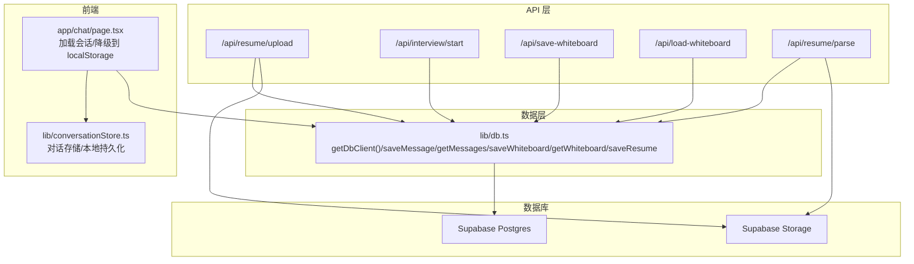
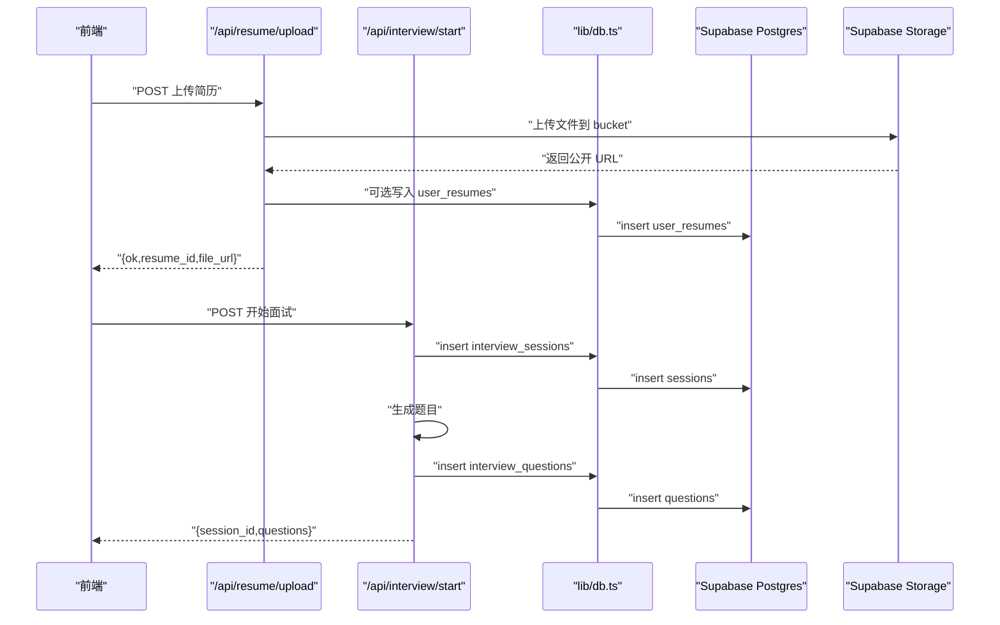
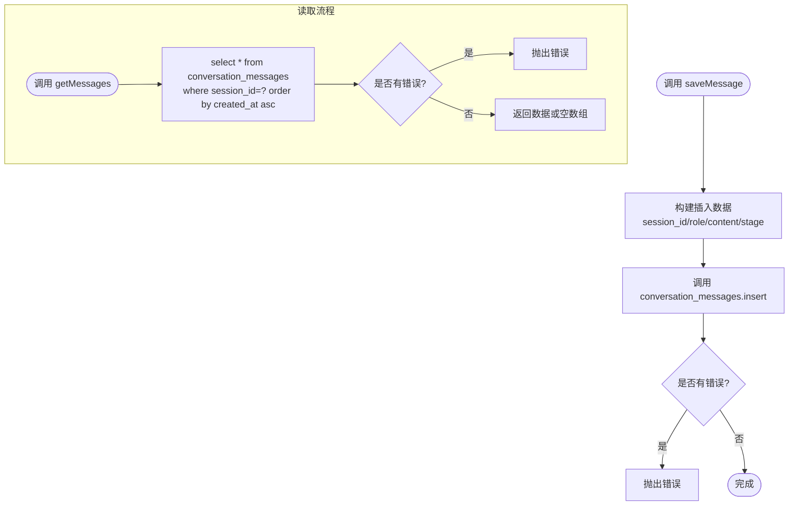
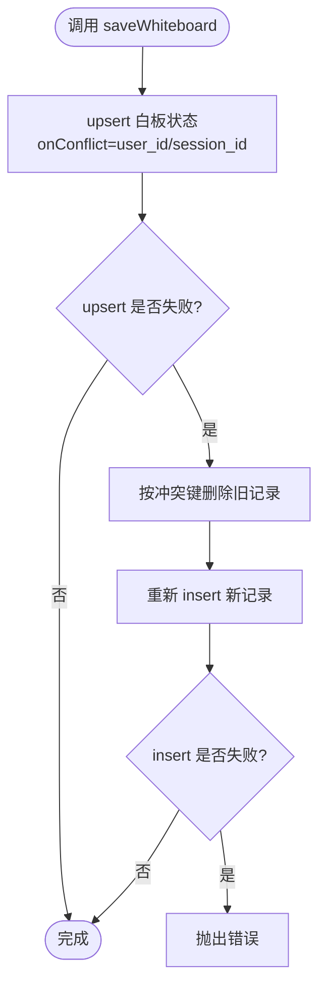
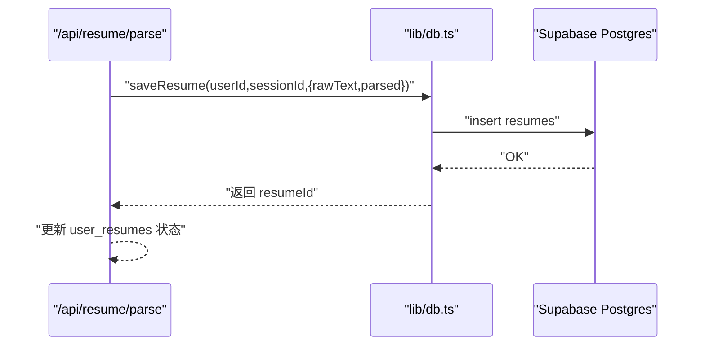
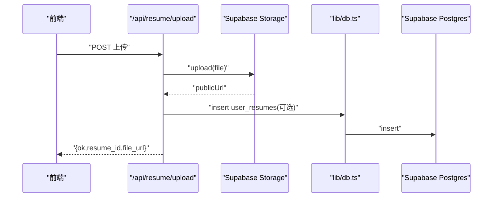
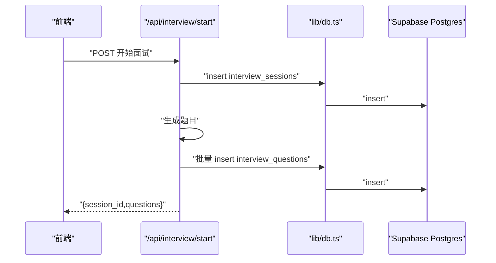
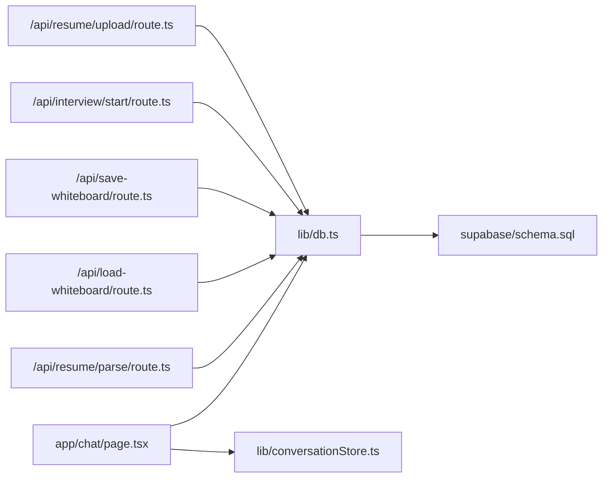
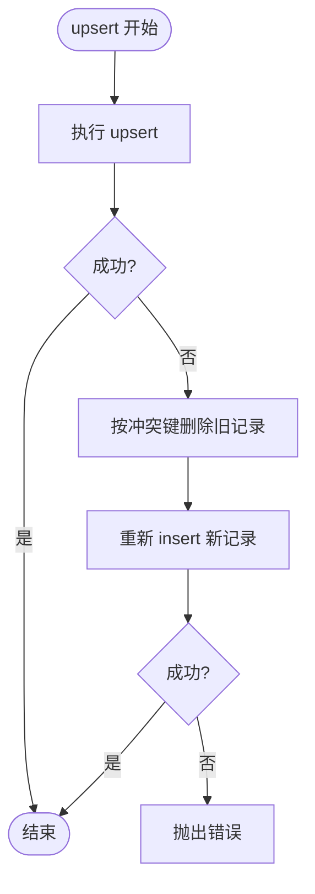

# 数据持久化

<cite>
**本文引用的文件**
- [lib/db.ts](file://lib/db.ts)
- [supabase/schema.sql](file://supabase/schema.sql)
- [app/api/resume/upload/route.ts](file://app/api/resume/upload/route.ts)
- [app/api/interview/start/route.ts](file://app/api/interview/start/route.ts)
- [app/api/save-whiteboard/route.ts](file://app/api/save-whiteboard/route.ts)
- [app/api/load-whiteboard/route.ts](file://app/api/load-whiteboard/route.ts)
- [app/api/resume/parse/route.ts](file://app/api/resume/parse/route.ts)
- [lib/conversationStore.ts](file://lib/conversationStore.ts)
- [app/chat/page.tsx](file://app/chat/page.tsx)
</cite>

## 目录
1. [简介](#简介)
2. [项目结构](#项目结构)
3. [核心组件](#核心组件)
4. [架构总览](#架构总览)
5. [详细组件分析](#详细组件分析)
6. [依赖关系分析](#依赖关系分析)
7. [性能考量](#性能考量)
8. [故障排查指南](#故障排查指南)
9. [结论](#结论)
10. [附录](#附录)

## 简介
本文件围绕 lib/db.ts 中基于 Supabase 的数据持久化机制展开，系统性解析以下核心数据操作函数的实现逻辑与一致性保障策略：
- saveMessage：消息写入
- getMessages：按会话读取消息
- saveWhiteboard：白板状态 upsert 与冲突恢复
- getWhiteboard：按会话读取白板
- saveResume：简历解析结果入库

同时结合简历上传与面试启动 API 的实际调用流程，说明数据写入与读取的一致性保障方案；覆盖 upsert 冲突处理、错误恢复机制（删除后重插）、分页与排序查询优化，并给出性能监控与数据库连接池调优建议；最后提供批量操作与条件查询的安全实践，以及数据库不可用时的降级策略（localStorage）。

## 项目结构
本项目采用“API 层 + 应用层 + 数据层”的分层组织方式：
- API 层：位于 app/api/*，负责请求鉴权、参数校验、调用数据层与外部服务（如 Supabase Storage）
- 数据层：位于 lib/db.ts，封装 Supabase 客户端与统一的数据操作接口
- 数据库模式：位于 supabase/schema.sql，定义表结构、索引与触发器
- 前端降级：当数据库不可用时，前端页面与对话存储组件回退至 localStorage



图表来源
- [lib/db.ts](file://lib/db.ts#L1-L327)
- [supabase/schema.sql](file://supabase/schema.sql#L1-L84)
- [app/api/resume/upload/route.ts](file://app/api/resume/upload/route.ts#L1-L155)
- [app/api/interview/start/route.ts](file://app/api/interview/start/route.ts#L1-L175)
- [app/api/save-whiteboard/route.ts](file://app/api/save-whiteboard/route.ts#L1-L50)
- [app/api/load-whiteboard/route.ts](file://app/api/load-whiteboard/route.ts#L1-L39)
- [app/api/resume/parse/route.ts](file://app/api/resume/parse/route.ts#L1-L345)
- [lib/conversationStore.ts](file://lib/conversationStore.ts#L1-L258)
- [app/chat/page.tsx](file://app/chat/page.tsx#L106-L180)

章节来源
- [lib/db.ts](file://lib/db.ts#L1-L327)
- [supabase/schema.sql](file://supabase/schema.sql#L1-L84)

## 核心组件
- 数据库客户端初始化与可用性检测：getDbClient() 在环境变量齐全时创建 Supabase 客户端，否则返回 null 并记录警告，保证应用在数据库不可用时仍可运行（配合前端 localStorage 降级）
- 消息持久化：saveMessage 与 getMessages 提供会话级消息写入与有序读取
- 白板状态持久化：saveWhiteboard 与 getWhiteboard 提供 upsert 与按会话/用户读取
- 简历解析结果持久化：saveResume 生成唯一 ID 并写入 resumes 表
- 数据库模式与索引：schema.sql 定义表结构、外键约束、唯一约束与索引，提升查询性能

章节来源
- [lib/db.ts](file://lib/db.ts#L1-L327)
- [supabase/schema.sql](file://supabase/schema.sql#L1-L84)

## 架构总览
下图展示了简历上传与面试启动两个关键流程中，API 层、数据层与数据库之间的交互路径与一致性保障要点。



图表来源
- [app/api/resume/upload/route.ts](file://app/api/resume/upload/route.ts#L1-L155)
- [app/api/interview/start/route.ts](file://app/api/interview/start/route.ts#L1-L175)
- [lib/db.ts](file://lib/db.ts#L1-L327)

## 详细组件分析

### 组件一：消息持久化（saveMessage 与 getMessages）
- 实现要点
  - saveMessage：构造插入数据（包含会话标识、角色、内容、阶段），调用 conversation_messages 表 insert，错误即抛出
  - getMessages：按 session_id 等值过滤，按 created_at 升序返回，错误即抛出
- 一致性与事务
  - 单条消息写入为原子操作；多条消息写入建议在 API 层使用批量插入（见“批量操作”章节），并在同一事务中提交
- 错误处理
  - getMessages 在数据库不可用时返回空数组（由 getDbClient 返回 null 时的行为决定）
- 性能优化
  - schema.sql 已为 conversation_messages.session_id 与 created_at 建立索引，满足高频查询场景



图表来源
- [lib/db.ts](file://lib/db.ts#L55-L112)
- [supabase/schema.sql](file://supabase/schema.sql#L22-L30)

章节来源
- [lib/db.ts](file://lib/db.ts#L55-L112)
- [supabase/schema.sql](file://supabase/schema.sql#L22-L30)

### 组件二：白板状态持久化（saveWhiteboard 与 getWhiteboard）
- 实现要点
  - saveWhiteboard：upsert 白板状态，按 user_id 或 session_id 冲突键处理；若 upsert 失败，执行删除后重插，确保幂等
  - getWhiteboard：按 session_id 查询最新白板状态；getWhiteboardByUserId：按 user_id 查询最近一次更新
- upsert 冲突处理
  - onConflict 依据是否传入 userId 选择 user_id 或 session_id，避免并发写入导致的冲突
- 错误恢复机制
  - 删除后重插：当 upsert 报错时，先按冲突键删除对应记录，再执行 insert，保证最终一致
- 一致性与事务
  - 单次 upsert 为原子操作；批量更新建议在 API 层组合为单次 upsert（见“批量操作”章节）



图表来源
- [lib/db.ts](file://lib/db.ts#L141-L228)
- [supabase/schema.sql](file://supabase/schema.sql#L32-L40)

章节来源
- [lib/db.ts](file://lib/db.ts#L141-L228)
- [supabase/schema.sql](file://supabase/schema.sql#L32-L40)

### 组件三：简历解析结果持久化（saveResume）
- 实现要点
  - 生成唯一 ID，向 resumes 表写入原始文本与解析结果，错误即抛出
  - 数据库不可用时返回临时 ID（用于前端后续回退逻辑）
- 一致性与事务
  - 单条简历写入为原子操作；批量解析建议在 API 层聚合后再一次性写入



图表来源
- [lib/db.ts](file://lib/db.ts#L292-L327)
- [app/api/resume/parse/route.ts](file://app/api/resume/parse/route.ts#L200-L345)

章节来源
- [lib/db.ts](file://lib/db.ts#L292-L327)
- [app/api/resume/parse/route.ts](file://app/api/resume/parse/route.ts#L200-L345)

### 组件四：API 调用流程与一致性保障

#### 简历上传流程
- 流程概览
  - 鉴权与参数校验
  - 上传文件到 Supabase Storage，获取公开 URL
  - 可选写入 user_resumes（即使数据库不可用也不阻断响应）
- 一致性保障
  - 存储与数据库写入解耦：存储成功后才返回 URL；数据库写入失败不影响文件可用性
  - 前端在数据库不可用时可直接使用公开 URL



图表来源
- [app/api/resume/upload/route.ts](file://app/api/resume/upload/route.ts#L1-L155)
- [lib/db.ts](file://lib/db.ts#L1-L327)

章节来源
- [app/api/resume/upload/route.ts](file://app/api/resume/upload/route.ts#L1-L155)

#### 面试启动流程
- 流程概览
  - 鉴权与参数校验
  - 插入 interview_sessions
  - 生成题目并批量插入 interview_questions
- 一致性保障
  - 会话创建与题目写入为两个独立原子操作；建议在 API 层将题目写入合并为一次批量插入，减少往返与锁竞争



图表来源
- [app/api/interview/start/route.ts](file://app/api/interview/start/route.ts#L1-L175)
- [lib/db.ts](file://lib/db.ts#L1-L327)

章节来源
- [app/api/interview/start/route.ts](file://app/api/interview/start/route.ts#L1-L175)

### 组件五：数据库模式与索引
- 表结构与约束
  - users：主键 id，唯一 phone/email
  - sessions：外键 user_id
  - conversation_messages：外键 session_id，字段 role 有限制
  - whiteboard_states：唯一 session_id
  - user_progress：唯一 user_id
- 索引
  - idx_messages_session_id、idx_messages_created_at、idx_whiteboard_session_id、idx_progress_user_id
- 触发器
  - update_updated_at_column() 自动维护 updated_at

```mermaid
erDiagram
USERS {
uuid id PK
text phone UK
text email UK
text provider
timestamptz created_at
timestamptz last_active
}
SESSIONS {
uuid id PK
uuid user_id FK
timestamptz created_at
timestamptz updated_at
}
CONVERSATION_MESSAGES {
uuid id PK
uuid session_id FK
text role
text content
text stage
timestamptz created_at
}
WHITEBOARD_STATES {
uuid id PK
uuid session_id FK UK
jsonb whiteboard
timestamptz updated_at
}
USER_PROGRESS {
uuid id PK
uuid user_id FK UK
text current_stage
timestamptz updated_at
}
USERS ||--o{ SESSIONS : "has"
SESSIONS ||--o{ CONVERSATION_MESSAGES : "contains"
SESSIONS ||--|o WHITEBOARD_STATES : "owns"
USERS ||--|o USER_PROGRESS : "has"
```

图表来源
- [supabase/schema.sql](file://supabase/schema.sql#L1-L84)

章节来源
- [supabase/schema.sql](file://supabase/schema.sql#L1-L84)

## 依赖关系分析
- lib/db.ts 作为统一数据访问层，被多个 API 路由依赖
- API 路由在 Node.js runtime 下运行，避免在 Edge Runtime 使用数据库驱动
- 前端页面在加载会话失败时回退到 localStorage，形成“数据库不可用时的降级链路”



图表来源
- [lib/db.ts](file://lib/db.ts#L1-L327)
- [app/api/resume/upload/route.ts](file://app/api/resume/upload/route.ts#L1-L155)
- [app/api/interview/start/route.ts](file://app/api/interview/start/route.ts#L1-L175)
- [app/api/save-whiteboard/route.ts](file://app/api/save-whiteboard/route.ts#L1-L50)
- [app/api/load-whiteboard/route.ts](file://app/api/load-whiteboard/route.ts#L1-L39)
- [app/api/resume/parse/route.ts](file://app/api/resume/parse/route.ts#L1-L345)
- [lib/conversationStore.ts](file://lib/conversationStore.ts#L1-L258)
- [app/chat/page.tsx](file://app/chat/page.tsx#L106-L180)
- [supabase/schema.sql](file://supabase/schema.sql#L1-L84)

章节来源
- [lib/db.ts](file://lib/db.ts#L1-L327)
- [app/api/resume/upload/route.ts](file://app/api/resume/upload/route.ts#L1-L155)
- [app/api/interview/start/route.ts](file://app/api/interview/start/route.ts#L1-L175)
- [app/api/save-whiteboard/route.ts](file://app/api/save-whiteboard/route.ts#L1-L50)
- [app/api/load-whiteboard/route.ts](file://app/api/load-whiteboard/route.ts#L1-L39)
- [app/api/resume/parse/route.ts](file://app/api/resume/parse/route.ts#L1-L345)
- [lib/conversationStore.ts](file://lib/conversationStore.ts#L1-L258)
- [app/chat/page.tsx](file://app/chat/page.tsx#L106-L180)
- [supabase/schema.sql](file://supabase/schema.sql#L1-L84)

## 性能考量
- 查询优化
  - 按 created_at 升序读取消息：schema.sql 已建立 idx_messages_created_at，满足高频排序读取
  - 按 session_id/ user_id 过滤：已建立 idx_messages_session_id、idx_progress_user_id 等索引
- 批量操作
  - 建议在 API 层将多条记录合并为一次 insert/upsert，减少网络往返与锁竞争
  - 对于大量数据写入，优先使用批量接口而非循环逐条写入
- 连接池与并发
  - Supabase JS 客户端在 Node.js 环境下复用底层连接；在高并发场景下，建议控制 API 层并发度，避免瞬时压力过大
  - 若部署在边缘（Edge Runtime），由于 pg 驱动不可用，需通过 API 层集中化数据库操作，避免在边缘实例中频繁创建连接
- 监控与告警
  - 建议对关键写入接口（如 saveMessage、saveWhiteboard、saveResume）埋点统计成功率、延迟与错误码分布
  - 对数据库慢查询（如大范围排序）进行识别与优化，必要时引入物化视图或缓存

[本节为通用性能指导，无需列出具体文件来源]

## 故障排查指南
- 数据库不可用
  - getDbClient 返回 null，各数据函数行为：
    - 写入类：saveMessage/saveWhiteboard/saveResume 等直接返回（静默失败）
    - 读取类：getMessages/getMessagesByUserId/getWhiteboard/getUserStage 等返回空集合或默认值
  - 前端降级：app/chat/page.tsx 在加载会话失败时回退到 localStorage；lib/conversationStore.ts 提供对话历史的本地持久化
- 白板 upsert 冲突
  - 若 upsert 失败，系统自动执行删除后重插；若仍失败，检查 onConflict 键是否正确（user_id 或 session_id）
- 简历上传
  - Storage 上传失败不影响响应；数据库写入失败不会阻断返回，前端仍可使用公开 URL
- 面试启动
  - 会话创建与题目写入为两个独立操作；若题目写入失败，会话仍可用，可在后续重试或补偿

章节来源
- [lib/db.ts](file://lib/db.ts#L1-L327)
- [app/chat/page.tsx](file://app/chat/page.tsx#L106-L180)
- [lib/conversationStore.ts](file://lib/conversationStore.ts#L1-L258)

## 结论
本项目通过 lib/db.ts 将 Supabase 数据访问抽象为统一接口，配合 schema.sql 的索引与约束，实现了消息、白板、进度与简历解析结果的可靠持久化。在简历上传与面试启动等关键流程中，API 层采用“存储优先、数据库可选”的设计，既保证了可用性，又通过 upsert 冲突处理与删除后重插策略确保一致性。前端在数据库不可用时回退至 localStorage，形成完整的降级链路。建议在生产环境中进一步完善批量操作、监控与连接池调优，以应对更高并发与更复杂的业务场景。

[本节为总结性内容，无需列出具体文件来源]

## 附录

### upsert 冲突处理与删除后重插流程


图表来源
- [lib/db.ts](file://lib/db.ts#L141-L228)

### 分页与排序查询优化
- 已建立的索引
  - idx_messages_session_id：加速按会话过滤
  - idx_messages_created_at：加速按时间排序
  - idx_whiteboard_session_id：加速按会话读取白板
  - idx_progress_user_id：加速按用户读取进度
- 建议
  - 对于大结果集的分页，优先使用 created_at 上限/下限游标分页，避免 offset
  - 对复杂查询引入物化视图或缓存中间态数据

章节来源
- [supabase/schema.sql](file://supabase/schema.sql#L50-L84)

### 批量操作与条件查询安全实践
- 批量写入
  - 在 API 层将多条记录合并为一次 insert/upsert，减少往返与锁竞争
  - 对于大量数据，分批处理并设置合理的并发上限
- 条件查询
  - 严格使用等值过滤与索引列，避免全表扫描
  - 对排序字段使用索引列，避免在无索引列上进行 ORDER BY
- 错误恢复
  - 对于 upsert 失败的幂等写入，采用删除后重插策略
  - 对于可选写入（如 user_resumes），数据库失败不应阻断主流程

章节来源
- [lib/db.ts](file://lib/db.ts#L141-L228)
- [app/api/resume/upload/route.ts](file://app/api/resume/upload/route.ts#L118-L137)

### 数据库不可用时的降级策略（localStorage）
- 前端页面在加载会话失败时回退到 localStorage，恢复用户阶段与聊天记录、白板数据
- 对话存储组件提供基于用户 ID 的本地持久化与恢复能力

章节来源
- [app/chat/page.tsx](file://app/chat/page.tsx#L106-L180)
- [lib/conversationStore.ts](file://lib/conversationStore.ts#L1-L258)