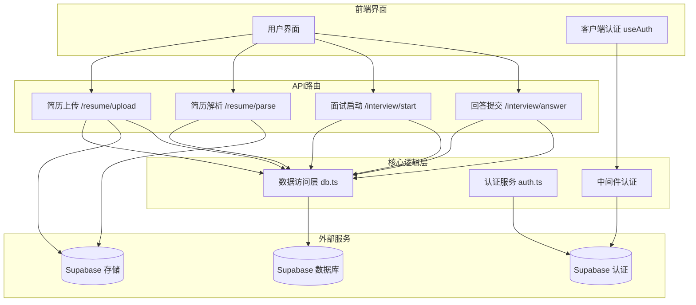
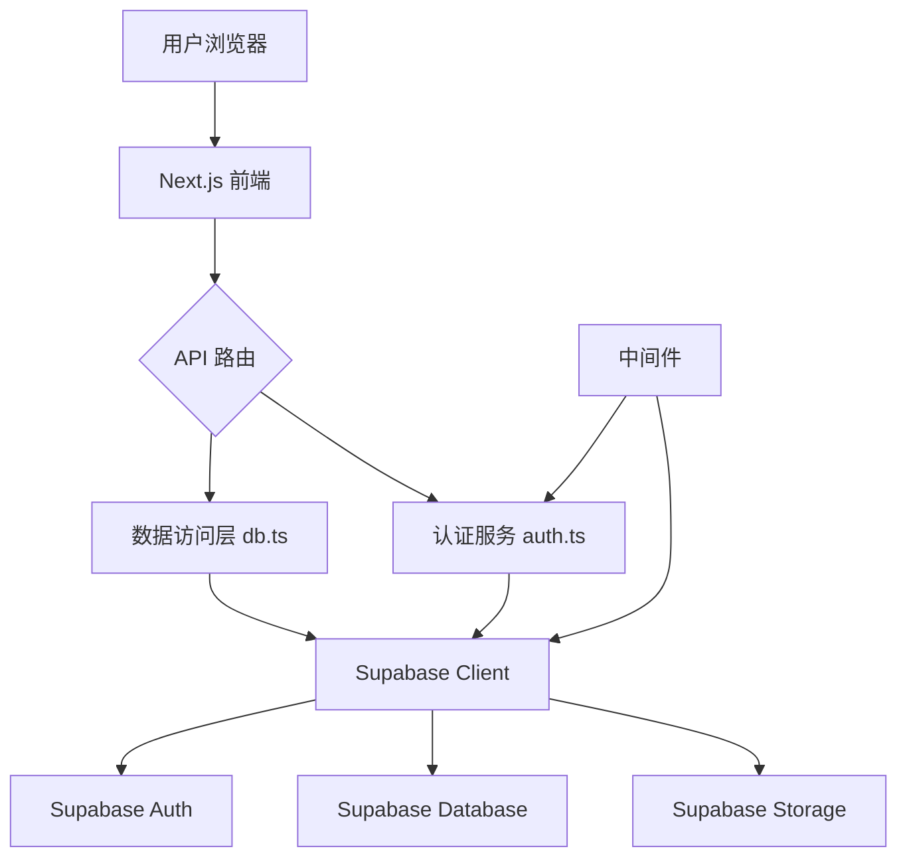
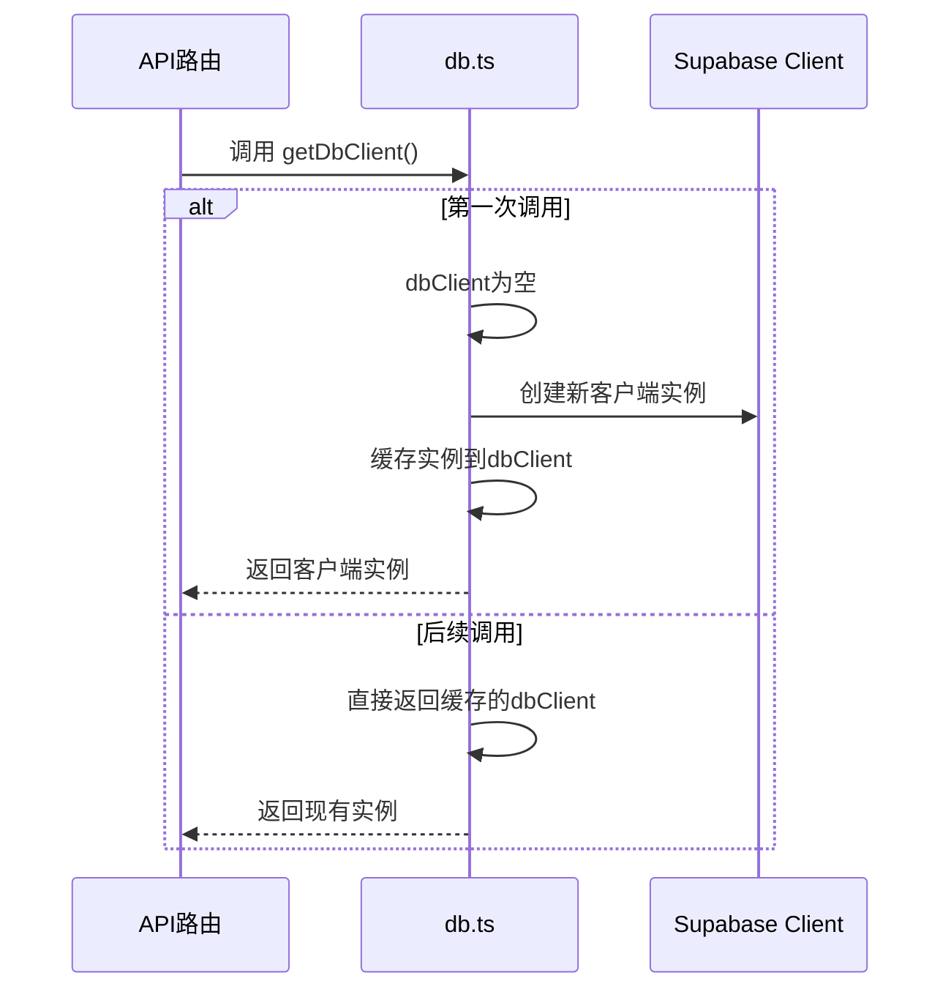
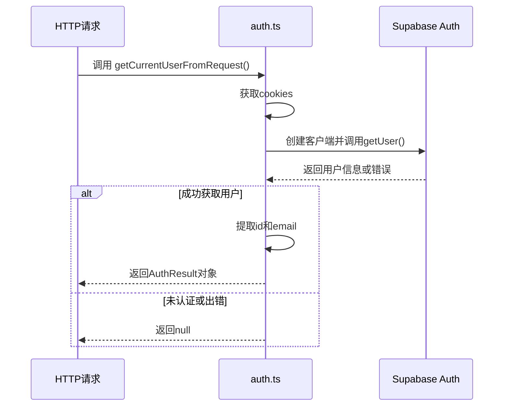
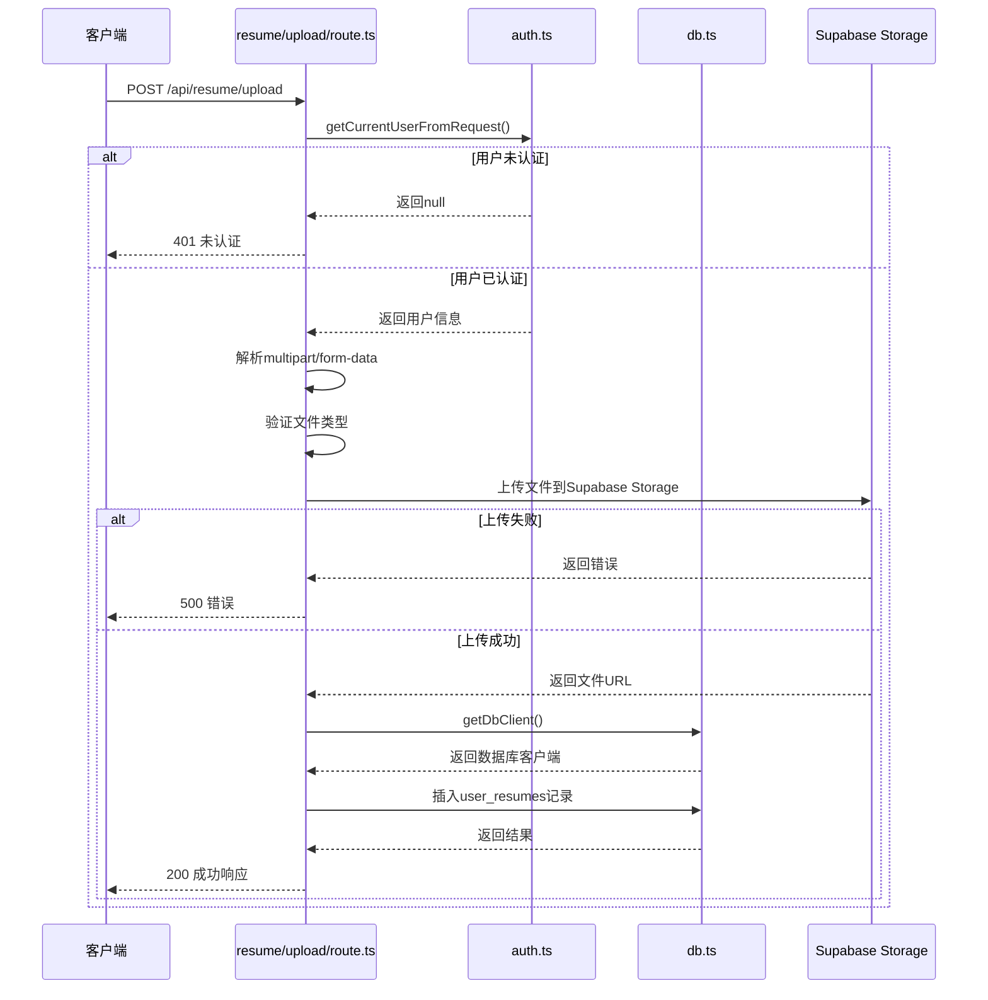
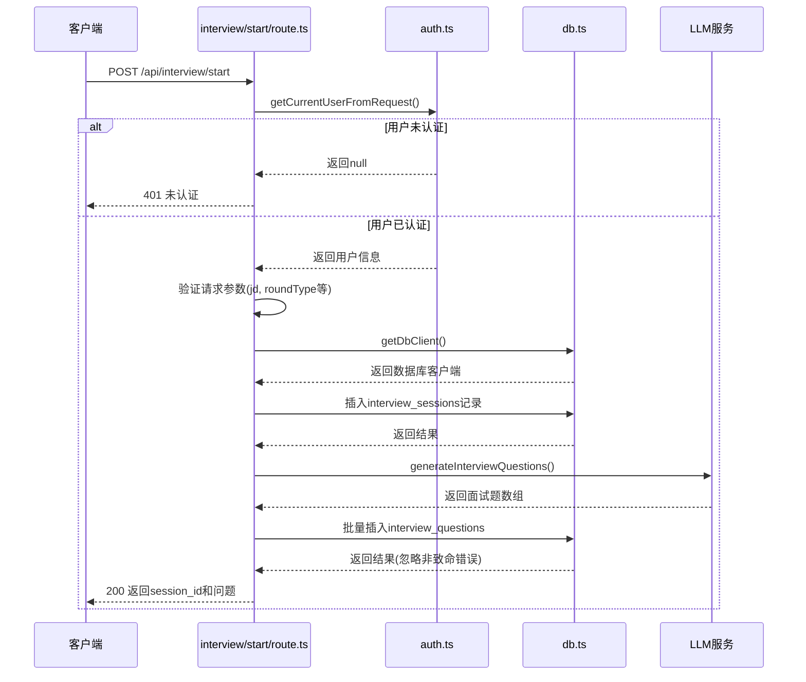
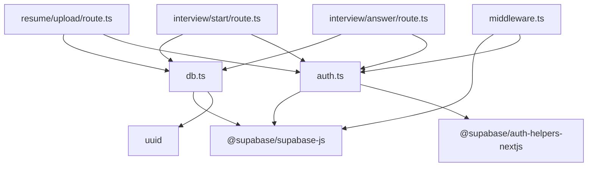

# 数据访问层

<cite>
**本文档中引用的文件**  
- [db.ts](file://lib/db.ts)
- [auth.ts](file://lib/auth.ts)
- [useAuth.ts](file://lib/useAuth.ts)
- [middleware.ts](file://middleware.ts)
- [resume/upload/route.ts](file://app/api/resume/upload/route.ts)
- [resume/parse/route.ts](file://app/api/resume/parse/route.ts)
- [interview/start/route.ts](file://app/api/interview/start/route.ts)
- [interview/answer/route.ts](file://app/api/interview/answer/route.ts)
- [package.json](file://package.json)
</cite>

## 目录
1. [引言](#引言)
2. [项目结构](#项目结构)
3. [核心组件](#核心组件)
4. [架构概述](#架构概述)
5. [详细组件分析](#详细组件分析)
6. [依赖分析](#依赖分析)
7. [性能考虑](#性能考虑)
8. [故障排除指南](#故障排除指南)
9. [结论](#结论)

## 引言
本文档系统阐述了AI求职教练项目中数据访问抽象层的设计原理与实现细节。重点分析了`db.ts`作为核心数据访问模块的单例模式封装、Supabase客户端集成、连接管理及错误处理策略。通过解析简历上传和面试启动等关键API路由对`getDbClient()`的实际调用流程，展示了数据库操作的标准化实践。同时说明了`auth.ts`中用户认证逻辑与Supabase Auth服务的深度集成方式，涵盖token验证、用户会话提取及权限控制机制。文档还提供了数据库事务处理建议、查询优化策略、常见连接问题排查方法以及安全访问的最佳实践。

## 项目结构
本项目采用Next.js App Router架构，数据访问层主要集中在`lib/`目录下，通过统一的`db.ts`模块对外提供数据库操作接口。API路由分布在`app/api/`路径下，各功能模块（如简历、面试）拥有独立的路由处理文件。认证逻辑由`auth.ts`和中间件共同实现，确保前后端一致的安全控制。

**图示来源**  
- [db.ts](file://lib/db.ts)
- [auth.ts](file://lib/auth.ts)
- [middleware.ts](file://middleware.ts)
- [resume/upload/route.ts](file://app/api/resume/upload/route.ts)
- [interview/start/route.ts](file://app/api/interview/start/route.ts)

**本节来源**  
- [lib/db.ts](file://lib/db.ts)
- [lib/auth.ts](file://lib/auth.ts)
- [middleware.ts](file://middleware.ts)

## 核心组件
`db.ts`作为数据访问抽象层的核心，实现了对Supabase客户端的单例模式封装，提供统一的数据库操作接口。该模块支持在无数据库配置时优雅降级至localStorage，确保应用的可用性。`auth.ts`封装了基于Supabase Auth的用户认证逻辑，提供从请求中提取当前用户信息的功能。`middleware.ts`实现了全局认证拦截，保护受保护路由。多个API路由（如简历上传、面试启动）通过调用`getDbClient()`获取数据库实例，执行具体的业务数据操作。

**本节来源**  
- [db.ts](file://lib/db.ts#L1-L327)
- [auth.ts](file://lib/auth.ts#L1-L40)
- [middleware.ts](file://middleware.ts#L1-L170)

## 架构概述
系统采用分层架构设计，前端通过Next.js API路由与后端逻辑交互。数据访问层（`db.ts`）作为独立抽象层，屏蔽底层数据库实现细节，仅暴露高层业务操作接口。认证体系基于Supabase Auth构建，通过中间件和API路由双重验证确保安全性。文件存储与数据库操作分离，简历文件存于Supabase Storage，元数据存于PostgreSQL数据库。整体架构充分利用Supabase提供的BaaS能力，实现快速开发与部署。

**图示来源**  
- [db.ts](file://lib/db.ts#L1-L327)
- [auth.ts](file://lib/auth.ts#L1-L40)
- [middleware.ts](file://middleware.ts#L1-L170)

## 详细组件分析
### 数据访问层分析
`db.ts`模块实现了数据库客户端的单例模式封装，确保在整个应用生命周期内仅创建一个Supabase客户端实例，有效管理连接资源。该设计避免了重复初始化带来的性能开销和潜在的内存泄漏问题。

#### 单例模式与连接管理

**图示来源**  
- [db.ts](file://lib/db.ts#L15-L48)

#### 错误处理与降级策略
当Supabase客户端初始化失败或环境变量未配置时，`getDbClient()`返回`null`而非抛出异常，使应用能够优雅降级至使用localStorage进行数据持久化，保证核心功能可用性。所有数据库操作函数均检查客户端有效性，若不可用则静默失败或返回默认值。

**本节来源**  
- [db.ts](file://lib/db.ts#L15-L48)

### 认证集成分析
`auth.ts`模块封装了从HTTP请求中提取当前用户信息的逻辑，利用Supabase Auth Helpers提供的`createRouteHandlerClient`从cookies中读取会话信息，实现服务端的用户身份验证。

#### 用户会话提取流程

**图示来源**  
- [auth.ts](file://lib/auth.ts#L9-L39)

#### 权限控制机制
系统通过中间件和API路由双重验证实现权限控制。`middleware.ts`拦截所有非公开路径，验证会话有效性，未认证用户被重定向至登录页。API路由在处理业务逻辑前再次调用`getCurrentUserFromRequest()`确认用户身份，防止绕过中间件的直接API调用。

**本节来源**  
- [auth.ts](file://lib/auth.ts#L9-L39)
- [middleware.ts](file://middleware.ts#L14-L153)

### API路由调用分析
#### 简历上传流程

**图示来源**  
- [resume/upload/route.ts](file://app/api/resume/upload/route.ts#L12-L140)

#### 面试启动流程

**图示来源**  
- [interview/start/route.ts](file://app/api/interview/start/route.ts#L33-L175)

**本节来源**  
- [resume/upload/route.ts](file://app/api/resume/upload/route.ts#L12-L140)
- [interview/start/route.ts](file://app/api/interview/start/route.ts#L33-L175)
- [interview/answer/route.ts](file://app/api/interview/answer/route.ts#L33-L205)

## 依赖分析
项目依赖关系清晰，核心依赖为Supabase生态组件。`@supabase/supabase-js`提供数据库、存储和认证的统一客户端，`@supabase/auth-helpers-nextjs`简化Next.js环境下的认证集成。数据访问层(`db.ts`)依赖Supabase客户端和UUID生成库，被所有需要数据库操作的API路由所依赖。认证服务(`auth.ts`)依赖Supabase Auth Helpers，被API路由和中间件共同依赖。

**图示来源**  
- [package.json](file://package.json)
- [db.ts](file://lib/db.ts)
- [auth.ts](file://lib/auth.ts)

**本节来源**  
- [package.json](file://package.json)
- [db.ts](file://lib/db.ts)
- [auth.ts](file://lib/auth.ts)

## 性能考虑
数据访问层的设计充分考虑了性能因素。单例模式避免了重复创建数据库客户端的开销。所有数据库操作均使用Supabase的异步API，不会阻塞事件循环。对于可能耗时的操作（如生成面试题、解析简历），API路由在保存会话状态后异步执行，确保快速响应。建议对频繁查询的字段（如`user_id`, `session_id`）建立数据库索引以提升查询性能。连接池由Supabase自动管理，无需应用层干预。

## 故障排除指南
### 常见连接问题
1. **数据库客户端初始化失败**：检查环境变量`SUPABASE_URL`和`SUPABASE_ANON_KEY`是否正确配置。
2. **API返回500错误**：查看日志中是否有"数据库连接失败"或"Supabase配置缺失"等信息，确认环境变量设置。
3. **认证失败**：检查浏览器cookies中是否存在`sb-access-token`和`sb-session-user-id`，确认Supabase Auth配置正确。
4. **文件上传失败**：验证`SUPABASE_SERVICE_ROLE_KEY`是否配置，该密钥用于服务端文件操作。

### 安全访问最佳实践
1. **环境变量保护**：`SUPABASE_SERVICE_ROLE_KEY`仅在服务端使用，绝不暴露给客户端。
2. **RLS策略**：在Supabase中为所有表启用行级安全(RLS)，确保用户只能访问自己的数据。
3. **输入验证**：所有API路由对请求参数进行严格验证，防止注入攻击。
4. **最小权限原则**：Supabase客户端使用最小必要权限的API密钥。
5. **会话管理**：合理设置会话有效期，定期清理过期会话。

**本节来源**  
- [db.ts](file://lib/db.ts)
- [auth.ts](file://lib/auth.ts)
- [middleware.ts](file://middleware.ts)

## 结论
`db.ts`作为数据访问抽象层，成功实现了对Supabase客户端的高效封装，通过单例模式管理连接，提供健壮的错误处理和降级策略。与`auth.ts`的紧密集成确保了安全的用户认证和权限控制。API路由通过标准化的`getDbClient()`调用，实现了数据库操作的统一管理和最佳实践。整个数据访问架构设计合理，兼顾了性能、安全性和可维护性，为AI求职教练应用提供了稳定可靠的数据支撑。