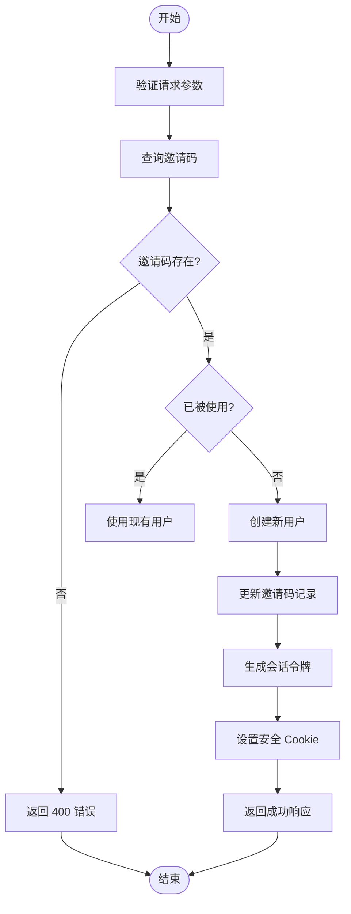
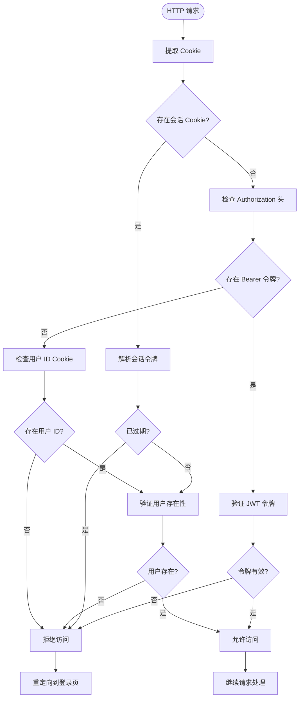

# 认证服务

<cite>
**本文档引用的文件**  
- [auth.ts](file://lib/auth.ts)
- [create-session/route.ts](file://app/api/auth/create-session/route.ts)
- [middleware.ts](file://middleware.ts)
- [useAuth.ts](file://lib/useAuth.ts)
- [load-session/route.ts](file://app/api/load-session/route.ts)
- [SESSION_SYSTEM_README.md](file://SESSION_SYSTEM_README.md)
- [login/page.tsx](file://app/login/page.tsx)
</cite>

## 目录
1. [简介](#简介)
2. [核心认证函数解析](#核心认证函数解析)
3. [会话创建流程](#会话创建流程)
4. [中间件认证拦截机制](#中间件认证拦截机制)
5. [客户端认证检查](#客户端认证检查)
6. [认证信息传递与安全防护](#认证信息传递与安全防护)
7. [常见认证问题排查](#常见认证问题排查)
8. [无头模式测试策略](#无头模式测试策略)

## 简介
本系统基于 Supabase Auth 实现用户认证服务，采用邀请码驱动的登录机制。系统支持 OAuth2.0 集成、JWT 令牌管理、会话状态同步和权限边界控制。用户通过邀请码登录后，系统创建会话并设置安全 cookie，实现 7 天免登录体验。所有受保护的 API 路径均需有效会话才能访问，确保系统安全性。

## 核心认证函数解析

`auth.ts` 文件中定义了两个核心认证函数：`getCurrentUserFromRequest` 和 `getCurrentUserId`。这两个函数构成了服务器端用户身份验证的基础。

### getCurrentUserFromRequest 函数
该函数从 HTTP 请求中提取当前用户信息，工作流程如下：
1. 获取请求中的 cookie 存储
2. 创建 Supabase 路由处理器客户端
3. 调用 Supabase Auth 的 `getUser` 方法验证身份令牌
4. 返回用户 ID 和邮箱信息

此函数实现了基于 cookie 的身份令牌验证机制，是服务器端获取用户会话的主要方式。

### getCurrentUserId 函数
作为 `getCurrentUserFromRequest` 的便捷封装，该函数仅返回用户的 ID。它简化了需要用户 ID 的场景，如数据库查询和权限检查。

**核心组件来源**
- [auth.ts](file://lib/auth.ts#L9-L39)

## 会话创建流程

会话创建通过 `/api/auth/create-session` API 端点实现，该流程整合了邀请码验证和会话生成。

### 创建会话 API 工作流程
1. **请求验证**：检查请求体中的 `inviteCode` 参数
2. **邀请码处理**：使用 Supabase Admin API 查询或创建用户
3. **用户管理**：为邀请码创建虚拟邮箱并管理用户状态
4. **会话生成**：创建包含用户信息的 JWT 风格令牌
5. **Cookie 设置**：设置安全的会话 cookie

系统为每个用户创建两个 cookie：
- `sb-access-token`：包含用户 ID、邮箱和过期时间的 base64 编码令牌
- `sb-session-user-id`：单独的用户 ID cookie 用于快速验证

会话有效期为 7 天，符合 `SESSION_SYSTEM_README.md` 中定义的免登录策略。



**流程图来源**
- [create-session/route.ts](file://app/api/auth/create-session/route.ts#L22-L219)

**核心实现来源**
- [create-session/route.ts](file://app/api/auth/create-session/route.ts#L22-L219)

## 中间件认证拦截机制

系统使用 Next.js 中间件实现全局认证拦截，确保未授权用户无法访问受保护的路由。

### 拦截规则
中间件配置了明确的路径匹配规则，允许匿名访问以下路径：
- `/login` 及其子路径
- `/invite` 及其子路径
- 所有 `/api/` 路径
- 静态资源文件

其他所有路径均受认证保护。

### 会话验证策略
中间件采用三级会话验证策略：

1. **Cookie 验证**：解析 `sb-access-token` 并验证其完整性和过期时间
2. **Header 验证**：检查 `Authorization` 头部的 Bearer 令牌
3. **用户存在性验证**：使用 Supabase Admin API 验证用户 ID 的有效性

这种多层验证机制确保了会话的安全性，防止令牌伪造和重放攻击。



**中间件来源**
- [middleware.ts](file://middleware.ts#L14-L170)

## 客户端认证检查

除了服务器端的中间件拦截，系统还实现了客户端的认证检查机制，作为额外的安全保障。

### useAuth Hook
`useAuth` 是一个 React Hook，用于在客户端组件中检查用户认证状态：

1. **立即检查**：组件挂载时立即验证会话状态
2. **定期轮询**：每 30 秒检查一次会话状态，防止 cookie 被清除
3. **多源验证**：同时检查 cookie 和 localStorage 中的会话信息

这种双重检查机制确保了即使服务器端会话仍然有效，客户端也能及时响应会话状态变化。

### 降级兼容策略
系统考虑了向后兼容性，同时支持新的 cookie 会话机制和旧的 localStorage 机制。当用户通过旧机制登录时，系统仍能正确识别用户身份。

**客户端检查来源**
- [useAuth.ts](file://lib/useAuth.ts#L1-L58)

## 认证信息传递与安全防护

系统通过多层次的安全措施确保认证信息的安全传递和存储。

### 安全 Cookie 配置
会话 cookie 采用严格的安全配置：
- `httpOnly`: 防止 XSS 攻击读取 cookie
- `secure`: 仅在 HTTPS 连接上传输
- `sameSite: "lax"`: 防止 CSRF 攻击
- `maxAge`: 7 天有效期，实现免登录体验

### 权限边界控制
系统实现了严格的权限边界：
- **API 级别**：所有受保护的 API 都验证会话有效性
- **数据级别**：聊天记录、白板内容等数据按 `user_id` 绑定
- **设备级别**：支持单设备登录，新设备登录会踢出旧设备

### 错误处理机制
当认证失败时，系统提供清晰的错误处理：
- 返回 401 状态码
- 前端自动跳转到登录页
- 显示友好的错误提示

**安全配置来源**
- [create-session/route.ts](file://app/api/auth/create-session/route.ts#L192-L207)
- [middleware.ts](file://middleware.ts#L142-L149)

## 常见认证问题排查

### Token 过期问题
**症状**：用户频繁被重定向到登录页
**原因**：会话 token 已过期（7 天有效期）
**解决方案**：
1. 检查 `sb-access-token` cookie 的 `exp` 字段
2. 确认服务器时间同步
3. 如需延长有效期，修改 `create-session` API 中的过期时间计算

### Cookie 域不匹配
**症状**：本地开发环境认证正常，生产环境失效
**原因**：`secure` 标志要求 HTTPS，本地开发可能使用 HTTP
**解决方案**：
1. 检查 `NODE_ENV` 环境变量
2. 确保生产环境使用 HTTPS
3. 开发环境可临时禁用 `secure` 标志进行测试

### 401 错误处理
系统对 401 错误有专门的处理流程：
1. 前端 `apiFetch` 工具自动捕获 401 错误
2. 显示提示："当前账号已在其他设备登录，你已被登出"
3. 自动重定向到 `/login` 页面

### 会话冲突
**症状**：用户在新设备登录后，旧设备无法访问
**原因**：系统设计为单设备登录，新会话会踢出旧会话
**解决方案**：
1. 检查 `sessions` 表中 `is_active` 字段
2. 确认 `expires_at` 时间戳
3. 如需支持多设备登录，需修改会话管理逻辑

**问题排查来源**
- [SESSION_SYSTEM_README.md](file://SESSION_SYSTEM_README.md#L125-L172)
- [middleware.ts](file://middleware.ts#L142-L149)

## 无头模式测试策略

### 自动化登录流程
在无头模式下进行测试时，可采用以下自动化登录策略：

1. **API 直接调用**：绕过前端界面，直接调用 `create-session` API
```typescript
// 测试脚本示例
const response = await fetch('/api/auth/create-session', {
  method: 'POST',
  headers: { 'Content-Type': 'application/json' },
  body: JSON.stringify({ inviteCode: 'TEST123' })
});
```

2. **Cookie 注入**：在测试开始前预设会话 cookie
3. **环境变量配置**：设置测试专用的邀请码和用户数据

### 测试注意事项
- 使用独立的测试数据库
- 避免在测试中使用生产环境的 Supabase 密钥
- 清理测试创建的用户和会话记录
- 模拟各种边界情况（过期 token、无效邀请码等）

**测试策略来源**
- [SESSION_SYSTEM_README.md](file://SESSION_SYSTEM_README.md#L188-L205)
- [login/page.tsx](file://app/login/page.tsx#L38-L99)