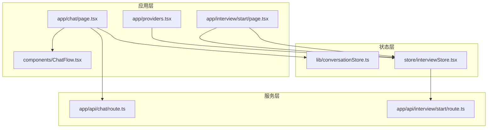
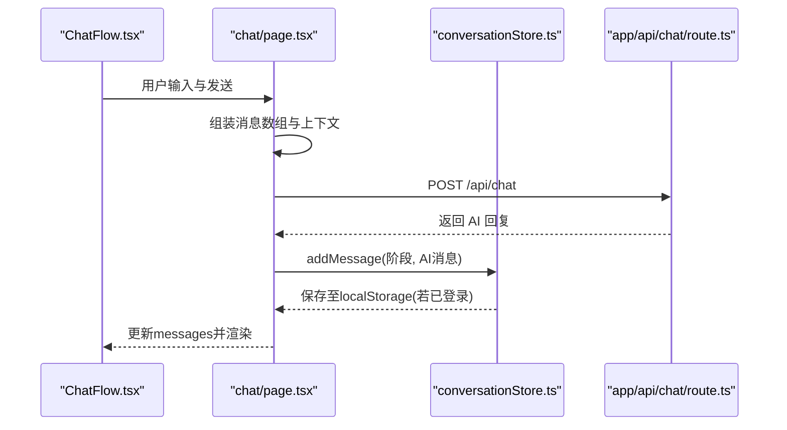
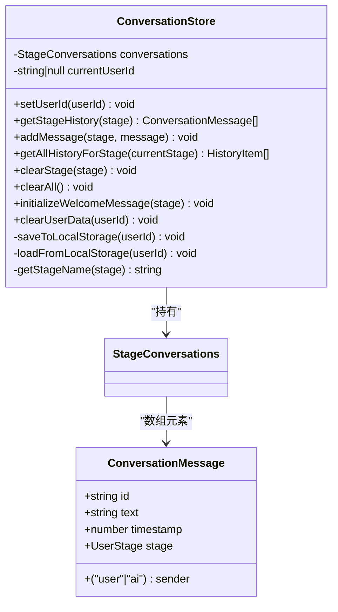
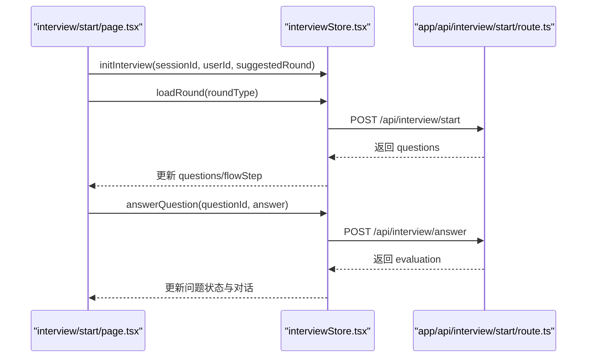
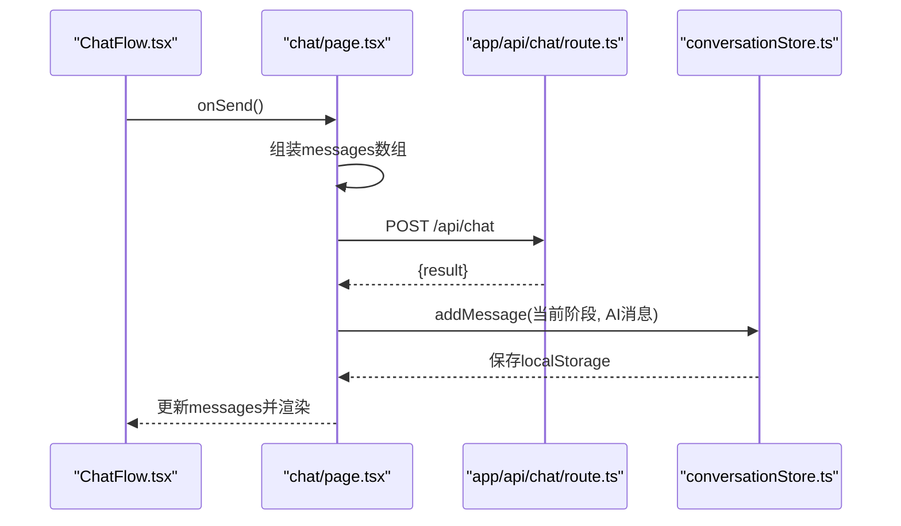
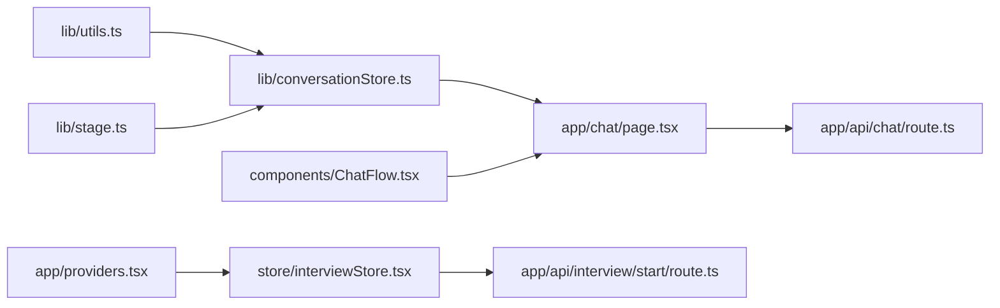

# 状态管理模块

<cite>
**本文引用的文件**
- [conversationStore.ts](file://lib/conversationStore.ts)
- [interviewStore.tsx](file://store/interviewStore.tsx)
- [chat/page.tsx](file://app/chat/page.tsx)
- [ChatFlow.tsx](file://components/ChatFlow.tsx)
- [utils.ts](file://lib/utils.ts)
- [stage.ts](file://lib/stage.ts)
- [providers.tsx](file://app/providers.tsx)
- [interview/start/page.tsx](file://app/interview/start/page.tsx)
- [chat/route.ts](file://app/api/chat/route.ts)
- [interview/start/route.ts](file://app/api/interview/start/route.ts)
</cite>

## 目录
1. [简介](#简介)
2. [项目结构](#项目结构)
3. [核心组件](#核心组件)
4. [架构总览](#架构总览)
5. [详细组件分析](#详细组件分析)
6. [依赖关系分析](#依赖关系分析)
7. [性能考量](#性能考量)
8. [故障排查指南](#故障排查指南)
9. [结论](#结论)
10. [附录](#附录)

## 简介
本文件深入解析基于 Zustand 的状态管理实现，重点说明 conversationStore.ts 如何管理对话消息流、会话上下文与实时更新机制；并结合 app/chat/page.tsx 与 components/ChatFlow.tsx 中的实际调用，展示状态变更的完整生命周期。同时解释 interviewStore.tsx 作为补充状态容器的作用及其与主对话流的协同方式。文档提供典型使用场景（消息发送、流式响应处理、历史会话加载）与错误处理、边界情况管理的指导。

## 项目结构
本项目采用“按功能域划分”的组织方式：
- lib：通用工具与领域模型（含 conversationStore、stage、utils）
- store：React Context 状态容器（interviewStore.tsx）
- app：Next.js 页面与 API 路由（chat、interview 等）
- components：UI 组件（ChatFlow、MessageBubble 等）

图表来源
- [chat/page.tsx](file://app/chat/page.tsx#L1-L200)
- [ChatFlow.tsx](file://components/ChatFlow.tsx#L1-L167)
- [conversationStore.ts](file://lib/conversationStore.ts#L1-L258)
- [interviewStore.tsx](file://store/interviewStore.tsx#L1-L200)
- [providers.tsx](file://app/providers.tsx#L1-L13)
- [interview/start/page.tsx](file://app/interview/start/page.tsx#L1-L200)
- [chat/route.ts](file://app/api/chat/route.ts#L1-L238)
- [interview/start/route.ts](file://app/api/interview/start/route.ts#L1-L175)

章节来源
- [chat/page.tsx](file://app/chat/page.tsx#L1-L200)
- [conversationStore.ts](file://lib/conversationStore.ts#L1-L258)
- [interviewStore.tsx](file://store/interviewStore.tsx#L1-L200)

## 核心组件
- conversationStore.ts：基于类的对话状态管理，按阶段维护消息历史，支持本地持久化与欢迎消息初始化。
- interviewStore.tsx：基于 React Context 的面试流程状态管理，提供面试轮次、问题、对话与引导的完整生命周期。
- chat/page.tsx：聊天页入口，负责会话加载、消息渲染、阶段切换与白板分析。
- ChatFlow.tsx：聊天 UI 流水线，负责输入、滚动、加载态与消息渲染。
- utils.ts：生成消息 ID 等工具。
- stage.ts：定义用户阶段枚举、顺序与校验。

章节来源
- [conversationStore.ts](file://lib/conversationStore.ts#L1-L258)
- [interviewStore.tsx](file://store/interviewStore.tsx#L1-L200)
- [chat/page.tsx](file://app/chat/page.tsx#L1-L200)
- [ChatFlow.tsx](file://components/ChatFlow.tsx#L1-L167)
- [utils.ts](file://lib/utils.ts#L1-L15)
- [stage.ts](file://lib/stage.ts#L1-L85)

## 架构总览
本系统采用“双轨状态”设计：
- 主对话流：lib/conversationStore.ts 管理各阶段的历史消息，配合 app/chat/page.tsx 的消息渲染与持久化。
- 面试补充流：store/interviewStore.tsx 管理面试轮次、问题与对话，通过 app/interview/start/page.tsx 与后端 API 协作。

图表来源
- [ChatFlow.tsx](file://components/ChatFlow.tsx#L1-L167)
- [chat/page.tsx](file://app/chat/page.tsx#L760-L860)
- [conversationStore.ts](file://lib/conversationStore.ts#L56-L90)
- [chat/route.ts](file://app/api/chat/route.ts#L145-L238)

## 详细组件分析

### conversationStore 类分析
- 数据结构
  - StageConversations：以 UserStage 为键的映射，值为 ConversationMessage 数组。
  - ConversationMessage：包含 id、sender、text、timestamp、stage。
- 关键方法
  - setUserId(userId)：切换用户时加载历史或清空。
  - getStageHistory(stage)：按阶段读取历史。
  - addMessage(stage, message)：去重后追加消息并持久化。
  - getAllHistoryForStage(currentStage)：按阶段顺序拼接历史，带阶段切换标记。
  - clearStage(stage)/clearAll()：清空指定或全部阶段。
  - initializeWelcomeMessage(stage)：在无历史时注入欢迎消息。
  - loadFromLocalStorage(userId)/saveToLocalStorage(userId)：基于 localStorage 的持久化。
- 实时更新机制
  - addMessage 内部在有 userId 时立即保存，确保断网/刷新后仍可恢复。
  - initializeWelcomeMessage 在无历史时注入，避免重复欢迎。
- 错误处理
  - 持久化与加载均包裹 try/catch 并打印错误日志，保证健壮性。

图表来源
- [conversationStore.ts](file://lib/conversationStore.ts#L1-L258)

章节来源
- [conversationStore.ts](file://lib/conversationStore.ts#L1-L258)
- [utils.ts](file://lib/utils.ts#L1-L15)
- [stage.ts](file://lib/stage.ts#L1-L85)

### interviewStore.tsx（面试状态容器）
- 角色与职责
  - 管理面试会话标识、轮次、问题、对话与流程步骤。
  - 提供加载轮次、回答问题、评估、下一道题、完成轮次等方法。
  - 通过 React Context 暴露给组件树使用。
- 生命周期
  - initInterview：初始化会话与轮次。
  - loadRound：拉取题目并进入 ready 状态。
  - answerQuestion：记录回答并调用后端评估。
  - nextQuestion：获取下一题或完成轮次。
  - completeRound：生成总结并归档历史。
  - resetRound/resetInterviewConversation：重置轮次或引导对话。
- 与主对话流的协同
  - 两者独立，互不耦合。面试流程的消息与对话在 interviewStore 中管理，主聊天页的消息在 conversationStore 中管理。
  - 二者均可通过后端 API 与 LLM 交互，但状态来源不同。

图表来源
- [interviewStore.tsx](file://store/interviewStore.tsx#L420-L501)
- [interview/start/page.tsx](file://app/interview/start/page.tsx#L1-L200)
- [interview/start/route.ts](file://app/api/interview/start/route.ts#L1-L175)

章节来源
- [interviewStore.tsx](file://store/interviewStore.tsx#L1-L789)
- [providers.tsx](file://app/providers.tsx#L1-L13)

### 聊天页与聊天流（app/chat/page.tsx 与 components/ChatFlow.tsx）
- 聊天页职责
  - 会话加载：优先调用后端 /api/load-session，失败则回退到 localStorage。
  - 阶段切换：保存当前阶段聊天记录，加载目标阶段记录，同步 FSM。
  - 白板分析：debounce 地调用 /api/analyze，合并并保存白板数据。
  - 发送消息：组装消息数组，调用 /api/chat 获取回复，写入 conversationStore 并渲染。
- ChatFlow 职责
  - 输入、自动高度、回车发送、滚动到底部、加载态占位。
- 状态变更生命周期
  - 用户输入 -> 组装消息 -> 调用 API -> 接收回复 -> addMessage -> 保存 localStorage -> 重新渲染。

图表来源
- [ChatFlow.tsx](file://components/ChatFlow.tsx#L1-L167)
- [chat/page.tsx](file://app/chat/page.tsx#L760-L860)
- [chat/route.ts](file://app/api/chat/route.ts#L145-L238)
- [conversationStore.ts](file://lib/conversationStore.ts#L56-L90)

章节来源
- [chat/page.tsx](file://app/chat/page.tsx#L1-L200)
- [chat/page.tsx](file://app/chat/page.tsx#L312-L361)
- [chat/page.tsx](file://app/chat/page.tsx#L478-L663)
- [chat/page.tsx](file://app/chat/page.tsx#L762-L860)
- [ChatFlow.tsx](file://components/ChatFlow.tsx#L1-L167)

## 依赖关系分析
- conversationStore.ts
  - 依赖 lib/utils.ts 生成消息 ID。
  - 依赖 lib/stage.ts 的 UserStage 类型与校验。
- chat/page.tsx
  - 依赖 conversationStore.ts 进行消息持久化与欢迎消息初始化。
  - 依赖 components/ChatFlow.tsx 渲染 UI。
  - 依赖 app/api/chat/route.ts 与 LLM 交互。
- interviewStore.tsx
  - 通过 app/providers.tsx 注入到应用树。
  - 依赖 app/api/interview/start/route.ts 生成题目与会话。
- ChatFlow.tsx
  - 仅作为 UI 展示与输入控制，不直接依赖状态层。

图表来源
- [conversationStore.ts](file://lib/conversationStore.ts#L1-L258)
- [utils.ts](file://lib/utils.ts#L1-L15)
- [stage.ts](file://lib/stage.ts#L1-L85)
- [chat/page.tsx](file://app/chat/page.tsx#L1-L200)
- [ChatFlow.tsx](file://components/ChatFlow.tsx#L1-L167)
- [providers.tsx](file://app/providers.tsx#L1-L13)
- [interviewStore.tsx](file://store/interviewStore.tsx#L1-L200)
- [interview/start/route.ts](file://app/api/interview/start/route.ts#L1-L175)

章节来源
- [conversationStore.ts](file://lib/conversationStore.ts#L1-L258)
- [chat/page.tsx](file://app/chat/page.tsx#L1-L200)
- [interviewStore.tsx](file://store/interviewStore.tsx#L1-L200)

## 性能考量
- 消息持久化
  - addMessage 在有 userId 时立即保存，避免频繁写入可考虑引入防抖策略（例如在 UI 层对输入进行节流）。
- 白板分析
  - chat/page.tsx 使用 debounce（约 1 秒）减少高频分析请求，降低 API 压力。
- UI 渲染
  - ChatFlow.tsx 仅在 messages 或 isLoading 变化时滚动，避免不必要的重排。
- API 调用
  - chat/page.tsx 对 /api/chat 的调用包含超时控制（15 秒），防止长时间阻塞 UI。
- 面试流程
  - interviewStore.tsx 在加载/评估时设置 isLoadingQuestion/isEvaluating，避免重复提交。

章节来源
- [chat/page.tsx](file://app/chat/page.tsx#L478-L663)
- [chat/page.tsx](file://app/chat/page.tsx#L712-L760)
- [ChatFlow.tsx](file://components/ChatFlow.tsx#L1-L167)
- [interviewStore.tsx](file://store/interviewStore.tsx#L372-L418)

## 故障排查指南
- 会话加载失败
  - chat/page.tsx 在调用 /api/load-session 失败时回退到 localStorage，检查本地键值是否存在与格式正确。
- 消息持久化异常
  - conversationStore.ts 的 saveToLocalStorage/loadFromLocalStorage 包裹 try/catch 并打印错误，检查浏览器 localStorage 权限与容量。
- 面试流程错误
  - interviewStore.tsx 在 fetch 失败时打印错误并提示用户重试，检查 sessionId/roundType 参数与后端接口状态。
- 输入发送被禁用
  - ChatFlow.tsx 在 isLoading 或输入为空时禁用发送按钮，确认 isLoading 状态与输入值。
- 阶段切换历史丢失
  - chat/page.tsx 在 handleSelectStage 前会保存当前阶段聊天记录，确认 localStorage 键值 ajc_chatHistory 存在。

章节来源
- [chat/page.tsx](file://app/chat/page.tsx#L1-L200)
- [conversationStore.ts](file://lib/conversationStore.ts#L183-L227)
- [interviewStore.tsx](file://store/interviewStore.tsx#L372-L418)
- [ChatFlow.tsx](file://components/ChatFlow.tsx#L1-L167)

## 结论
本项目通过“主对话流（conversationStore）+ 面试补充流（interviewStore）”的双轨设计，实现了求职全流程的状态管理。主对话流专注于各阶段消息历史与持久化，面试流专注于轮次、问题与评估。二者通过各自的 API 与 UI 组件协作，形成清晰的职责边界与可维护性。建议在高频写入场景中增加 UI 层防抖，在错误处理上统一提示与日志上报，以进一步提升用户体验与稳定性。

## 附录

### 典型使用场景与调用路径
- 消息发送与历史加载
  - 路径参考：[chat/page.tsx](file://app/chat/page.tsx#L762-L860) -> [chat/route.ts](file://app/api/chat/route.ts#L145-L238) -> [conversationStore.ts](file://lib/conversationStore.ts#L56-L90)
- 流式响应处理
  - 当前实现为一次性返回 AI 回复；若需流式，可在 API 层改为流式传输并在 UI 层增量渲染。
- 历史会话加载
  - 路径参考：[chat/page.tsx](file://app/chat/page.tsx#L44-L137) -> [chat/page.tsx](file://app/chat/page.tsx#L140-L176)
- 面试轮次加载与答题
  - 路径参考：[interviewStore.tsx](file://store/interviewStore.tsx#L430-L501) -> [interview/start/route.ts](file://app/api/interview/start/route.ts#L1-L175)

### 边界情况与错误处理清单
- 未登录或会话缺失：chat/page.tsx 与 interviewStore.tsx 均有兜底逻辑与错误提示。
- localStorage 异常：conversationStore.ts 的持久化方法包含 try/catch。
- API 超时与错误：chat/page.tsx 对 /api/chat 设置 15 秒超时；interviewStore.tsx 对面试 API 设置错误分支处理。
- 输入为空或加载中：ChatFlow.tsx 禁用发送按钮，避免无效请求。

章节来源
- [chat/page.tsx](file://app/chat/page.tsx#L712-L760)
- [conversationStore.ts](file://lib/conversationStore.ts#L183-L227)
- [interviewStore.tsx](file://store/interviewStore.tsx#L372-L418)
- [ChatFlow.tsx](file://components/ChatFlow.tsx#L1-L167)