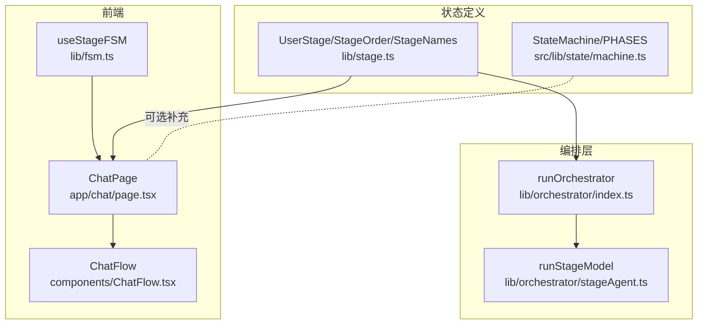
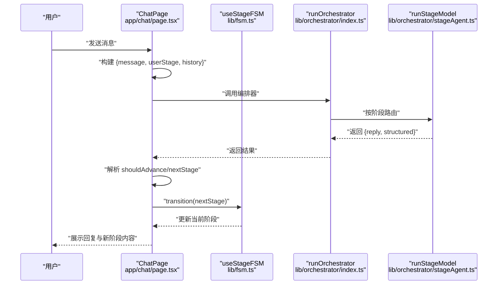
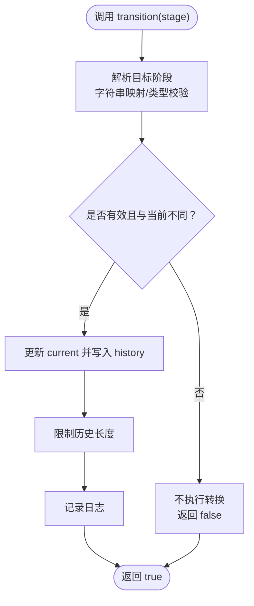
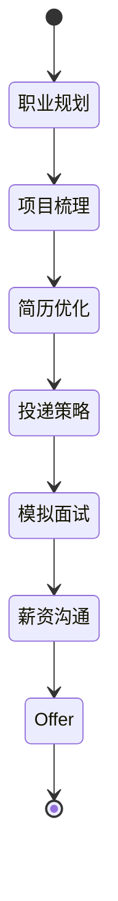
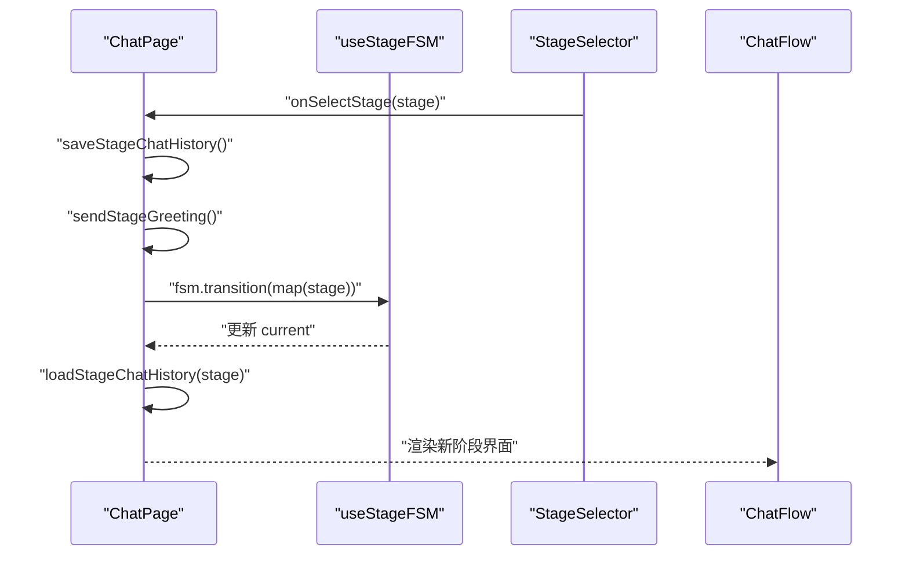
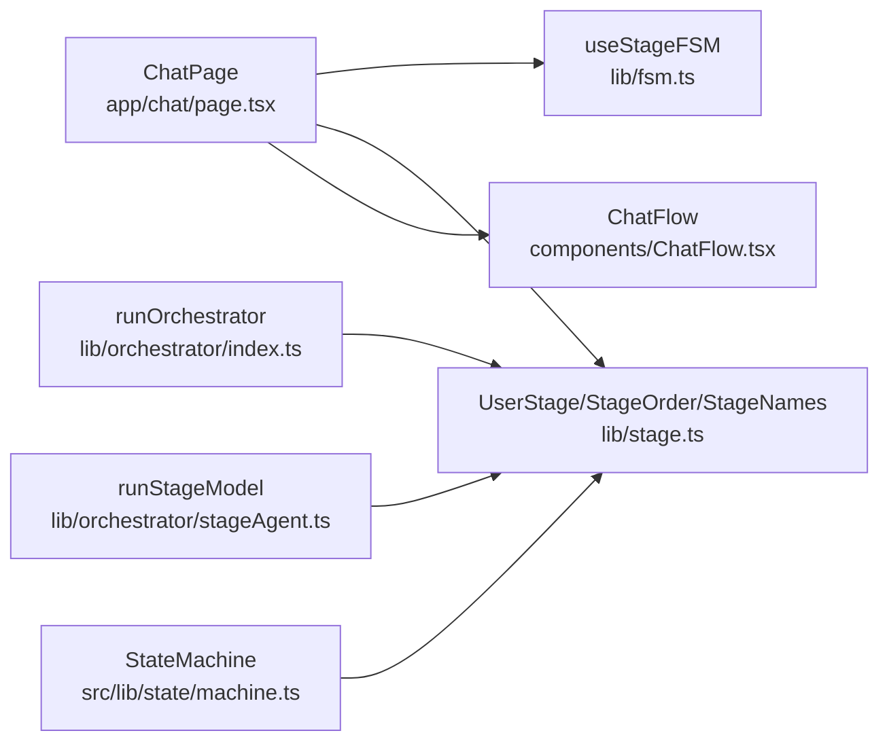

# AI交互状态机模型

<cite>
**本文引用的文件**
- [src/lib/state/machine.ts](file://src/lib/state/machine.ts)
- [src/lib/state/index.ts](file://src/lib/state/index.ts)
- [lib/fsm.ts](file://lib/fsm.ts)
- [lib/stage.ts](file://lib/stage.ts)
- [app/chat/page.tsx](file://app/chat/page.tsx)
- [components/ChatFlow.tsx](file://components/ChatFlow.tsx)
- [lib/orchestrator/stageAgent.ts](file://lib/orchestrator/stageAgent.ts)
- [lib/orchestrator/index.ts](file://lib/orchestrator/index.ts)
- [lib/stage_implementation.md](file://lib/stage_implementation.md)
- [lib/stage_selector_implementation.md](file://lib/stage_selector_implementation.md)
</cite>

## 目录
1. [简介](#简介)
2. [项目结构](#项目结构)
3. [核心组件](#核心组件)
4. [架构总览](#架构总览)
5. [详细组件分析](#详细组件分析)
6. [依赖关系分析](#依赖关系分析)
7. [性能考量](#性能考量)
8. [故障排查指南](#故障排查指南)
9. [结论](#结论)
10. [附录](#附录)

## 简介
本文件系统性阐述了本项目中“有限状态机（FSM）”在复杂AI交互流程中的核心作用，重点围绕以下目标展开：
- 解释状态节点（阶段）与转换边（阶段推进/回退）的建模方式；
- 如何通过状态迁移控制多轮对话的走向；
- 结合求职场景，将“职业规划→简历优化→模拟面试→薪资谈判”的阶段流转形式化为状态图；
- 分析该设计如何提升对话逻辑的可维护性与可扩展性；
- 提供实际状态配置示例，并说明前端状态机工厂函数的初始化流程。

## 项目结构
本项目在前后端分别实现了两类状态机：
- 前端React Hook状态机：lib/fsm.ts 提供 useStageFSM，用于UI层面的阶段切换与历史导航；
- 后端/库内状态机：src/lib/state/machine.ts 提供 StateMachine 类，用于统一管理求职阶段序列与边界规则。

此外，lib/stage.ts 定义了用户侧阶段枚举、顺序与中文名称，作为阶段流转的权威来源；app/chat/page.tsx 将前端状态机与聊天流程集成，形成完整的“阶段选择—对话—阶段推进”的闭环。



图表来源
- [lib/fsm.ts](file://lib/fsm.ts#L1-L125)
- [app/chat/page.tsx](file://app/chat/page.tsx#L1-L11)
- [lib/stage.ts](file://lib/stage.ts#L1-L85)
- [src/lib/state/machine.ts](file://src/lib/state/machine.ts#L1-L121)
- [lib/orchestrator/index.ts](file://lib/orchestrator/index.ts#L1-L126)
- [lib/orchestrator/stageAgent.ts](file://lib/orchestrator/stageAgent.ts#L1-L99)

章节来源
- [lib/fsm.ts](file://lib/fsm.ts#L1-L125)
- [lib/stage.ts](file://lib/stage.ts#L1-L85)
- [src/lib/state/machine.ts](file://src/lib/state/machine.ts#L1-L121)
- [app/chat/page.tsx](file://app/chat/page.tsx#L1-L11)

## 核心组件
- 前端阶段状态机（useStageFSM）
  - 提供 transition/back/getCurrent/getCurrentName/canGoBack 等方法，支持任意阶段前进/后退与历史记录管理。
  - 内置阶段名称映射与校验，保证输入合法性。
- 用户阶段定义（lib/stage.ts）
  - 定义 UserStage 枚举、阶段顺序、中文名称与描述，提供 getNextStage/getPrevStage/isValidStage 工具。
- 后端/库内状态机（src/lib/state/machine.ts）
  - 提供 StateMachine 类，支持 get/set/next/isFirst/isLast/getIndex 等能力，确保阶段序列与边界安全。
- 编排层（lib/orchestrator）
  - runOrchestrator/runStageModel 根据阶段路由到不同模型，当前以 passthrough 为主，便于后续替换为真实LLM链路。

章节来源
- [lib/fsm.ts](file://lib/fsm.ts#L1-L125)
- [lib/stage.ts](file://lib/stage.ts#L1-L85)
- [src/lib/state/machine.ts](file://src/lib/state/machine.ts#L1-L121)
- [lib/orchestrator/index.ts](file://lib/orchestrator/index.ts#L1-L126)
- [lib/orchestrator/stageAgent.ts](file://lib/orchestrator/stageAgent.ts#L1-L99)

## 架构总览
下图展示了从用户输入到阶段推进的端到端流程，以及状态机在其中的位置。



图表来源
- [app/chat/page.tsx](file://app/chat/page.tsx#L1-L11)
- [lib/fsm.ts](file://lib/fsm.ts#L1-L125)
- [lib/orchestrator/index.ts](file://lib/orchestrator/index.ts#L1-L126)
- [lib/orchestrator/stageAgent.ts](file://lib/orchestrator/stageAgent.ts#L1-L99)

## 详细组件分析

### 前端阶段状态机（useStageFSM）
- 设计要点
  - 使用 useState 管理 current 阶段与 useRef 维护 history，transition 支持字符串映射与任意前进/后退，back 支持回退到历史节点。
  - 通过 STAGE_ORDER 与 STAGE_NAMES 实现合法性校验与中文名称展示。
  - 使用 useMemo 稳定返回对象引用，减少不必要的重渲染。
- 关键行为
  - transition(stage): 校验并转换到目标阶段，更新历史，返回布尔值表示是否发生转换。
  - back(): 从历史弹栈并回退，返回布尔值表示是否成功回退。
  - getCurrent/getCurrentName/canGoBack: 提供查询接口。
- 与聊天流程集成
  - ChatPage 在用户选择阶段时，先保存当前阶段聊天记录，再调用 sendStageGreeting 初始化新阶段，随后通过 fsm.transition 同步更新前端状态机，并加载新阶段聊天记录。



图表来源
- [lib/fsm.ts](file://lib/fsm.ts#L30-L123)

章节来源
- [lib/fsm.ts](file://lib/fsm.ts#L1-L125)
- [app/chat/page.tsx](file://app/chat/page.tsx#L409-L448)

### 用户阶段定义（lib/stage.ts）
- 阶段枚举与顺序
  - UserStage 包含 career_planning、project_review、resume_optimization、application_strategy、interview、salary_talk、offer。
  - StageOrder 定义严格顺序，getNextStage/getPrevStage 提供顺序推进/回退工具。
- 名称与描述
  - StageNames 提供中文名称映射；StageDescriptions 用于AI prompt 注入阶段任务与引导原则。
- 与编排层配合
  - 编排器 runOrchestrator/runStageModel 依据 UserStage 路由到不同模型，当前以 passthrough 为主，便于后续替换。

```mermaid
classDiagram
class UserStage {
<<enum>>
"career_planning"
"project_review"
"resume_optimization"
"application_strategy"
"interview"
"salary_talk"
"offer"
}
class StageUtils {
+StageOrder : UserStage[]
+StageNames : Record<UserStage,string>
+StageDescriptions : Record<UserStage,string>
+getNextStage(current) : UserStage|null
+getPrevStage(current) : UserStage|null
+isValidStage(stage) : boolean
}
class Orchestrator {
+runOrchestrator(input) : OrchestratorResult
+runStageModel(stage, messages) : any
}
StageUtils <.. Orchestrator : "使用阶段枚举/顺序"
```

图表来源
- [lib/stage.ts](file://lib/stage.ts#L1-L85)
- [lib/orchestrator/index.ts](file://lib/orchestrator/index.ts#L1-L126)
- [lib/orchestrator/stageAgent.ts](file://lib/orchestrator/stageAgent.ts#L1-L99)

章节来源
- [lib/stage.ts](file://lib/stage.ts#L1-L85)
- [lib/orchestrator/index.ts](file://lib/orchestrator/index.ts#L1-L126)
- [lib/orchestrator/stageAgent.ts](file://lib/orchestrator/stageAgent.ts#L1-L99)

### 后端/库内状态机（StateMachine）
- 设计要点
  - PHASES 定义阶段序列，StateMachine 通过 Zod 枚举校验确保阶段名称合法。
  - 提供 getPhase/setPhase/next/isFirst/isLast/getCurrentPhaseIndex 等方法，支持顺序推进与边界保护。
- 适用场景
  - 适合需要强约束阶段顺序与边界控制的后端/库内逻辑；前端更推荐 useStageFSM 的灵活性。

```mermaid
classDiagram
class StateMachine {
-currentPhase : Phase
-phases : readonly Phase[]
+constructor(initialPhase)
+getPhase() : Phase
+setPhase(phaseName) : void
+next() : Phase
+getPhases() : readonly Phase[]
+isLastPhase() : boolean
+isFirstPhase() : boolean
+getCurrentPhaseIndex() : number
}
class Phase {
<<enum>>
"career_plan"
"project_review"
"resume_edit"
"interview"
"negotiation"
"offer"
}
StateMachine ..> Phase : "使用"
```

图表来源
- [src/lib/state/machine.ts](file://src/lib/state/machine.ts#L1-L121)

章节来源
- [src/lib/state/machine.ts](file://src/lib/state/machine.ts#L1-L121)

### 阶段流转与求职场景建模
- 阶段序列（用户视角）
  - career_planning → project_review → resume_optimization → application_strategy → interview → salary_talk → offer
- 前端FSM阶段序列（字符串映射）
  - career → project → resume → apply → interview → offer
- 状态图（形式化）
  - 节点：career、project、resume、apply、interview、offer
  - 边：按顺序单向前进；transition 支持任意跳转；back 支持回退
- 求职流程与状态机的契合
  - 通过阶段顺序与名称映射，将“职业规划→简历优化→模拟面试→薪资谈判”的现实流程形式化为状态图，使AI对话具备明确的推进方向与边界条件。



图表来源
- [lib/stage.ts](file://lib/stage.ts#L1-L85)
- [lib/fsm.ts](file://lib/fsm.ts#L1-L125)

章节来源
- [lib/stage.ts](file://lib/stage.ts#L1-L85)
- [lib/fsm.ts](file://lib/fsm.ts#L1-L125)

### 前端状态机工厂函数初始化流程
- 初始化入口
  - ChatPage 在客户端侧通过 useStageFSM("career") 初始化前端状态机，初始阶段为 career。
- 阶段切换流程
  - 用户在 StageSelector 选择阶段后，ChatPage 先保存当前阶段聊天记录，再调用 sendStageGreeting 初始化新阶段，随后通过 fsm.transition 将前端状态机同步到新阶段，并加载新阶段聊天记录。
- 历史管理
  - transition/back 会维护 history，限制长度并避免重复项，支持 UI 层的“返回上一步”体验。



图表来源
- [app/chat/page.tsx](file://app/chat/page.tsx#L409-L448)
- [lib/fsm.ts](file://lib/fsm.ts#L30-L123)
- [components/ChatFlow.tsx](file://components/ChatFlow.tsx#L1-L167)

章节来源
- [app/chat/page.tsx](file://app/chat/page.tsx#L1-L11)
- [app/chat/page.tsx](file://app/chat/page.tsx#L409-L448)
- [lib/fsm.ts](file://lib/fsm.ts#L1-L125)
- [components/ChatFlow.tsx](file://components/ChatFlow.tsx#L1-L167)

## 依赖关系分析
- 前端依赖
  - ChatPage 依赖 useStageFSM、UserStage/StageOrder/StageNames、StageDescriptions、StageSelector、ChatFlow 等。
  - ChatFlow 仅负责UI渲染，不参与状态逻辑。
- 编排层依赖
  - runOrchestrator/runStageModel 依赖 UserStage 枚举与顺序，当前以 passthrough 为主，便于后续替换为LangChain链路。
- 状态机依赖
  - StateMachine 与 PHASES 为库内独立组件，适合后端/库内强约束场景；前端更推荐 useStageFSM 的灵活性。



图表来源
- [app/chat/page.tsx](file://app/chat/page.tsx#L1-L11)
- [lib/fsm.ts](file://lib/fsm.ts#L1-L125)
- [lib/stage.ts](file://lib/stage.ts#L1-L85)
- [lib/orchestrator/index.ts](file://lib/orchestrator/index.ts#L1-L126)
- [lib/orchestrator/stageAgent.ts](file://lib/orchestrator/stageAgent.ts#L1-L99)
- [src/lib/state/machine.ts](file://src/lib/state/machine.ts#L1-L121)

章节来源
- [app/chat/page.tsx](file://app/chat/page.tsx#L1-L11)
- [lib/fsm.ts](file://lib/fsm.ts#L1-L125)
- [lib/stage.ts](file://lib/stage.ts#L1-L85)
- [lib/orchestrator/index.ts](file://lib/orchestrator/index.ts#L1-L126)
- [lib/orchestrator/stageAgent.ts](file://lib/orchestrator/stageAgent.ts#L1-L99)
- [src/lib/state/machine.ts](file://src/lib/state/machine.ts#L1-L121)

## 性能考量
- 前端状态机
  - 使用 useMemo 稳定返回对象引用，减少不必要的重渲染；history 限制长度避免内存膨胀。
- 编排层
  - 当前以 passthrough 为主，避免LLM调用开销；后续接入LangChain时，建议引入缓存与并发控制。
- UI渲染
  - ChatFlow 使用滚动锚点与条件渲染，避免大列表重绘；输入框自适应高度减少布局抖动。

[本节为通用指导，无需特定文件来源]

## 故障排查指南
- 阶段名称无效
  - useStageFSM 在 transition 中对目标阶段进行校验，若不在 STAGE_ORDER 内会返回 false 并输出警告日志；请检查传入字符串是否正确映射。
- 无法回退
  - back 仅当 history 长度大于1时才可回退；若返回 false，请确认是否已发生过阶段转换。
- 阶段推进异常
  - ChatPage 在解析 shouldAdvance/nextStage 后调用 fsm.transition；若推进未生效，请检查后端返回字段与映射逻辑。
- 历史记录过多
  - transition 会限制 history 长度；如发现内存占用上升，可适当降低限制或清理历史。

章节来源
- [lib/fsm.ts](file://lib/fsm.ts#L30-L123)
- [app/chat/page.tsx](file://app/chat/page.tsx#L409-L448)

## 结论
本项目通过“前端阶段状态机 + 用户阶段定义 + 编排层路由”的组合，将复杂的求职流程形式化为清晰的状态图与可维护的代码结构。前端 useStageFSM 提供灵活的阶段切换与历史导航，用户阶段定义确保阶段顺序与名称的一致性，编排层为后续接入LLM提供稳定扩展点。该设计在保障对话逻辑可维护性的同时，也为多轮交互的可控推进提供了坚实基础。

[本节为总结性内容，无需特定文件来源]

## 附录

### 实际状态配置示例（路径参考）
- 前端阶段映射与校验
  - 参考路径：[lib/fsm.ts](file://lib/fsm.ts#L30-L84)
- 用户阶段枚举与顺序
  - 参考路径：[lib/stage.ts](file://lib/stage.ts#L1-L85)
- 后端/库内状态机
  - 参考路径：[src/lib/state/machine.ts](file://src/lib/state/machine.ts#L1-L121)
- 前端状态机初始化
  - 参考路径：[app/chat/page.tsx](file://app/chat/page.tsx#L1-L11)

### 阶段推进与聊天流程文档
- 前端阶段推进与聊天历史
  - 参考路径：[lib/stage_implementation.md](file://lib/stage_implementation.md#L64-L244)
- 阶段选择与聊天历史存储
  - 参考路径：[lib/stage_selector_implementation.md](file://lib/stage_selector_implementation.md#L120-L201)