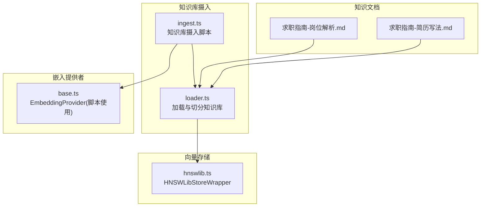
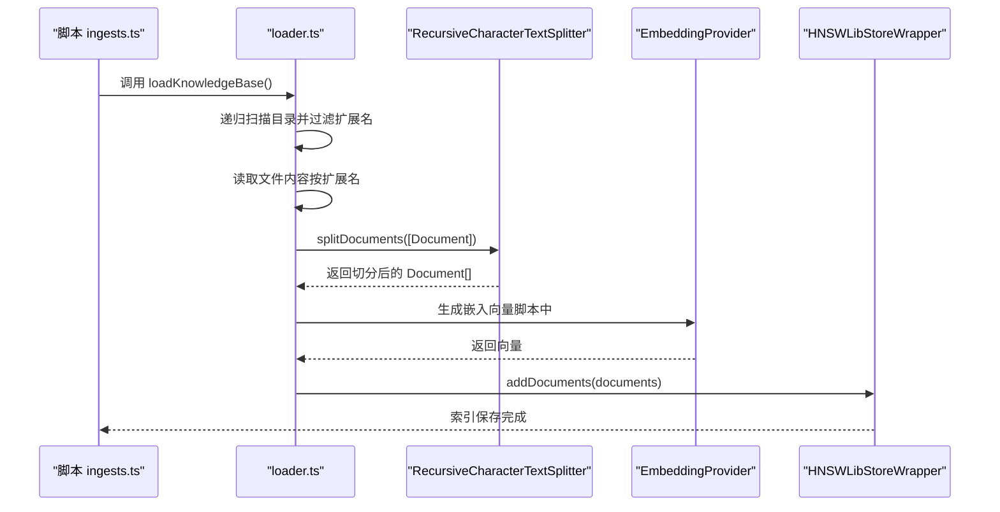
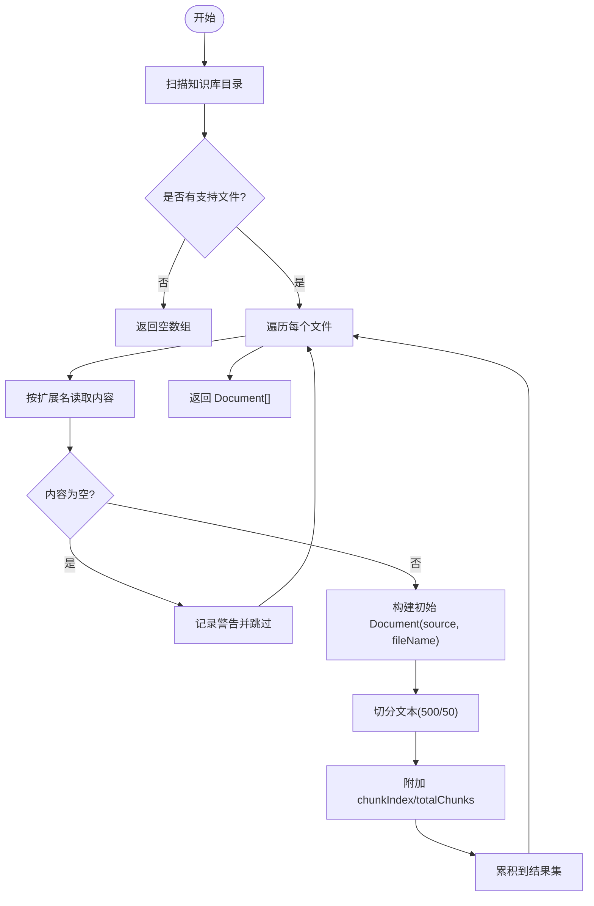
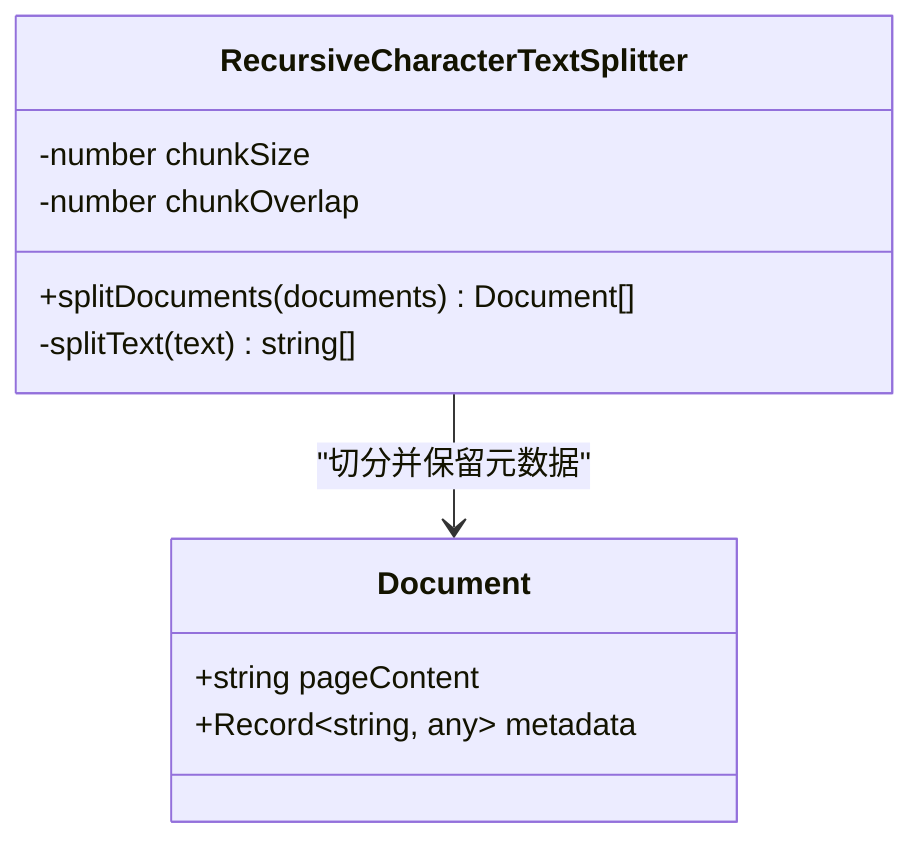
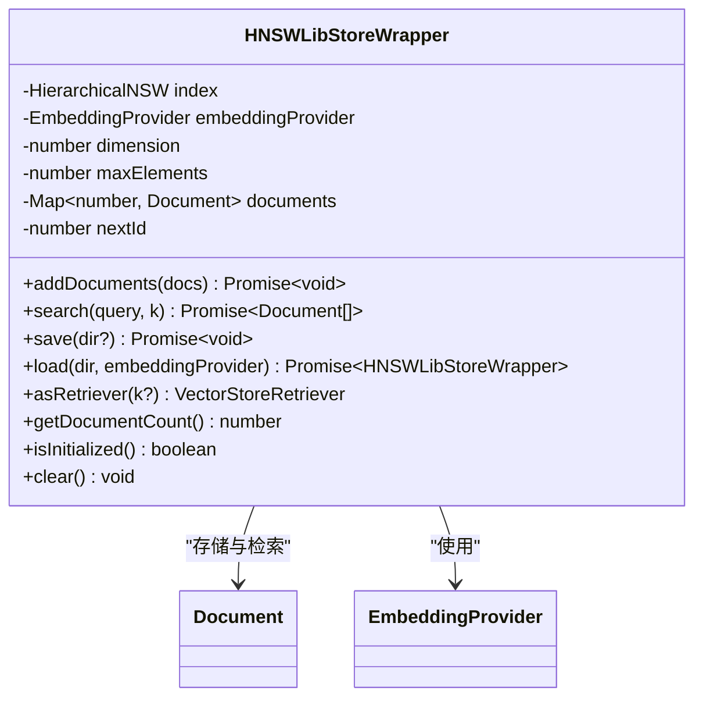
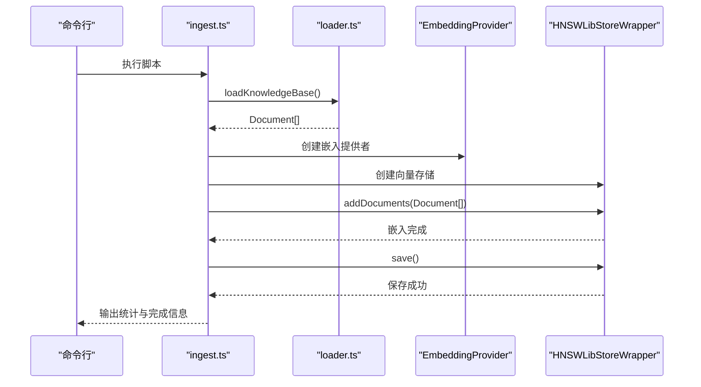
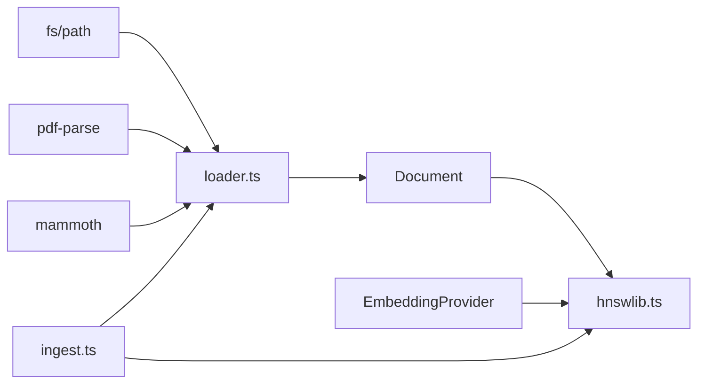

# RAG系统与知识库摄入

<cite>
**本文引用的文件**
- [loader.ts](file://src/lib/rag/loader.ts)
- [hnswlib.ts](file://src/lib/vectorstore/hnswlib.ts)
- [ingest.ts](file://scripts/ingest.ts)
- [base.ts](file://src/lib/embeddings/base.ts)
- [求职指南-岗位解析.md](file://src/lib/knowledge/base/求职指南-岗位解析.md)
- [求职指南-简历写法.md](file://src/lib/knowledge/base/求职指南-简历写法.md)
</cite>

## 目录
1. [简介](#简介)
2. [项目结构](#项目结构)
3. [核心组件](#核心组件)
4. [架构总览](#架构总览)
5. [组件详解](#组件详解)
6. [依赖关系分析](#依赖关系分析)
7. [性能考量](#性能考量)
8. [故障排查指南](#故障排查指南)
9. [结论](#结论)

## 简介
本文件深入解析 ai-job-coach 中 RAG（检索增强生成）系统的实现机制，重点围绕知识库摄入流程展开，涵盖以下方面：
- loader.ts 中 loadKnowledgeBase 函数如何递归扫描 src/lib/knowledge 目录，支持 .md/.txt/.pdf/.docx 多种格式文件的统一加载流程；
- 临时 Document 类与自定义 RecursiveCharacterTextSplitter 文本切分器的设计目的；
- chunkSize=500、chunkOverlap=50 的分块策略及其对检索精度的影响；
- 元数据（source、fileName、chunkIndex、totalChunks）在检索中的作用；
- 知识摄入全流程的实际代码示例路径与错误处理机制（空文件跳过、单文件异常不影响整体流程）。

## 项目结构
RAG 相关代码主要分布在如下位置：
- 知识库摄入与切分：src/lib/rag/loader.ts
- 向量存储与检索：src/lib/vectorstore/hnswlib.ts
- 嵌入提供者（脚本中使用）：src/lib/embeddings/base.ts
- 知识库脚本入口：scripts/ingest.ts
- 示例知识文档：src/lib/knowledge/base/*.md

图表来源
- [loader.ts](file://src/lib/rag/loader.ts#L145-L212)
- [hnswlib.ts](file://src/lib/vectorstore/hnswlib.ts#L107-L149)
- [ingest.ts](file://scripts/ingest.ts#L17-L71)
- [base.ts](file://src/lib/embeddings/base.ts#L17-L42)
- [求职指南-岗位解析.md](file://src/lib/knowledge/base/求职指南-岗位解析.md#L1-L203)
- [求职指南-简历写法.md](file://src/lib/knowledge/base/求职指南-简历写法.md#L1-L96)

章节来源
- [loader.ts](file://src/lib/rag/loader.ts#L145-L212)
- [hnswlib.ts](file://src/lib/vectorstore/hnswlib.ts#L107-L149)
- [ingest.ts](file://scripts/ingest.ts#L17-L71)

## 核心组件
- 临时 Document 类：用于兼容 LangChain 文档结构，承载 pageContent 与 metadata，贯穿加载、切分、嵌入与检索全过程。
- 自定义 RecursiveCharacterTextSplitter：实现按字符边界切分，支持 chunkSize 与 chunkOverlap 参数，确保上下文连贯性与检索粒度平衡。
- loadKnowledgeBase：递归扫描知识库目录，按扩展名选择读取器，读取内容后切分为固定大小的块，并为每个块附加元数据。
- HNSWLibStoreWrapper：封装 HNSW 检索与持久化，负责将文档嵌入向量并保存索引，提供检索接口。
- EmbeddingProvider：在脚本中使用，负责将文本嵌入为向量（当前实现为占位，仅在本地脚本中可用）。

章节来源
- [loader.ts](file://src/lib/rag/loader.ts#L9-L55)
- [loader.ts](file://src/lib/rag/loader.ts#L145-L212)
- [hnswlib.ts](file://src/lib/vectorstore/hnswlib.ts#L107-L149)
- [base.ts](file://src/lib/embeddings/base.ts#L17-L42)

## 架构总览
RAG 系统的摄入与检索链路如下：
- 摄入阶段：脚本读取知识库目录，加载各格式文件，切分为 chunks，生成 Document 列表；
- 嵌入阶段：对每个 chunk 执行嵌入，得到向量；
- 存储阶段：将向量与 Document 映射写入 HNSWLib 索引并持久化；
- 检索阶段：用户查询经嵌入后，使用 HNSWLib 检索相似文档，返回候选块。

图表来源
- [ingest.ts](file://scripts/ingest.ts#L17-L71)
- [loader.ts](file://src/lib/rag/loader.ts#L145-L212)
- [hnswlib.ts](file://src/lib/vectorstore/hnswlib.ts#L107-L149)
- [base.ts](file://src/lib/embeddings/base.ts#L17-L42)

## 组件详解

### 知识库加载与切分：loader.ts
- 递归扫描目录：getAllFiles 递归遍历目录，仅收集 .md/.txt/.pdf/.docx 文件，避免无关文件干扰。
- 多格式读取：readFileContent 根据扩展名选择对应读取器（文本、PDF、DOCX），统一返回字符串内容。
- 空文件处理：若内容为空或仅空白字符，记录警告并跳过该文件，保证整体流程不受影响。
- 初始 Document 构建：以相对路径 source 与文件名 fileName 作为元数据，便于后续溯源与统计。
- 文本切分：使用自定义 RecursiveCharacterTextSplitter，按 chunkSize=500、chunkOverlap=50 切分，保留元数据并追加 chunkIndex、totalChunks。
- 异常处理：单文件读取或切分异常被捕获并记录错误，继续处理下一个文件，保障整体健壮性。
- 返回值：Promise<Document[]>，供脚本进一步嵌入与入库。

图表来源
- [loader.ts](file://src/lib/rag/loader.ts#L63-L83)
- [loader.ts](file://src/lib/rag/loader.ts#L121-L135)
- [loader.ts](file://src/lib/rag/loader.ts#L171-L208)

章节来源
- [loader.ts](file://src/lib/rag/loader.ts#L63-L83)
- [loader.ts](file://src/lib/rag/loader.ts#L90-L114)
- [loader.ts](file://src/lib/rag/loader.ts#L121-L135)
- [loader.ts](file://src/lib/rag/loader.ts#L145-L212)

### 文本切分器：RecursiveCharacterTextSplitter
- 设计目的：替代 LangChain 的 TextSplitter，提供简单可靠的按字符边界切分能力，确保 chunkSize 与 chunkOverlap 参数可控。
- 切分策略：以 chunkSize 为窗口大小，按 chunkOverlap 偏移滑动，保证相邻块间有重叠，提升检索召回的上下文连贯性。
- 元数据保留：切分后复制初始 Document 的 metadata，便于检索后回溯来源与排序。

图表来源
- [loader.ts](file://src/lib/rag/loader.ts#L9-L18)
- [loader.ts](file://src/lib/rag/loader.ts#L21-L55)

章节来源
- [loader.ts](file://src/lib/rag/loader.ts#L21-L55)

### 向量存储与检索：HNSWLibStoreWrapper
- 嵌入与索引：addDocuments 接收 Document[]，提取 pageContent，调用 EmbeddingProvider 生成向量，使用 HNSWLib 写入索引并维护文档映射。
- 维度与容量：支持动态检测嵌入维度，必要时重建索引；maxElements 控制最大容量。
- 检索接口：search 接受查询文本，生成查询向量并在索引中检索 K 近邻，返回 Document[]。
- 持久化：save 将索引与元数据写入磁盘；load 从磁盘恢复索引与文档映射。
- 检索器适配：asRetriever 提供可调用的检索器对象，便于在链式调用中使用。

图表来源
- [hnswlib.ts](file://src/lib/vectorstore/hnswlib.ts#L40-L149)
- [hnswlib.ts](file://src/lib/vectorstore/hnswlib.ts#L157-L179)
- [hnswlib.ts](file://src/lib/vectorstore/hnswlib.ts#L181-L220)
- [hnswlib.ts](file://src/lib/vectorstore/hnswlib.ts#L222-L283)
- [hnswlib.ts](file://src/lib/vectorstore/hnswlib.ts#L285-L314)

章节来源
- [hnswlib.ts](file://src/lib/vectorstore/hnswlib.ts#L107-L149)
- [hnswlib.ts](file://src/lib/vectorstore/hnswlib.ts#L157-L179)
- [hnswlib.ts](file://src/lib/vectorstore/hnswlib.ts#L181-L220)
- [hnswlib.ts](file://src/lib/vectorstore/hnswlib.ts#L222-L283)
- [hnswlib.ts](file://src/lib/vectorstore/hnswlib.ts#L285-L314)

### 知识库摄入脚本：scripts/ingest.ts
- 入口流程：调用 loadKnowledgeBase 获取 Document[]，统计原始文档数与块数，创建 EmbeddingProvider 与 HNSWLibStoreWrapper，添加文档并保存索引。
- 错误处理：若未找到任何文档，输出错误并退出；捕获异常打印详细信息并退出进程，避免污染后续流程。

图表来源
- [ingest.ts](file://scripts/ingest.ts#L17-L71)
- [loader.ts](file://src/lib/rag/loader.ts#L145-L212)
- [hnswlib.ts](file://src/lib/vectorstore/hnswlib.ts#L107-L149)
- [base.ts](file://src/lib/embeddings/base.ts#L17-L42)

章节来源
- [ingest.ts](file://scripts/ingest.ts#L17-L71)

### 元数据在检索中的作用
- source：相对路径，用于溯源原始文件位置，便于审计与统计。
- fileName：文件名，用于统计原始文档数量与去重。
- chunkIndex：当前块在该文件中的序号，便于排序与回放。
- totalChunks：该文件被切分的总块数，用于后续排序或重排。

这些元数据在检索后可用于：
- 依据 fileName 去重，统计原始文档数量；
- 依据 chunkIndex/totalChunks 对候选块进行排序，优先返回更接近问题的上下文；
- 在 UI 展示时，提供来源链接或高亮显示。

章节来源
- [loader.ts](file://src/lib/rag/loader.ts#L182-L200)

### 分块策略：chunkSize=500、chunkOverlap=50
- 目的：在保证上下文连贯性的同时，控制块大小以提升检索效率与生成质量。
- 影响：
  - 较小块：召回更精确，但可能丢失上下文；适合细粒度问答。
  - 较大块：上下文更完整，但召回可能不够精准；适合综述类问题。
  - 重叠（50）：缓解跨块边界的信息断裂，提升检索召回的连续性。

章节来源
- [loader.ts](file://src/lib/rag/loader.ts#L163-L166)

### 错误处理机制
- 空文件跳过：若文件内容为空或仅空白字符，记录警告并跳过，不影响整体流程。
- 单文件异常：读取或切分异常被捕获并记录错误，继续处理下一个文件。
- 脚本级保护：未找到任何文档时输出错误并退出；捕获异常打印详细信息并退出进程，避免污染后续流程。

章节来源
- [loader.ts](file://src/lib/rag/loader.ts#L171-L208)
- [ingest.ts](file://scripts/ingest.ts#L23-L35)
- [ingest.ts](file://scripts/ingest.ts#L64-L71)

## 依赖关系分析
- loader.ts 依赖 fs/path 与第三方解析库（pdf-parse、mammoth），用于读取不同格式文件。
- loader.ts 与 hnswlib.ts 通过 Document 类耦合，Document 作为统一数据载体贯穿摄入与检索。
- ingest.ts 串联 loader.ts 与 hnswlib.ts，并在脚本中使用 EmbeddingProvider（当前实现为占位，仅用于本地脚本）。

图表来源
- [loader.ts](file://src/lib/rag/loader.ts#L1-L8)
- [loader.ts](file://src/lib/rag/loader.ts#L90-L114)
- [hnswlib.ts](file://src/lib/vectorstore/hnswlib.ts#L107-L149)
- [ingest.ts](file://scripts/ingest.ts#L17-L71)
- [base.ts](file://src/lib/embeddings/base.ts#L17-L42)

章节来源
- [loader.ts](file://src/lib/rag/loader.ts#L1-L8)
- [loader.ts](file://src/lib/rag/loader.ts#L90-L114)
- [hnswlib.ts](file://src/lib/vectorstore/hnswlib.ts#L107-L149)
- [ingest.ts](file://scripts/ingest.ts#L17-L71)
- [base.ts](file://src/lib/embeddings/base.ts#L17-L42)

## 性能考量
- 切分参数：chunkSize=500、chunkOverlap=50 在召回与上下文完整性之间取得平衡，适合中文问答场景。
- 嵌入维度：HNSWLibStoreWrapper 默认维度为 512（BAAI/bge-small-zh-v1.5），若维度变化会自动重建索引并清空已有文档映射。
- 索引容量：maxElements 控制最大元素数量，可根据知识库规模调整。
- I/O 与内存：批量嵌入与索引写入建议在本地脚本中执行，避免在生产环境阻塞请求。

章节来源
- [hnswlib.ts](file://src/lib/vectorstore/hnswlib.ts#L76-L78)
- [hnswlib.ts](file://src/lib/vectorstore/hnswlib.ts#L118-L136)

## 故障排查指南
- 知识库目录不存在：loadKnowledgeBase 会抛出错误并终止；请确认知识库目录路径正确。
- 未找到支持文件：返回空数组并记录警告；请检查扩展名是否为 .md/.txt/.pdf/.docx。
- 空文件跳过：记录警告并继续；请清理空文件或修正内容。
- 单文件异常：捕获错误并继续；请检查该文件格式与权限。
- 脚本失败：未找到文档或嵌入失败时会输出错误并退出；请查看详细错误信息与堆栈。

章节来源
- [loader.ts](file://src/lib/rag/loader.ts#L149-L160)
- [loader.ts](file://src/lib/rag/loader.ts#L171-L208)
- [ingest.ts](file://scripts/ingest.ts#L23-L35)
- [ingest.ts](file://scripts/ingest.ts#L64-L71)

## 结论
本系统通过自定义的 Document 与 RecursiveCharacterTextSplitter，实现了对多格式知识库的统一加载与切分；借助 HNSWLibStoreWrapper 完成向量嵌入与检索；脚本 ingest.ts 将上述流程自动化，保障了知识库摄入的健壮性与可维护性。chunkSize=500、chunkOverlap=50 的分块策略在召回与上下文完整性之间取得良好平衡，配合元数据（source、fileName、chunkIndex、totalChunks）为后续检索与展示提供了坚实基础。