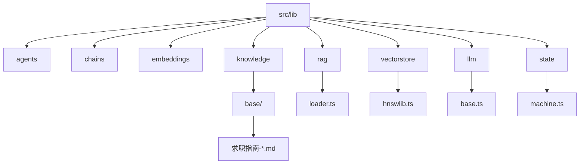
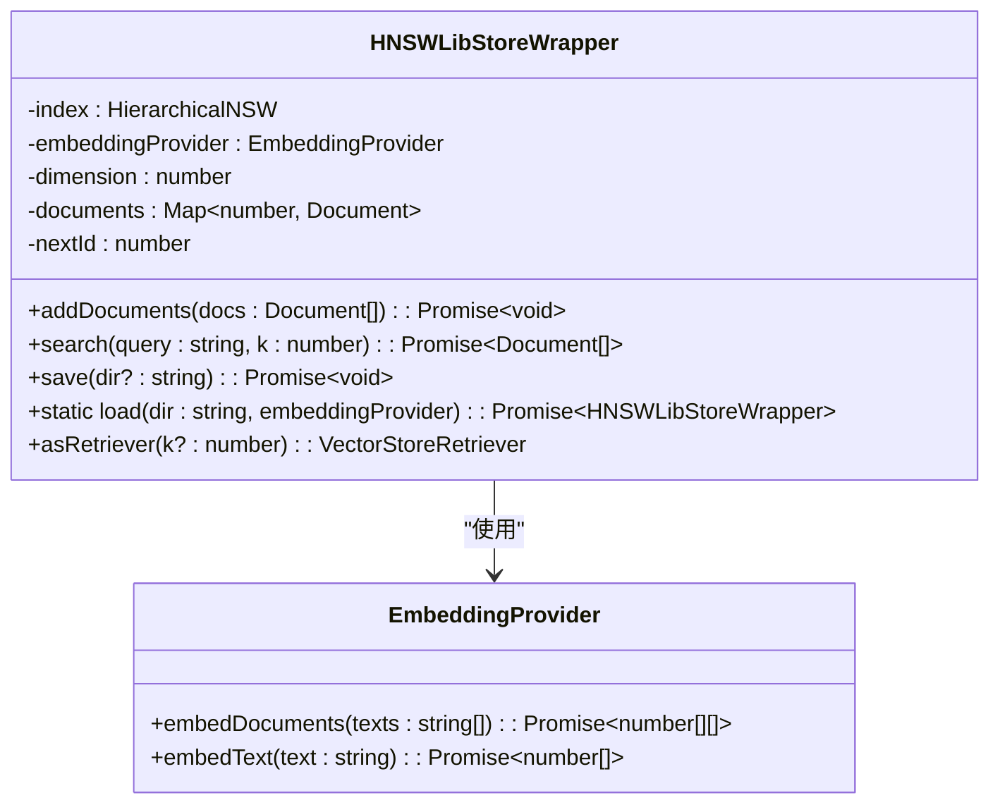
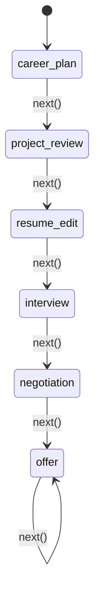
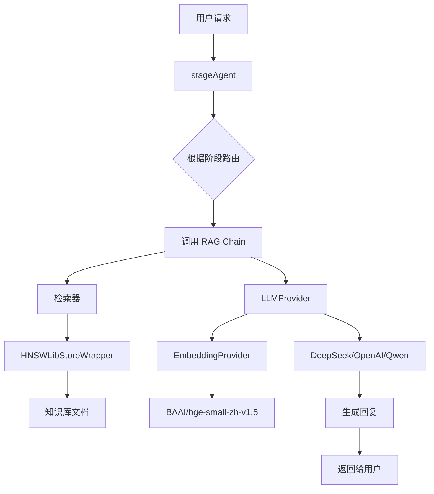

# src/lib 目录详解

<cite>
**本文档引用的文件**  
- [loader.ts](file://src/lib/rag/loader.ts)
- [hnswlib.ts](file://src/lib/vectorstore/hnswlib.ts)
- [求职指南-岗位解析.md](file://src/lib/knowledge/base/求职指南-岗位解析.md)
- [base.ts](file://src/lib/llm/base.ts)
- [machine.ts](file://src/lib/state/machine.ts)
- [stageAgent.ts](file://lib/orchestrator/stageAgent.ts)
- [ingest.ts](file://scripts/ingest.ts)
- [README.md](file://src/lib/README.md)
- [vectorstore/README.md](file://src/lib/vectorstore/README.md)
</cite>

## 目录

1. [项目结构](#项目结构)  
2. [RAG 数据摄入流程](#rag-数据摄入流程)  
3. [向量存储适配器设计](#向量存储适配器设计)  
4. [知识库文档组织结构](#知识库文档组织结构)  
5. [大模型 API 抽象封装](#大模型-api-抽象封装)  
6. [状态机模型与交互流程](#状态机模型与交互流程)  
7. [模块协同机制](#模块协同机制)  
8. [总结](#总结)

## 项目结构

src/lib 目录是 AI 能力的核心支撑模块，采用模块化设计，各子模块职责清晰，协同工作。其主要结构如下：

**Diagram sources**  
- [README.md](file://src/lib/README.md)

**Section sources**  
- [README.md](file://src/lib/README.md)

## RAG 数据摄入流程

`rag/loader.ts` 模块实现了知识库数据的摄入流程，负责将本地文档加载、解析并切分为适合向量化处理的文本块。

该流程的核心步骤如下：
1. **递归扫描**：从 `src/lib/knowledge` 目录开始，递归扫描所有子目录，收集 `.md`、`.txt`、`.pdf`、`.docx` 格式的文件。
2. **格式解析**：根据文件扩展名，使用不同的库进行内容提取：
   - Markdown/Text：直接读取 UTF-8 编码文本。
   - PDF：使用 `pdf-parse` 库提取文本内容。
   - DOCX：使用 `mammoth` 库提取原始文本。
3. **文档切分**：使用 `RecursiveCharacterTextSplitter` 将每个文档切分为固定大小的块（chunk），默认 `chunkSize=500`，`chunkOverlap=50`，以保证上下文的连续性。
4. **元数据注入**：为每个文本块注入元数据，包括源文件路径（`source`）、文件名（`fileName`）、块索引（`chunkIndex`）和总块数（`totalChunks`），便于后续溯源。

此流程通过 `loadKnowledgeBase()` 函数对外提供服务，返回一个 `Document[]` 数组，作为后续向量化处理的输入。

**Section sources**  
- [loader.ts](file://src/lib/rag/loader.ts)
- [README.md](file://src/lib/README.md)

## 向量存储适配器设计

`vectorstore/hnswlib.ts` 模块实现了基于 `hnswlib-node` 的向量存储适配器 `HNSWLibStoreWrapper`，用于替代传统的 FAISS，以适应 Vercel 等 Serverless 环境。

其设计原理和关键特性如下：

### 核心功能
- **向量索引**：使用 HNSW（Hierarchical Navigable Small World）算法构建高效的近似最近邻（ANN）索引，支持快速的相似性搜索。
- **文档映射**：在内存中维护一个 `Map<number, Document>`，将 HNSW 分配的 ID 与原始 `Document` 对象进行映射，确保搜索结果能还原为完整的文档对象。
- **持久化存储**：提供 `save()` 和 `load()` 方法，将索引和元数据分别保存为 `index.bin` 和 `meta.json` 文件，实现索引的持久化。

### 设计亮点
- **维度自适应**：在首次添加文档时自动检测嵌入向量的维度（如 BAAI/bge-small-zh-v1.5 的 512 维），无需手动配置。
- **兼容 LangChain**：通过 `asRetriever()` 方法，生成一个符合 `VectorStoreRetriever` 接口的检索器，可无缝集成到 LangChain 的 RAG 链中。
- **生产环境适配**：通过 `process.env.NODE_ENV` 区分开发和生产环境，使用不同的索引存储路径。

**Diagram sources**  
- [hnswlib.ts](file://src/lib/vectorstore/hnswlib.ts)

**Section sources**  
- [hnswlib.ts](file://src/lib/vectorstore/hnswlib.ts)
- [vectorstore/README.md](file://src/lib/vectorstore/README.md)

## 知识库文档组织结构

`knowledge/` 目录是知识库的物理存储位置，存放了所有用于 RAG 的 Markdown 文档。

### 文档组织
- **目录结构**：文档统一存放在 `src/lib/knowledge/base/` 目录下。
- **命名规范**：所有文档以 `求职指南-` 为前缀，后接具体主题，如 `求职指南-岗位解析.md`、`求职指南-简历写法.md` 等，结构清晰，易于维护。
- **内容格式**：采用纯 Markdown 格式，内容以 `#` 标题划分不同岗位或主题，使用 `---` 分隔符进行视觉分隔。

### 加载机制
`loader.ts` 模块通过 `getAllFiles()` 函数递归读取 `knowledge/` 目录下的所有支持格式的文件，并通过 `readFileContent()` 统一调度不同格式的解析器。最终，所有文档被加载为 `Document` 对象，并通过 `loadKnowledgeBase()` 函数暴露给外部使用。

**Section sources**  
- [knowledge/base/求职指南-岗位解析.md](file://src/lib/knowledge/base/求职指南-岗位解析.md)
- [loader.ts](file://src/lib/rag/loader.ts)
- [README.md](file://src/lib/README.md)

## 大模型 API 抽象封装

`llm/base.ts` 模块通过 `LLMProvider` 类对大模型 API 进行了统一的抽象封装，支持 `deepseek`、`openai`、`qwen` 三种模型提供商。

### 封装方式
- **统一接口**：提供 `call()`（非流式调用）和 `stream()`（流式调用）两个核心方法，屏蔽了不同提供商的 API 差异。
- **配置驱动**：通过环境变量 `LLM_MODEL_TYPE` 动态选择模型类型，支持运行时切换。
- **回退机制**：优先尝试使用 LangChain 的包装器（如 `ChatOpenAI`），若失败则回退到原生的 OpenAI SDK，保证了兼容性和健壮性。
- **多功能支持**：除了文本生成，还提供了 `embed()` 方法用于生成嵌入向量，`structured()` 方法用于结构化输出。

### 调用流程
1. **初始化**：`LLMProvider` 构造函数根据 `modelType` 初始化相应的客户端。
2. **参数处理**：`formatMessages()` 方法将输入的 `LLMCallParams` 转换为标准的 OpenAI 消息格式。
3. **调用执行**：`call()` 方法首先尝试使用 LangChain 模型（若存在且 `temperature` 为默认值），失败后使用 OpenAI SDK 直接调用。

这种设计实现了对底层 LLM 服务的解耦，使上层应用无需关心具体的服务提供商。

**Section sources**  
- [base.ts](file://src/lib/llm/base.ts)
- [README.md](file://src/lib/README.md)

## 状态机模型与交互流程

`state/machine.ts` 模块定义了 `StateMachine` 类，用于管理求职流程的复杂状态流转。

### 状态模型
- **状态定义**：使用 `PHASES` 常量数组定义了六个有序阶段：`career_plan`（职业规划）、`project_review`（项目梳理）、`resume_edit`（简历优化）、`interview`（面试辅导）、`negotiation`（薪资谈判）、`offer`（Offer 总结）。
- **状态验证**：利用 `zod` 库的 `enum` 校验器，确保 `setPhase()` 方法只能设置预定义的合法状态，防止非法状态注入。

### 流程控制
- **顺序流转**：`next()` 方法根据 `PHASES` 数组的顺序，将当前阶段推进到下一阶段。当处于最后一个阶段时，`next()` 不会改变状态。
- **状态查询**：提供 `getPhase()`、`isFirstPhase()`、`isLastPhase()` 等方法，方便外部组件查询当前状态。

该状态机通过单例模式导出 `stateMachine` 实例，确保了全局状态的一致性，为复杂的 AI 交互流程提供了可靠的控制基础。

**Diagram sources**  
- [machine.ts](file://src/lib/state/machine.ts)

**Section sources**  
- [machine.ts](file://src/lib/state/machine.ts)
- [README.md](file://src/lib/README.md)

## 模块协同机制

`src/lib` 目录下的各模块通过 `lib/orchestrator` 目录中的 `stageAgent.ts` 进行协同，体现了清晰的 AI 模块化设计思想。

### 协同流程
1. **状态驱动**：`stageAgent.ts` 中的 `runStageModel()` 函数接收当前用户阶段（`stage`）和对话历史（`messages`）。
2. **路由分发**：根据 `stage` 参数，该函数本应路由到 `orchestrator/models/` 下对应的模型（如 `runDeepSeekCareer`），但由于 LangChain 已禁用，目前为占位实现。
3. **RAG 调用**：在完整的实现中，`stageAgent` 会调用 `chains/rag` 模块创建的 RAG Chain。该 Chain 会：
   - 使用 `vectorstore` 模块的 `HNSWLibStoreWrapper` 作为检索器。
   - 从 `knowledge/` 加载的文档中检索与用户问题相关的上下文。
   - 将检索到的上下文与用户问题一起，通过 `llm` 模块调用大模型，生成增强的回复。

### 模块化设计思想
- **职责分离**：每个模块只负责一个核心功能（如 `rag` 负责数据加载，`vectorstore` 负责向量检索）。
- **接口清晰**：模块间通过明确定义的函数和类进行交互，如 `loadKnowledgeBase()`、`asRetriever()`。
- **可替换性**：`llm` 模块的多提供商支持和 `vectorstore` 模块的 HNSWLib 替代方案，都体现了良好的可替换性。
- **可测试性**：`scripts/ingest.ts` 脚本独立运行，用于构建和更新向量数据库，不依赖主应用，便于维护。

**Diagram sources**  
- [stageAgent.ts](file://lib/orchestrator/stageAgent.ts)
- [ingest.ts](file://scripts/ingest.ts)

**Section sources**  
- [stageAgent.ts](file://lib/orchestrator/stageAgent.ts)
- [ingest.ts](file://scripts/ingest.ts)
- [README.md](file://src/lib/README.md)

## 总结

`src/lib` 目录构建了一个功能完整、架构清晰的 AI 底层支撑系统。它通过 `rag/loader.ts` 实现了多格式知识库的摄入，利用 `vectorstore/hnswlib.ts` 提供了高性能的向量检索能力，结合 `llm/base.ts` 的大模型抽象层，形成了强大的 RAG 能力。`state/machine.ts` 定义的状态机为复杂的求职辅导流程提供了精确的控制。整个系统通过模块化设计，实现了高内聚、低耦合，展现了良好的可维护性和可扩展性。