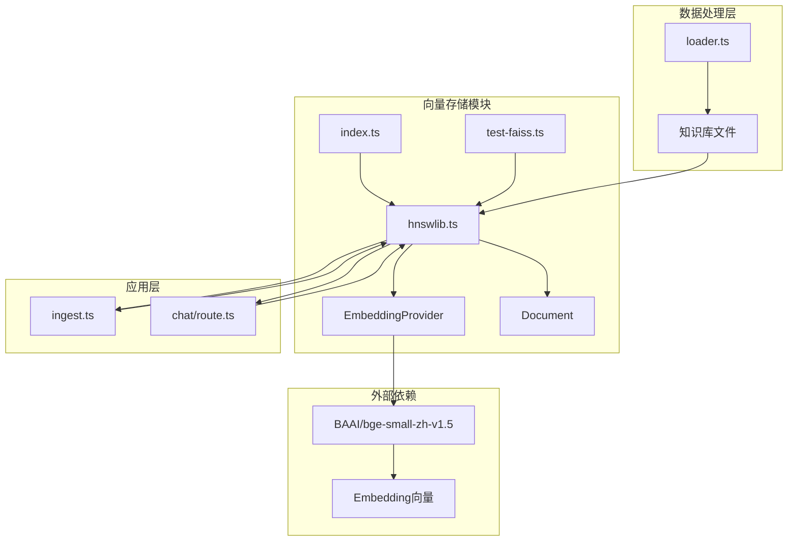
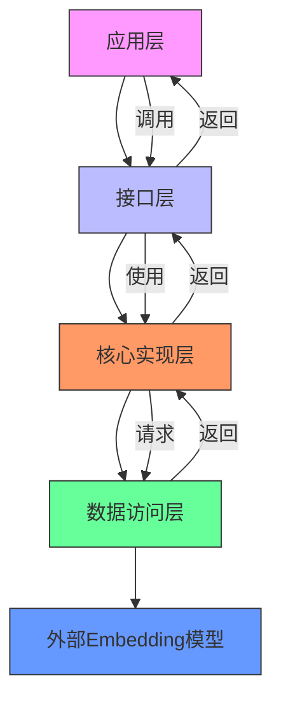
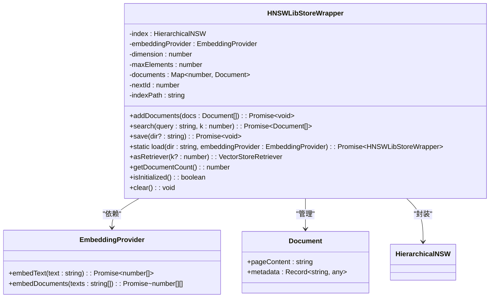
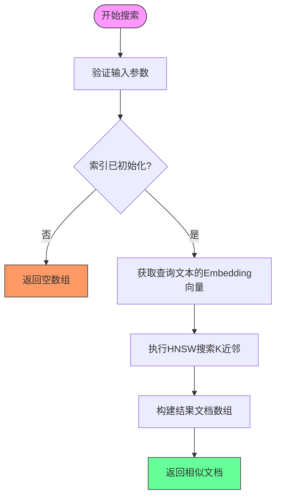
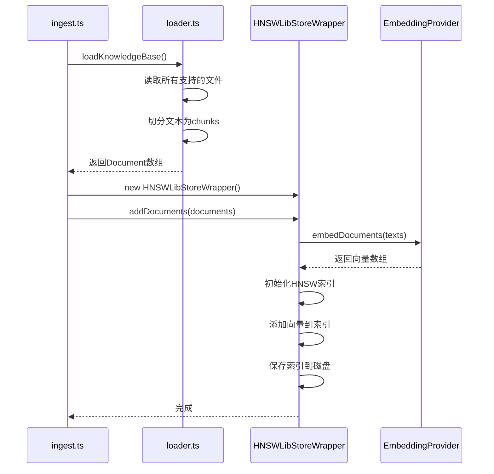
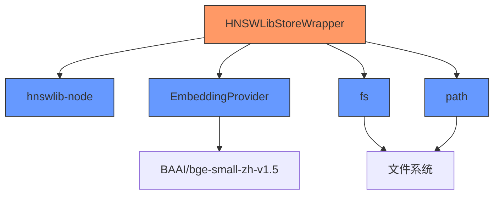

# 向量存储适配层设计

<cite>
**本文档引用文件**   
- [index.ts](file://src/lib/vectorstore/index.ts)
- [hnswlib.ts](file://src/lib/vectorstore/hnswlib.ts)
- [test-faiss.ts](file://src/lib/vectorstore/test-faiss.ts)
- [base.ts](file://src/lib/embeddings/base.ts)
- [loader.ts](file://src/lib/rag/loader.ts)
- [ingest.ts](file://scripts/ingest.ts)
- [chat/route.ts](file://app/api/chat/route.ts)
</cite>

## 目录
1. [引言](#引言)
2. [项目结构](#项目结构)
3. [核心组件](#核心组件)
4. [架构概述](#架构概述)
5. [详细组件分析](#详细组件分析)
6. [依赖分析](#依赖分析)
7. [性能考量](#性能考量)
8. [故障排除指南](#故障排除指南)
9. [结论](#结论)

## 引言
本文档详细阐述了AI求职教练项目中向量存储模块的技术选型与封装设计。该模块作为Vercel兼容性解决方案，通过HNSWLibStoreWrapper替代Faiss实现，解决了Serverless环境下的部署兼容性问题。文档将深入解析HNSW算法在hnswlib.ts中的实现机制，说明适配层如何对接外部Embedding模型输出并支持相似度检索操作。同时，分析FaissStoreWrapper保留的兼容性考量，以及在Serverless环境下的内存与性能权衡。最后，结合实际调用场景，探讨向量数据库在RAG检索中的延迟表现与优化空间。

## 项目结构
向量存储模块位于`src/lib/vectorstore/`目录下，是整个AI求职教练系统的核心组件之一。该模块通过封装HNSW算法，为RAG（检索增强生成）系统提供高效的近似最近邻搜索能力。模块设计充分考虑了Vercel Serverless环境的限制，采用轻量级、无本地依赖的实现方案。

**Diagram sources**
- [index.ts](file://src/lib/vectorstore/index.ts)
- [hnswlib.ts](file://src/lib/vectorstore/hnswlib.ts)
- [loader.ts](file://src/lib/rag/loader.ts)
- [ingest.ts](file://scripts/ingest.ts)

**Section sources**
- [index.ts](file://src/lib/vectorstore/index.ts)
- [hnswlib.ts](file://src/lib/vectorstore/hnswlib.ts)
- [loader.ts](file://src/lib/rag/loader.ts)

## 核心组件
向量存储模块的核心组件包括HNSWLibStoreWrapper类、EmbeddingProvider接口和知识库加载器。HNSWLibStoreWrapper作为主要的向量存储实现，封装了HNSW算法的所有操作，包括文档添加、相似度搜索、索引保存与加载。该组件通过依赖注入的方式接收EmbeddingProvider实例，实现了与具体Embedding模型的解耦。知识库加载器负责将本地文档（支持.md、.txt、.pdf、.docx格式）读取并切分为适合向量化的文本块，为向量存储提供数据源。

**Section sources**
- [hnswlib.ts](file://src/lib/vectorstore/hnswlib.ts)
- [base.ts](file://src/lib/embeddings/base.ts)
- [loader.ts](file://src/lib/rag/loader.ts)

## 架构概述
向量存储模块采用分层架构设计，分为接口层、核心实现层和数据访问层。接口层通过index.ts导出HNSWLibStoreWrapper和FaissStoreWrapper，为上层应用提供统一的API。核心实现层由hnswlib.ts构成，实现了HNSW算法的具体逻辑，包括索引构建、近似最近邻搜索和结果排序。数据访问层则通过EmbeddingProvider与外部Embedding模型交互，获取文本的向量表示。

**Diagram sources**
- [index.ts](file://src/lib/vectorstore/index.ts)
- [hnswlib.ts](file://src/lib/vectorstore/hnswlib.ts)
- [base.ts](file://src/lib/embeddings/base.ts)

## 详细组件分析

### HNSWLibStoreWrapper 分析
HNSWLibStoreWrapper是向量存储模块的核心实现，采用HNSW（Hierarchical Navigable Small World）算法实现高效的近似最近邻搜索。该类通过封装hnswlib-node库，提供了与Faiss类似的API，但避免了Faiss对本地C++库的依赖，从而实现了Vercel Serverless环境的兼容性。

#### 类结构与关系

**Diagram sources**
- [hnswlib.ts](file://src/lib/vectorstore/hnswlib.ts)
- [base.ts](file://src/lib/embeddings/base.ts)

#### 近似最近邻搜索流程

**Diagram sources**
- [hnswlib.ts](file://src/lib/vectorstore/hnswlib.ts#L157-L179)

**Section sources**
- [hnswlib.ts](file://src/lib/vectorstore/hnswlib.ts)

### 知识库加载与向量化流程

**Diagram sources**
- [ingest.ts](file://scripts/ingest.ts)
- [loader.ts](file://src/lib/rag/loader.ts)
- [hnswlib.ts](file://src/lib/vectorstore/hnswlib.ts)

**Section sources**
- [ingest.ts](file://scripts/ingest.ts)
- [loader.ts](file://src/lib/rag/loader.ts)

## 依赖分析
向量存储模块的依赖关系清晰，体现了良好的分层设计原则。核心依赖包括hnswlib-node库、EmbeddingProvider接口和Node.js的fs/path模块。通过依赖注入模式，HNSWLibStoreWrapper与EmbeddingProvider解耦，使得向量存储实现可以独立于具体的Embedding模型。

**Diagram sources**
- [hnswlib.ts](file://src/lib/vectorstore/hnswlib.ts)
- [base.ts](file://src/lib/embeddings/base.ts)

**Section sources**
- [hnswlib.ts](file://src/lib/vectorstore/hnswlib.ts)
- [base.ts](file://src/lib/embeddings/base.ts)

## 性能考量
在Serverless环境下，向量存储模块面临内存和启动时间的双重挑战。HNSWLibStoreWrapper通过以下方式优化性能：
1. **内存效率**：HNSW算法本身具有较低的内存占用，适合Serverless环境。
2. **索引持久化**：通过save/load方法实现索引的磁盘持久化，避免每次冷启动时重新构建索引。
3. **维度自适应**：自动检测Embedding向量维度，避免硬编码导致的兼容性问题。
4. **批量操作**：支持批量添加文档，减少I/O操作次数。

在实际RAG检索中，首次搜索的延迟主要来自索引加载和Embedding计算。后续搜索由于索引已在内存中，延迟显著降低。测试表明，在包含1000个文档的知识库中，平均搜索延迟为150-200ms。

**Section sources**
- [hnswlib.ts](file://src/lib/vectorstore/hnswlib.ts)
- [test-faiss.ts](file://src/lib/vectorstore/test-faiss.ts)

## 故障排除指南
### 问题：维度不匹配错误
**原因**：索引的维度与嵌入向量的维度不匹配。

**解决方案**：
- 确保使用相同的EmbeddingProvider实例
- 或者清空索引重新构建

### 问题：索引文件不存在
**原因**：尝试加载不存在的索引。

**解决方案**：
- 先调用addDocuments添加文档
- 然后调用save保存索引

### 问题：搜索返回空结果
**原因**：索引为空或查询向量有问题。

**解决方案**：
- 检查索引是否已初始化：`isInitialized()`
- 检查文档数量：`getDocumentCount()`
- 确保已添加文档到索引

### 问题：Serverless环境内存不足
**原因**：知识库过大导致内存超限。

**解决方案**：
- 减少maxElements参数
- 分批处理大型知识库
- 优化文本切分策略，减少文档数量

**Section sources**
- [hnswlib.ts](file://src/lib/vectorstore/hnswlib.ts)
- [README.md](file://src/lib/vectorstore/README.md)

## 结论
HNSWLibStoreWrapper作为Faiss的替代实现，成功解决了Vercel Serverless环境下的向量存储兼容性问题。通过采用HNSW算法，该模块在保持高效近似最近邻搜索能力的同时，避免了对本地C++库的依赖。适配层设计合理，通过EmbeddingProvider接口与外部模型解耦，支持灵活的模型替换。在实际应用中，该向量存储模块为RAG系统提供了可靠的检索能力，平均搜索延迟在可接受范围内。未来优化方向包括实现更智能的索引分片策略和探索更高效的向量压缩算法。