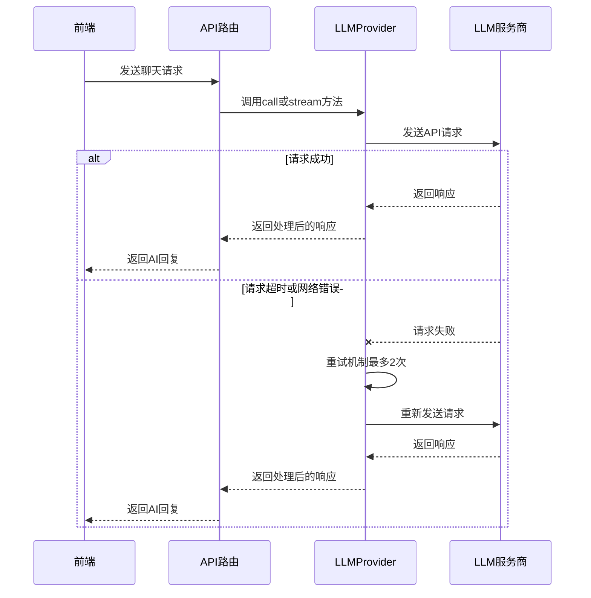

# 大模型API抽象层

<cite>
**本文档引用文件**   
- [base.ts](file://src/lib/llm/base.ts)
- [index.ts](file://src/lib/llm/index.ts)
- [llm.ts](file://lib/llm.ts)
- [chat/route.ts](file://app/api/chat/route.ts)
- [interview/llm.ts](file://lib/interview/llm.ts)
</cite>

## 目录
1. [引言](#引言)
2. [核心抽象机制](#核心抽象机制)
3. [请求参数标准化与响应归一化](#请求参数标准化与响应归一化)
4. [健壮性设计](#健壮性设计)
5. [多模型切换策略](#多模型切换策略)
6. [前端调用示例](#前端调用示例)
7. [结论](#结论)

## 引言

本项目通过 `LLMProvider` 类实现了对大语言模型服务的统一抽象，旨在为 OpenAI、DeepSeek 和 Qwen 等不同提供商的 API 提供一致的调用接口。该抽象层不仅封装了底层 API 的差异，还提供了流式响应处理、错误重试、请求超时等关键健壮性功能，确保了在复杂网络环境下的稳定运行。通过环境变量配置，系统能够灵活切换底层 LLM 引擎，为开发者提供了极大的便利性和可扩展性。

## 核心抽象机制

`LLMProvider` 类是整个抽象层的核心，它通过统一的接口封装了不同 LLM 提供商的 API 调用。该类支持三种模型类型：DeepSeek、OpenAI 和 Qwen，通过环境变量 `LLM_MODEL_TYPE` 进行配置，若未指定则默认使用 DeepSeek。类的构造函数会根据配置初始化相应的客户端，并优先尝试使用 LangChain 包装器，若失败则回退到 OpenAI SDK 兼容模式。

```mermaid
classDiagram
class LLMProvider {
-modelType : ModelType
-client : OpenAI | null
-langchainModel : BaseChatModel | null
+constructor(modelType? : ModelType)
-initializeClient() : void
-createLangChainModel() : BaseChatModel | null
-createOpenAIClient() : OpenAI
-getModelName() : string
-formatMessages(params : LLMCallParams) : Array<{role : string, content : string}>
+call(params : LLMCallParams) : Promise<string>
+stream(params : LLMCallParams) : AsyncGenerator<StreamChunk, void, unknown>
+embed(text : string | string[]) : Promise<number[][]>
+getLangChainModel() : BaseChatModel | null
+getModelType() : ModelType
}
class LLMCallParams {
+system? : string
+messages : Array<{role : string, content : string}>
+temperature? : number
+tools? : any[]
+maxTokens? : number
}
class StreamChunk {
+content : string
+done : boolean
}
LLMProvider --> LLMCallParams : "使用"
LLMProvider --> StreamChunk : "返回"
```

**图表来源**
- [base.ts](file://src/lib/llm/base.ts#L41-L387)

**本节来源**
- [base.ts](file://src/lib/llm/base.ts#L41-L387)

## 请求参数标准化与响应归一化

`LLMProvider` 类通过 `LLMCallParams` 接口定义了统一的请求参数，包括 `system` 消息、`messages` 消息数组、`temperature`、`tools` 和 `maxTokens`。这些参数在调用不同 LLM 提供商时会被标准化处理，确保了一致的调用方式。例如，`temperature` 参数在创建 LangChain 模型时设置，而在使用 OpenAI SDK 时则在调用时动态传递。

响应归一化方面，`call` 方法返回一个 Promise，解析为字符串形式的 AI 回复，而 `stream` 方法返回一个异步生成器，产生 `StreamChunk` 对象，包含 `content` 和 `done` 属性，用于流式处理响应。这种设计使得前端可以无缝处理不同 LLM 提供商的响应，无需关心底层实现细节。

**本节来源**
- [base.ts](file://src/lib/llm/base.ts#L18-L35)
- [base.ts](file://src/lib/llm/base.ts#L221-L336)

## 健壮性设计

为了确保在复杂网络环境下的稳定运行，`LLMProvider` 类实现了多种健壮性设计。首先，通过 `callWithTimeoutAndRetry` 函数实现了带超时和重试的 LLM 调用包装器，该函数在请求超时或网络错误时自动重试，最多重试两次。其次，`callLLM` 函数在调用 LLM API 时设置了合理的超时时间，并在请求失败时提供了详细的错误处理，如 API 配额不足、API Key 无效等。

此外，`LLMProvider` 类还支持流式响应处理，通过 `stream` 方法返回一个异步生成器，允许前端逐步接收和处理响应，提高了用户体验。这些设计共同确保了在各种异常情况下的稳定性和可靠性。



**图表来源**
- [base.ts](file://src/lib/llm/base.ts#L277-L336)
- [llm.ts](file://lib/llm.ts#L12-L73)

**本节来源**
- [base.ts](file://src/lib/llm/base.ts#L277-L336)
- [llm.ts](file://lib/llm.ts#L12-L73)

## 多模型切换策略

多模型切换策略通过环境变量 `LLM_MODEL_TYPE` 实现，允许在运行时动态切换底层 LLM 引擎。`LLMProvider` 类在初始化时读取该环境变量，确定要使用的模型类型，并相应地初始化客户端。例如，当 `LLM_MODEL_TYPE` 设置为 `deepseek` 时，`createOpenAIClient` 方法会设置 `baseURL` 为 `https://api.deepseek.com`，并使用 `DEEPSEEK_API_KEY` 作为 API 密钥。

在实际 AI 对话流程中，`chat/route.ts` 文件中的 `POST` 方法会根据前端传入的 `stage` 参数选择合适的系统提示，并调用 `callLLM` 函数生成 AI 回复。这种设计使得前端可以无缝切换底层 LLM 引擎，而无需修改任何代码。

**本节来源**
- [base.ts](file://src/lib/llm/base.ts#L48-L52)
- [chat/route.ts](file://app/api/chat/route.ts#L145-L228)

## 前端调用示例

前端通过调用 `/api/chat` 接口与 LLM 服务进行交互。以下是一个简单的调用示例：

```typescript
// 前端调用示例
const response = await fetch('/api/chat', {
  method: 'POST',
  headers: {
    'Content-Type': 'application/json',
  },
  body: JSON.stringify({
    messages: [
      { role: 'user', content: '你好，世界！' },
    ],
    stage: 'career_planning',
  }),
});

const data = await response.json();
if (data.ok) {
  console.log(data.result); // 输出AI回复
} else {
  console.error(data.error); // 输出错误信息
}
```

此示例展示了如何通过 POST 请求向 `/api/chat` 接口发送消息，并处理返回的 AI 回复。通过设置 `stage` 参数，可以指定不同的对话场景，从而获得个性化的 AI 回复。

**本节来源**
- [chat/route.ts](file://app/api/chat/route.ts#L145-L228)

## 结论

`LLMProvider` 类通过统一的接口封装了不同 LLM 提供商的 API 调用，实现了请求参数标准化和响应归一化。通过流式响应处理、错误重试、请求超时等关键健壮性设计，确保了在复杂网络环境下的稳定运行。多模型切换策略通过环境变量实现，使得前端可以无缝切换底层 LLM 引擎。这些设计共同为开发者提供了一个强大、灵活且可靠的 LLM 服务抽象层。