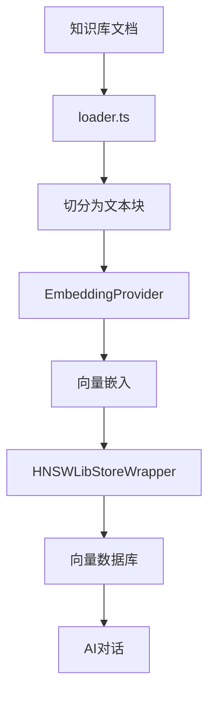

# 求职知识库组织结构

<cite>
**本文档引用文件**  
- [求职指南-岗位解析.md](file://src/lib/knowledge/base/求职指南-岗位解析.md)
- [求职指南-简历写法.md](file://src/lib/knowledge/base/求职指南-简历写法.md)
- [求职指南-行业分析.md](file://src/lib/knowledge/base/求职指南-行业分析.md)
- [求职指南-谈薪策略.md](file://src/lib/knowledge/base/求职指南-谈薪策略.md)
- [求职指南-面试技巧.md](file://src/lib/knowledge/base/求职指南-面试技巧.md)
- [loader.ts](file://src/lib/rag/loader.ts)
- [hnswlib.ts](file://src/lib/vectorstore/hnswlib.ts)
- [chat\route.ts](file://app/api/chat/route.ts)
</cite>

## 目录
1. [引言](#引言)
2. [知识库内容体系与结构化设计](#知识库内容体系与结构化设计)
3. [五类核心指南文档分析](#五类核心指南文档分析)
4. [《求职指南-简历写法》模块化写作框架详解](#求职指南-简历写法模块化写作框架详解)
5. [知识库与AI提示词工程的协同关系](#知识库与ai提示词工程的协同关系)
6. [知识库的可扩展性设计](#知识库的可扩展性设计)
7. [结论](#结论)

## 引言
本项目是一个基于 Next.js 和 DeepSeek AI 的智能求职教练应用，旨在帮助用户优化简历、准备面试、进行薪资谈判等求职相关任务。系统通过内嵌式知识库与AI大模型相结合的方式，为用户提供个性化的职业发展建议。知识库作为静态知识的载体，通过RAG（检索增强生成）技术注入动态对话中，实现专业、精准的求职指导服务。

## 知识库内容体系与结构化设计
求职知识库采用模块化、结构化的设计理念，将求职过程中的关键环节分解为五个核心维度：岗位解析、简历写法、行业分析、谈薪策略和面试技巧。每个维度均以独立的Markdown文档形式存储于`src/lib/knowledge/base/`目录下，形成一个完整的知识体系。

知识库内容采用清晰的层级结构，使用`#`标记作为章节标题，通过`---`分隔符划分逻辑模块。这种设计不仅便于人工阅读和维护，也利于机器解析和向量化处理。文档内容聚焦于实用性和可操作性，提供具体的方法论、模板和案例，确保用户能够快速获取有价值的信息。

**Section sources**
- [求职指南-岗位解析.md](file://src/lib/knowledge/base/求职指南-岗位解析.md)
- [求职指南-简历写法.md](file://src/lib/knowledge/base/求职指南-简历写法.md)
- [求职指南-行业分析.md](file://src/lib/knowledge/base/求职指南-行业分析.md)
- [求职指南-谈薪策略.md](file://src/lib/knowledge/base/求职指南-谈薪策略.md)
- [求职指南-面试技巧.md](file://src/lib/knowledge/base/求职指南-面试技巧.md)

## 五类核心指南文档分析
求职知识库围绕求职者的核心需求，构建了五类核心指南文档，每类文档都针对特定的求职环节，提供系统化的指导。

### 岗位解析
该文档深入剖析了互联网、制造业、央企国企、金融业等多个行业的核心岗位，包括产品经理、运营、后端开发、前端开发、算法开发、UI/UX设计师、软件测试工程师、数据工程师、运维工程师/SRE等。每个岗位的解析都涵盖基础职责、价值核心、市场与竞品、数据驱动、商业与战略、技术理解与协作等维度，帮助用户全面理解岗位要求和发展路径。

**Section sources**
- [求职指南-岗位解析.md](file://src/lib/knowledge/base/求职指南-岗位解析.md)

### 简历写法
该文档系统地介绍了简历撰写的完整流程，从内容完整性、格式规范到自我评价、实习经历、项目经历、教育背景、技能特长等模块的写作技巧。特别强调了STAR法则和高级模板的应用，指导用户如何通过量化成果和展现思考过程来提升简历的专业度。

**Section sources**
- [求职指南-简历写法.md](file://src/lib/knowledge/base/求职指南-简历写法.md)

### 行业分析
该文档对互联网、制造业、央企国企、金融业、AI产业、药企、车企等主要行业进行了宏观分析，揭示了各行业的核心模式、发展趋势、竞争格局和未来挑战。帮助用户理解不同行业的运作逻辑，为职业选择提供战略层面的参考。

**Section sources**
- [求职指南-行业分析.md](file://src/lib/knowledge/base/求职指南-行业分析.md)

### 谈薪策略
该文档详细阐述了校招薪酬结构的各个组成部分，包括Base（固定月薪）、Bonus（年终奖）、Stocks（股票/期权）、Allowance（补助）、Sign-on Bonus（签字费）等。并提供了谈薪的核心原则、完整流程、有效话术和避坑指南，帮助用户在薪资谈判中争取最大利益。

**Section sources**
- [求职指南-谈薪策略.md](file://src/lib/knowledge/base/求职指南-谈薪策略.md)

### 面试技巧
该文档全面覆盖了面试准备的各个方面，包括如何讲好实习项目、能力维度展示框架、面试问题分类与应答策略、央企国企面试专项指南等。通过结构化的讲述方式和具体的案例，指导用户如何在面试中有效展示自己的能力和价值。

**Section sources**
- [求职指南-面试技巧.md](file://src/lib/knowledge/base/求职指南-面试技巧.md)

## 《求职指南-简历写法》模块化写作框架详解
《求职指南-简历写法》文档采用高度模块化的写作框架，确保内容的完整性和专业性。该框架不仅为用户提供清晰的写作指引，也为AI生成专业建议提供了结构化的知识基础。

### 内容完整性
文档首先明确了简历必须包含的七大核心模块：基础信息、教育背景、自我评价/个人总结、实习经历、项目经历、校园经历、技能与掌握。这种模块化的设计确保了简历内容的全面性，避免遗漏关键信息。

### 格式规范
在格式方面，文档强调了长度控制（1-2页）、字体选择（宋体、微软雅黑等）、字号设置（10-12pt）、排版整洁和语言精炼等规范。这些要求有助于用户制作出专业、易读的简历。

### STAR法则
对于实习经历的描述，文档推荐使用STAR法则（情境-S、任务-T、行动-A、结果-R）作为基础模板。这一结构化的方法帮助用户清晰地展现自己的工作成果和价值贡献。

### 高级模板
对于核心实习经历，文档提出了更深入的“目标-策略-动作-难点-结果”高级模板。这一模板超越了简单的事实陈述，要求用户展现产品思维和业务洞察，从而在众多求职者中脱颖而出。

### 常见错误清单
文档还列出了简历撰写中的常见错误，如内容冗杂、描述模糊、缺乏量化、模板花哨、虚假信息等，并提供了具体的修正建议。这一部分帮助用户规避陷阱，提升简历质量。

该模块化框架通过RAG技术被注入到AI对话中，当用户咨询简历优化问题时，AI能够基于这些结构化知识，提供针对性的改进建议。

**Section sources**
- [求职指南-简历写法.md](file://src/lib/knowledge/base/求职指南-简历写法.md)

## 知识库与AI提示词工程的协同关系
求职知识库的内容与AI提示词工程形成了紧密的协同关系，通过RAG（检索增强生成）技术将静态知识动态化，实现高质量的对话生成。

### 静态知识的动态注入
知识库中的Markdown文档通过`scripts/ingest.ts`脚本被加载、切分并嵌入到向量数据库中。`loader.ts`文件中的`loadKnowledgeBase`函数负责递归读取`src/lib/knowledge/`目录下的所有支持格式的文件（.md, .txt, .pdf, .docx），并使用`RecursiveCharacterTextSplitter`将其切分为500个字符大小的块，重叠50个字符，以保证上下文的连贯性。

**Diagram sources**
- [loader.ts](file://src/lib/rag/loader.ts)
- [hnswlib.ts](file://src/lib/vectorstore/hnswlib.ts)

### 动态对话的生成
当用户发起对话时，`app/api/chat/route.ts`中的API会根据用户的`stage`参数选择相应的系统提示词（System Prompt）。例如，当`stage`为`resume_optimization`时，系统会加载简历优化师的角色设定和核心指令。AI在生成回复时，会从向量数据库中检索与用户问题最相关的知识片段，并结合提示词工程的要求，生成专业、精准的建议。

这种协同机制确保了AI的回复不仅基于大模型的通用知识，更融合了领域特定的专业知识，大大提升了建议的实用性和可信度。

**Section sources**
- [chat\route.ts](file://app/api/chat/route.ts)
- [loader.ts](file://src/lib/rag/loader.ts)

## 知识库的可扩展性设计
求职知识库的设计充分考虑了未来的可扩展性，支持新增文档的自动集成。

### 自动化摄入流程
`scripts/ingest.ts`脚本定义了一个完整的知识库摄入流程。该脚本可以自动扫描`src/lib/knowledge/`目录下的所有文件，无论是一级目录还是子目录，只要文件扩展名为`.md`、`.txt`、`.pdf`或`.docx`，都会被自动加载和处理。这意味着，只需将新的`.md`文档放入知识库目录，运行摄入脚本即可将其纳入检索范围。

### 向量数据库的动态更新
`HNSWLibStoreWrapper`类提供了`addDocuments`和`save`方法，允许在运行时动态添加新的文档并保存更新后的索引。这为知识库的持续迭代和扩展提供了技术保障。

### 模块化文件结构
知识库采用扁平化的文件结构，所有核心指南文档均位于`base`目录下。这种设计简化了文件管理，降低了维护成本，同时也便于自动化脚本进行批量处理。

这种可扩展性设计使得知识库能够随着业务需求的变化而不断丰富和完善，确保系统始终能够提供最新、最全面的求职指导。

**Section sources**
- [scripts\ingest.ts](file://scripts/ingest.ts)
- [hnswlib.ts](file://src/lib/vectorstore/hnswlib.ts)

## 结论
本求职知识库通过系统化的结构设计和模块化的文档组织，构建了一个全面、专业的求职指导体系。五类核心指南文档覆盖了求职过程中的关键环节，为用户提供了实用的方法论和模板。以《求职指南-简历写法》为例，其采用的模块化写作框架不仅支撑了AI生成专业建议，也体现了知识库内容的深度和专业性。通过RAG技术，静态知识被有效注入动态对话，实现了知识与AI的深度融合。同时，知识库的可扩展性设计确保了其能够持续迭代和丰富，为系统的长期发展奠定了坚实的基础。