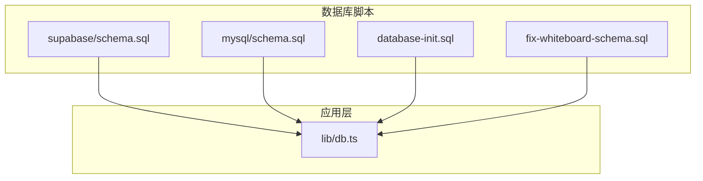
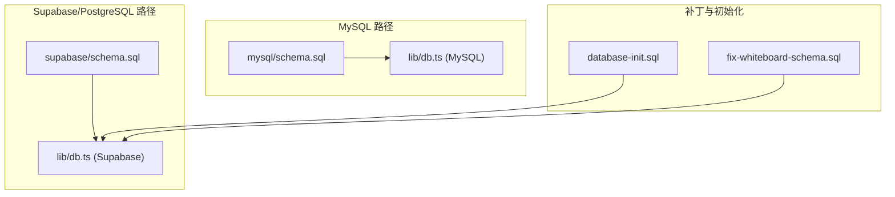
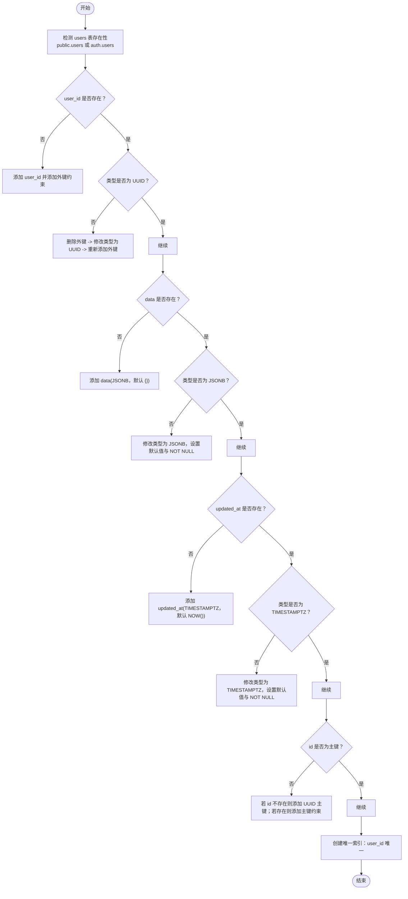
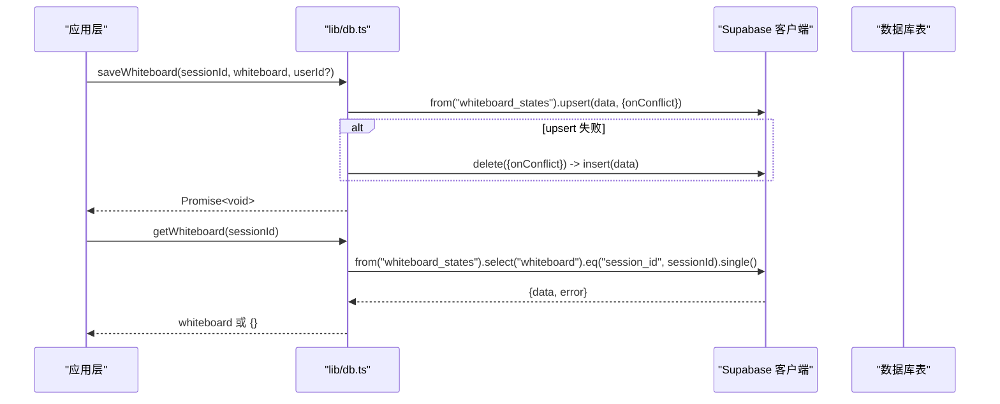
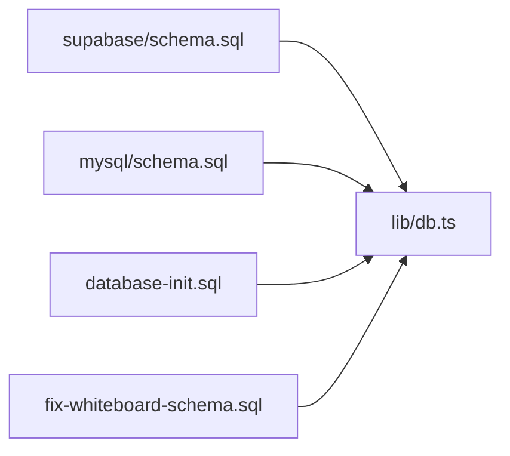

# 数据库相关目录详解

<cite>
**本文引用的文件**
- [supabase/schema.sql](file://supabase/schema.sql)
- [mysql/schema.sql](file://mysql/schema.sql)
- [database-init.sql](file://database-init.sql)
- [fix-whiteboard-schema.sql](file://fix-whiteboard-schema.sql)
- [lib/db.ts](file://lib/db.ts)
- [mysql/README.md](file://mysql/README.md)
- [mysql/SETUP.md](file://mysql/SETUP.md)
</cite>

## 目录
1. [简介](#简介)
2. [项目结构](#项目结构)
3. [核心组件](#核心组件)
4. [架构总览](#架构总览)
5. [详细组件分析](#详细组件分析)
6. [依赖关系分析](#依赖关系分析)
7. [性能考量](#性能考量)
8. [故障排查指南](#故障排查指南)
9. [结论](#结论)
10. [附录](#附录)

## 简介
本文件系统性说明数据库脚本目录（supabase/ 与 mysql/）的设计目的与使用场景，对比 supabase/schema.sql 与 mysql/schema.sql 的表结构异同，解释其分别适配不同部署环境的技术考量；阐述 database-init.sql 作为初始化脚本的核心作用，以及 fix-whiteboard-schema.sql 针对特定问题的修复逻辑；并说明这些 SQL 文件如何与 lib/db.ts 中的数据访问层协同工作，确保应用层与持久化层的一致性，为新开发者提供数据库结构的权威参考。

## 项目结构
- supabase/schema.sql：面向 Supabase/PostgreSQL 的统一 Schema 定义，包含用户、会话、对话消息、白板状态、用户进度等核心表及索引、触发器。
- mysql/schema.sql：面向 MySQL 的 Schema 定义，包含用户、会话、对话消息、白板状态、用户进度、简历等表，采用邀请码作为用户唯一标识。
- database-init.sql：通用初始化脚本，用于创建基础表（users、sessions），并确保部分字段存在与索引建立，便于早期迁移与补丁。
- fix-whiteboard-schema.sql：白板表结构修复脚本，用于在 Supabase 环境中补齐缺失字段、修正类型、添加主键与唯一约束，保证白板状态的稳定存储。
- lib/db.ts：数据访问层封装，统一通过 Supabase 客户端访问数据库，提供消息、白板、进度、简历等 CRUD 封装，并处理 upsert 冲突与回退逻辑。
- mysql/README.md 与 mysql/SETUP.md：MySQL 方案的安装与使用说明，强调邀请码作为用户 ID 的设计、数据库优先级与环境变量配置。

图表来源
- [supabase/schema.sql](file://supabase/schema.sql#L1-L84)
- [mysql/schema.sql](file://mysql/schema.sql#L1-L83)
- [database-init.sql](file://database-init.sql#L1-L45)
- [fix-whiteboard-schema.sql](file://fix-whiteboard-schema.sql#L1-L146)
- [lib/db.ts](file://lib/db.ts#L1-L327)

章节来源
- [supabase/schema.sql](file://supabase/schema.sql#L1-L84)
- [mysql/schema.sql](file://mysql/schema.sql#L1-L83)
- [database-init.sql](file://database-init.sql#L1-L45)
- [fix-whiteboard-schema.sql](file://fix-whiteboard-schema.sql#L1-L146)
- [lib/db.ts](file://lib/db.ts#L1-L327)
- [mysql/README.md](file://mysql/README.md#L1-L183)
- [mysql/SETUP.md](file://mysql/SETUP.md#L1-L103)

## 核心组件
- Supabase/PostgreSQL Schema：定义 UUID 主键、JSONB 白板数据、统一时间戳字段、索引与触发器，适合云原生部署与边缘运行时。
- MySQL Schema：定义 VARCHAR 主键（邀请码）、JSON 文本字段、外键约束与索引，适合传统 MySQL 部署与本地开发。
- 初始化脚本 database-init.sql：创建基础表与索引，确保关键字段存在，便于早期迁移与补丁。
- 白板修复脚本 fix-whiteboard-schema.sql：在 Supabase 环境中动态检测并补齐 user_id、data、updated_at 等字段，修正类型与约束，确保每用户唯一。
- 数据访问层 lib/db.ts：统一通过 Supabase 客户端访问数据库，封装消息、白板、进度、简历等操作，处理 upsert 冲突与回退逻辑，提供一致的 API。

章节来源
- [supabase/schema.sql](file://supabase/schema.sql#L1-L84)
- [mysql/schema.sql](file://mysql/schema.sql#L1-L83)
- [database-init.sql](file://database-init.sql#L1-L45)
- [fix-whiteboard-schema.sql](file://fix-whiteboard-schema.sql#L1-L146)
- [lib/db.ts](file://lib/db.ts#L1-L327)

## 架构总览
下图展示了数据库脚本与数据访问层之间的协作关系，以及 Supabase 与 MySQL 两种部署路径的差异。

图表来源
- [supabase/schema.sql](file://supabase/schema.sql#L1-L84)
- [mysql/schema.sql](file://mysql/schema.sql#L1-L83)
- [database-init.sql](file://database-init.sql#L1-L45)
- [fix-whiteboard-schema.sql](file://fix-whiteboard-schema.sql#L1-L146)
- [lib/db.ts](file://lib/db.ts#L1-L327)

## 详细组件分析

### Supabase/PostgreSQL Schema（supabase/schema.sql）
- 设计要点
  - 使用 UUID 主键与默认生成函数，统一时间戳字段，减少跨数据库差异。
  - 白板状态使用 JSONB 存储，便于复杂结构与高效查询。
  - 为关键列建立索引，提升查询性能。
  - 通过触发器自动维护 updated_at 字段，降低业务代码负担。
- 适用场景
  - 云原生部署（Supabase、Vercel Edge Runtime）。
  - 需要强一致与高扩展性的对话与白板状态管理。
- 关键表与字段
  - users：id（UUID）、phone、email、provider、created_at、last_active。
  - sessions：id（UUID）、user_id（UUID 外键）、created_at、updated_at。
  - conversation_messages：id（UUID）、session_id（UUID 外键）、role、content、stage、created_at。
  - whiteboard_states：id（UUID）、session_id（UUID 外键）、whiteboard（JSONB）、updated_at。
  - user_progress：id（UUID）、user_id（UUID 外键）、current_stage、updated_at。

章节来源
- [supabase/schema.sql](file://supabase/schema.sql#L1-L84)

### MySQL Schema（mysql/schema.sql）
- 设计要点
  - 使用邀请码作为用户主键，简化无邮箱/手机场景下的用户识别。
  - 会话、消息、白板、进度、简历等表均采用 UTF8MB4 字符集与合适索引。
  - 外键约束保证数据一致性，JSON 字段存储结构化数据。
- 适用场景
  - 传统 MySQL 部署、本地开发与测试环境。
  - 需要邀请码驱动的匿名用户体系。
- 关键表与字段
  - users：invite_code（主键）、phone、email、nickname、provider、created_at、last_active。
  - sessions：id（主键）、user_id（外键，指向 users.invite_code）、created_at、updated_at。
  - conversation_messages：id（主键）、session_id（外键）、role、content、stage、created_at。
  - whiteboard_states：id（主键）、session_id（唯一外键）、whiteboard（JSON）、updated_at。
  - user_progress：id（主键）、user_id（唯一外键）、current_stage、updated_at。
  - resumes：id（主键）、user_id（外键）、session_id（外键，可为空）、raw_text、parsed_data、created_at。

章节来源
- [mysql/schema.sql](file://mysql/schema.sql#L1-L83)
- [mysql/README.md](file://mysql/README.md#L1-L183)
- [mysql/SETUP.md](file://mysql/SETUP.md#L1-L103)

### 初始化脚本 database-init.sql
- 核心作用
  - 创建 users 与 sessions 基础表，确保 invite_code 唯一性与时间戳字段存在。
  - 为 sessions 建立常用索引（user_id、is_active、expires_at），优化查询性能。
  - 提供字段存在性检查与补充提示，便于早期迁移与补丁。
- 使用场景
  - 新环境首次部署或从旧版本升级时的快速初始化。
  - 需要确保某些字段存在后再进行其他操作的前置步骤。

章节来源
- [database-init.sql](file://database-init.sql#L1-L45)

### 白板修复脚本 fix-whiteboard-schema.sql
- 修复目标
  - 动态检测并补齐 whiteboard_states 表的 user_id、data、updated_at 字段。
  - 修正字段类型不匹配的问题（UUID、JSONB、TIMESTAMPTZ）。
  - 确保 id 字段为主键，且每用户仅一条记录（通过唯一索引约束）。
- 技术考量
  - 使用条件判断与动态外键引用，兼容 public.users 与 auth.users 两种用户表布局。
  - 通过 DO $$ ... $$ 块实现幂等修复，避免重复执行导致的错误。
  - 保留 old_user_id 字段以便过渡期数据迁移。

图表来源
- [fix-whiteboard-schema.sql](file://fix-whiteboard-schema.sql#L1-L146)

章节来源
- [fix-whiteboard-schema.sql](file://fix-whiteboard-schema.sql#L1-L146)

### 数据访问层 lib/db.ts 与数据库脚本的协同
- 统一客户端
  - 通过 getDbClient() 返回 Supabase 客户端实例，确保在 Vercel Edge Runtime 环境下可用。
  - 若未配置数据库，返回 null，应用层使用本地存储作为降级方案。
- 消息与白板
  - saveMessage/getMessages：基于 conversation_messages 表，支持按 session_id 查询与按 user_id 查询。
  - saveWhiteboard/getWhiteboard/getWhiteboardByUserId：基于 whiteboard_states 表，支持 upsert 冲突处理与回退插入。
- 进度与简历
  - setUserStage/getUserStage：基于 user_progress 表，upsert 冲突处理与回退插入。
  - saveResume：基于 resumes 表，生成 UUID 作为主键并插入结构化数据。
- 与脚本的对应关系
  - Supabase/PostgreSQL：lib/db.ts 直接使用 supabase/schema.sql 定义的表结构与字段。
  - MySQL：lib/db.ts 同时支持 MySQL 方案（邀请码作为用户 ID），配合 mysql/schema.sql 的表结构。
  - 白板修复：fix-whiteboard-schema.sql 保证 whiteboard_states 表结构与字段类型一致，lib/db.ts 的 upsert 逻辑依赖该结构。

图表来源
- [lib/db.ts](file://lib/db.ts#L141-L228)
- [supabase/schema.sql](file://supabase/schema.sql#L32-L39)

章节来源
- [lib/db.ts](file://lib/db.ts#L1-L327)
- [supabase/schema.sql](file://supabase/schema.sql#L1-L84)
- [mysql/schema.sql](file://mysql/schema.sql#L1-L83)

## 依赖关系分析
- Supabase/PostgreSQL 路径
  - supabase/schema.sql 定义表结构与索引，lib/db.ts 通过 Supabase 客户端访问。
  - fix-whiteboard-schema.sql 作为补丁脚本，修复白板表结构，确保 upsert 与查询正常。
- MySQL 路径
  - mysql/schema.sql 定义表结构与索引，lib/db.ts 通过 MySQL 驱动访问（邀请码作为用户 ID）。
  - database-init.sql 作为初始化脚本，确保基础表与索引存在。
- 两路径共性
  - 两者均提供消息、白板、进度、简历等核心能力，通过 lib/db.ts 的统一接口对外暴露。

图表来源
- [supabase/schema.sql](file://supabase/schema.sql#L1-L84)
- [mysql/schema.sql](file://mysql/schema.sql#L1-L83)
- [database-init.sql](file://database-init.sql#L1-L45)
- [fix-whiteboard-schema.sql](file://fix-whiteboard-schema.sql#L1-L146)
- [lib/db.ts](file://lib/db.ts#L1-L327)

章节来源
- [lib/db.ts](file://lib/db.ts#L1-L327)
- [supabase/schema.sql](file://supabase/schema.sql#L1-L84)
- [mysql/schema.sql](file://mysql/schema.sql#L1-L83)
- [database-init.sql](file://database-init.sql#L1-L45)
- [fix-whiteboard-schema.sql](file://fix-whiteboard-schema.sql#L1-L146)

## 性能考量
- 索引设计
  - Supabase/PostgreSQL：为 sessions.user_id、conversation_messages.session_id、whiteboard_states.session_id、user_progress.user_id 等建立索引，提升查询效率。
  - MySQL：同样为关键列建立索引，确保外键与时间戳查询性能。
- 时间字段
  - 统一使用带时区的时间戳字段，便于跨时区部署与排序。
- upsert 冲突处理
  - lib/db.ts 对白板与进度表采用 upsert 冲突处理与回退插入，减少并发写入冲突带来的失败率。

章节来源
- [supabase/schema.sql](file://supabase/schema.sql#L50-L56)
- [mysql/schema.sql](file://mysql/schema.sql#L18-L21)
- [lib/db.ts](file://lib/db.ts#L141-L228)

## 故障排查指南
- 白板状态异常
  - 现象：白板无法保存或读取。
  - 排查：执行 fix-whiteboard-schema.sql 修复 user_id、data、updated_at 字段类型与约束；确认唯一索引存在。
- 数据库不可用
  - 现象：应用层使用本地存储替代数据库。
  - 排查：检查 SUPABASE_URL/SUPABASE_ANON_KEY 环境变量；若未配置，lib/db.ts 将返回 null 并降级。
- MySQL 连接失败
  - 现象：无法连接 MySQL。
  - 排查：确认 MYSQL_HOST/MYSQL_PORT/MYSQL_USER/MYSQL_PASSWORD/MYSQL_DATABASE 配置正确；确保数据库存在且驱动已安装。
- 邀请码冲突
  - 现象：邀请码重复。
  - 排查：系统会自动增加长度重试；若仍冲突，检查生成逻辑与去噪字符集。

章节来源
- [fix-whiteboard-schema.sql](file://fix-whiteboard-schema.sql#L1-L146)
- [lib/db.ts](file://lib/db.ts#L1-L48)
- [mysql/README.md](file://mysql/README.md#L162-L183)
- [mysql/SETUP.md](file://mysql/SETUP.md#L31-L53)

## 结论
- Supabase/PostgreSQL 与 MySQL 两条路径分别适配云原生与传统部署场景，通过统一的数据访问层 lib/db.ts 实现一致的 API。
- supabase/schema.sql 与 mysql/schema.sql 在核心业务上保持一致，仅在主键类型、字段类型与字符集方面有所差异。
- database-init.sql 与 fix-whiteboard-schema.sql 分别承担初始化与结构修复职责，确保数据库结构的稳定性与一致性。
- 对于新开发者，建议先阅读 mysql/README.md 与 mysql/SETUP.md 了解 MySQL 方案，再对照 supabase/schema.sql 与 lib/db.ts 的实现，理解两条路径的差异与协同方式。

## 附录
- 邀请码系统（MySQL）
  - 邀请码作为用户唯一标识，长度默认 6 位，字符集排除易混淆字符，支持自动生成与唯一性保障。
- 数据库优先级
  - Supabase > PostgreSQL > MySQL（由环境变量决定启用哪条路径）。

章节来源
- [mysql/README.md](file://mysql/README.md#L58-L104)
- [mysql/SETUP.md](file://mysql/SETUP.md#L54-L81)