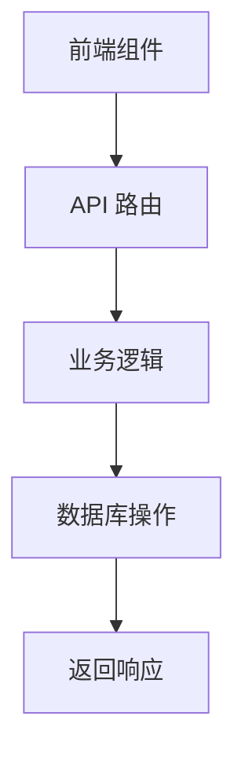

# 目录结构详解

<cite>
**本文档引用的文件**
- [app/api/interview/answer/route.ts](file://app/api/interview/answer/route.ts)
- [app/api/chat/route.ts](file://app/api/chat/route.ts)
- [app/layout.tsx](file://app/layout.tsx)
- [app/providers.tsx](file://app/providers.tsx)
- [components/interview/InterviewPanel.tsx](file://components/interview/InterviewPanel.tsx)
- [components/resume/ResumeCenterPanel.tsx](file://components/resume/ResumeCenterPanel.tsx)
- [lib/db.ts](file://lib/db.ts)
- [lib/conversationStore.ts](file://lib/conversationStore.ts)
- [lib/stage.ts](file://lib/stage.ts)
- [lib/orchestrator/index.ts](file://lib/orchestrator/index.ts)
- [src/lib/rag/loader.ts](file://src/lib/rag/loader.ts)
- [store/interviewStore.tsx](file://store/interviewStore.tsx)
- [middleware.ts](file://middleware.ts)
- [package.json](file://package.json)
- [README.md](file://README.md)
</cite>

## 目录结构

1. [项目结构概览](#项目结构概览)
2. [app/ 目录：Next.js App Router 入口](#app-目录nextjs-app-router-入口)
3. [components/ 目录：UI 组件组织](#components-目录ui-组件组织)
4. [lib/ 目录：核心业务逻辑](#lib-目录核心业务逻辑)
5. [src/lib/ 目录：AI 与知识库模块](#srclib-目录ai-与知识库模块)
6. [辅助目录：docs/、mysql/、supabase/](#辅助目录docsmysqlsupabase)
7. [模块间依赖关系](#模块间依赖关系)
8. [总结](#总结)

## 项目结构概览

ai-job-coach 项目是一个基于 Next.js 16 和 DeepSeek AI 的智能求职教练应用，旨在帮助用户优化简历、准备面试、进行薪资谈判等求职相关任务。项目采用模块化设计，通过清晰的目录结构分离关注点，实现功能的高内聚与低耦合。

项目主要目录包括：
- `app/`：Next.js App Router 的入口，包含页面和 API 路由。
- `components/`：可复用的 UI 组件，按功能模块组织。
- `lib/`：核心业务逻辑、状态管理、数据库操作等。
- `src/lib/`：AI 相关模块，如 RAG、向量存储、知识库等。
- `docs/`：技术文档和 API 说明。
- `mysql/` 和 `supabase/`：数据库模式定义。
- `store/`：全局状态管理器。

**Section sources**
- [README.md](file://README.md)
- [package.json](file://package.json)

## app/ 目录：Next.js App Router 入口

`app/` 目录是 Next.js App Router 的根目录，负责定义应用的路由、布局和入口点。该目录下的文件结构直接映射到 URL 路径，实现了基于文件系统的路由。

### 页面与布局

- `page.tsx`：应用的主页面，定义了根路由 `/` 的内容。
- `layout.tsx`：全局布局文件，定义了所有页面共享的 HTML 结构、元数据和样式。它引入了全局 CSS 文件，并通过 `Providers` 组件包裹子组件，为应用提供全局状态。
- `providers.tsx`：提供全局状态管理器，如 `InterviewProvider`，确保状态在应用的任何页面间共享。

### API 路由

`app/api/` 目录包含了所有 API 路由，每个 `route.ts` 文件对应一个 API 端点。这些路由处理客户端请求，与后端服务（如数据库、AI 模型）交互，并返回响应。

- **职责划分**：
  - `page.tsx`：负责渲染用户界面，处理用户交互。
  - `route.ts`：负责处理数据请求，执行业务逻辑，与外部服务通信。

例如，`app/api/interview/answer/route.ts` 处理面试回答的提交和评估，而 `app/chat/page.tsx` 则负责渲染聊天界面。

**Section sources**
- [app/layout.tsx](file://app/layout.tsx)
- [app/providers.tsx](file://app/providers.tsx)

## components/ 目录：UI 组件组织

`components/` 目录存放了应用中所有可复用的 UI 组件。这些组件按功能模块进行分类，提高了代码的可维护性和可读性。

### 分类原则

- `interview/`：与模拟面试相关的组件，如 `InterviewPanel.tsx`、`QuestionCard.tsx` 等。
- `resume/`：与简历处理相关的组件，如 `ResumeCenterPanel.tsx`、`ResumePreview.tsx` 等。

这种分类方式使得开发者可以快速定位到特定功能的组件，便于开发和维护。

### 组件示例

- `InterviewPanel.tsx`：模拟面试的主面板，包含聊天输入、问题卡片和白板总结三个部分。
- `ResumeCenterPanel.tsx`：简历处理的中心面板，负责简历的上传、解析和预览。

**Section sources**
- [components/interview/InterviewPanel.tsx](file://components/interview/InterviewPanel.tsx)
- [components/resume/ResumeCenterPanel.tsx](file://components/resume/ResumeCenterPanel.tsx)

## lib/ 目录：核心业务逻辑

`lib/` 目录包含了应用的核心业务逻辑，如数据库操作、状态管理、认证等。

### db.ts：数据库操作

`lib/db.ts` 封装了与 Supabase 数据库的交互，提供了统一的 API 来执行 CRUD 操作。它支持在 Vercel 部署环境中使用 Supabase 客户端，并在数据库不可用时回退到本地存储。

### conversationStore.ts：对话状态管理

`lib/conversationStore.ts` 管理各阶段的独立对话历史。它使用单例模式创建 `conversationStore` 实例，确保状态在应用的任何地方都能被访问。该模块支持按阶段（如职业规划、简历优化）存储和检索对话历史，并提供方法来添加、清除和保存消息。

### stage.ts：求职流程阶段管理

`lib/stage.ts` 定义了用户求职流程的各个阶段，如 `career_planning`、`project_review` 等。它提供了阶段顺序、中文名称映射和描述，以及获取下一个和上一个阶段的方法。这些定义用于控制 AI 引导用户完成求职流程。

**Section sources**
- [lib/db.ts](file://lib/db.ts)
- [lib/conversationStore.ts](file://lib/conversationStore.ts)
- [lib/stage.ts](file://lib/stage.ts)

## src/lib/ 目录：AI 与知识库模块

`src/lib/` 目录专注于 AI 相关的功能，如 RAG（检索增强生成）、向量存储和知识库管理。

### RAG 与知识库

- `rag/loader.ts`：负责加载知识库中的所有文档。它递归读取 `src/lib/knowledge/` 目录下的 `.md`、`.txt`、`.pdf` 和 `.docx` 文件，使用 `RecursiveCharacterTextSplitter` 将文档切分为块，并为每个块添加元数据。
- `knowledge/`：存放求职相关的知识文档，如“求职指南-岗位解析.md”、“求职指南-简历写法.md”等。这些文档为 AI 提供了丰富的背景知识，使其能够生成更准确和专业的建议。

### 分层结构

- `agents/`：AI 代理模块，负责执行特定任务。
- `chains/`：链式调用模块，组合多个 AI 操作。
- `embeddings/`：嵌入向量生成模块。
- `llm/`：大语言模型接口。
- `vectorstore/`：向量存储，用于高效检索。

**Section sources**
- [src/lib/rag/loader.ts](file://src/lib/rag/loader.ts)

## 辅助目录：docs/、mysql/、supabase/

### docs/ 目录

`docs/` 目录存放了项目的技术文档和 API 说明，如 `interview_api.md` 和 `interview_api_debug.md`。这些文档帮助开发者理解和使用 API，以及调试问题。

### mysql/ 和 supabase/ 目录

- `mysql/`：包含 MySQL 数据库的模式定义文件 `schema.sql`，用于本地开发环境。
- `supabase/`：包含 Supabase 数据库的模式定义文件 `schema.sql`，用于生产环境。

这些目录确保了数据库模式的一致性，并便于在不同环境中部署和迁移数据。

**Section sources**
- [docs/interview_api.md](file://docs/interview_api.md)
- [mysql/schema.sql](file://mysql/schema.sql)
- [supabase/schema.sql](file://supabase/schema.sql)

## 模块间依赖关系

项目中的模块通过清晰的依赖关系协同工作。前端组件通过调用 `lib/` 中的状态管理器来获取和更新数据，而 `lib/` 模块则通过 API 路由与后端服务通信。

### 前端组件调用状态管理器

例如，`ResumeCenterPanel.tsx` 组件在用户上传简历后，调用 `fetch` 方法向 `/api/resume/upload` 和 `/api/resume/parse` 发送请求，这些请求最终由 `lib/db.ts` 中的数据库操作处理。

### API 路由处理请求

`app/api/interview/answer/route.ts` 处理面试回答的提交。它首先验证用户身份，然后解析请求体，验证参数，获取数据库客户端，验证会话和题目，评估答案，并将结果保存到数据库。整个过程展示了从 API 入口到业务逻辑再到数据存储的完整流程。

**Diagram sources**
- [app/api/interview/answer/route.ts](file://app/api/interview/answer/route.ts)
- [lib/db.ts](file://lib/db.ts)

**Section sources**
- [app/api/interview/answer/route.ts](file://app/api/interview/answer/route.ts)
- [lib/db.ts](file://lib/db.ts)

## 总结

ai-job-coach 项目通过精心设计的目录结构，实现了功能的模块化和高内聚。`app/` 目录作为 Next.js App Router 的入口，清晰地划分了页面和 API 路由的职责。`components/` 目录按功能模块组织 UI 组件，提高了代码的可维护性。`lib/` 目录封装了核心业务逻辑，而 `src/lib/` 目录则专注于 AI 相关的功能。辅助目录如 `docs/`、`mysql/` 和 `supabase/` 提供了必要的文档和支持。模块间的依赖关系清晰，前端组件通过调用状态管理器和 API 路由与后端服务通信，确保了应用的高效运行。