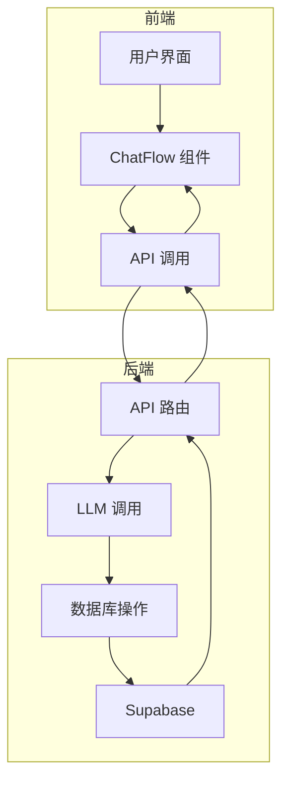
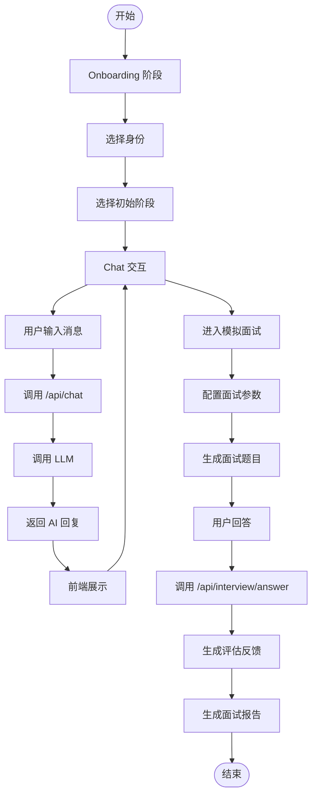
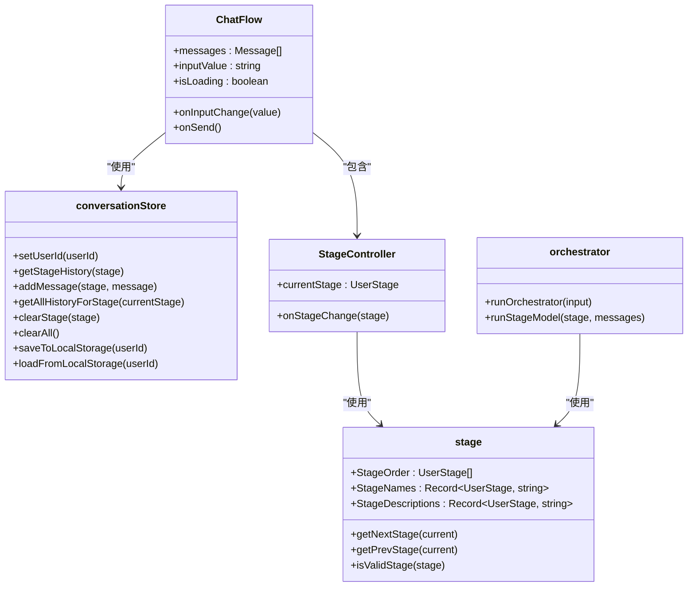

# 系统概述

<cite>
**本文档引用的文件**  
- [README.md](file://README.md)
- [package.json](file://package.json)
- [app/layout.tsx](file://app/layout.tsx)
- [lib/conversationStore.ts](file://lib/conversationStore.ts)
- [lib/stage.ts](file://lib/stage.ts)
- [lib/orchestrator/index.ts](file://lib/orchestrator/index.ts)
- [lib/orchestrator/stageAgent.ts](file://lib/orchestrator/stageAgent.ts)
- [lib/db.ts](file://lib/db.ts)
- [lib/auth.ts](file://lib/auth.ts)
- [lib/useAuth.ts](file://lib/useAuth.ts)
- [app/api/chat/route.ts](file://app/api/chat/route.ts)
- [components/ChatFlow.tsx](file://components/ChatFlow.tsx)
- [components/interview/InterviewPanel.tsx](file://components/interview/InterviewPanel.tsx)
- [store/interviewStore.tsx](file://store/interviewStore.tsx)
- [app/onboarding/identity-select/page.tsx](file://app/onboarding/identity-select/page.tsx)
- [app/chat/page.tsx](file://app/chat/page.tsx)
</cite>

## 目录
1. [项目简介](#项目简介)
2. [核心功能](#核心功能)
3. [系统架构](#系统架构)
4. [技术选型与权衡](#技术选型与权衡)
5. [用户流程分析](#用户流程分析)
6. [关键组件关系](#关键组件关系)
7. [典型使用场景](#典型使用场景)

## 项目简介

ai-job-coach 是一个基于 Next.js 和 DeepSeek AI 的全栈智能求职辅导平台，旨在为用户提供从职业规划到 Offer 决策的全流程支持。该项目通过 AI 驱动的对话式交互，帮助用户优化简历、准备模拟面试、制定投递策略、进行薪资谈判等关键求职环节。平台采用现代化的前端框架与云原生后端集成，确保用户体验流畅且数据安全。

项目以用户为中心，设计了清晰的求职流程阶段，包括职业规划、项目梳理、简历优化、投递策略、模拟面试、薪资沟通和 Offer 决策。每个阶段都配备了专门的 AI 模型和提示词，确保辅导的专业性和针对性。同时，系统通过状态管理和数据持久化机制，保障用户在不同会话间的上下文连续性。

**Section sources**
- [README.md](file://README.md#L3-L13)
- [app/layout.tsx](file://app/layout.tsx#L8-L9)

## 核心功能

ai-job-coach 平台提供一系列围绕求职全流程的核心功能，旨在通过 AI 技术提升用户的求职效率和成功率。

- **AI 求职教练**：基于 DeepSeek 的智能对话引擎，提供个性化的职业建议和指导，帮助用户明确职业方向。
- **简历优化**：通过 AI 分析用户简历内容，提供具体的修改建议，突出核心技能和项目成果，提升简历竞争力。
- **模拟面试**：提供多轮次的模拟面试体验，涵盖业务面、技术面、HR 面等多种场景，并提供详细的评估反馈。
- **薪资谈判**：提供专业的薪资谈判策略和建议，帮助用户在薪酬谈判中获得理想结果。
- **进度跟踪**：可视化展示用户在各个求职阶段的进度，帮助用户清晰了解自己的求职状态。
- **成就系统**：通过激励机制，鼓励用户完成各项任务，增强用户参与感和成就感。

这些功能共同构成了一个完整的求职辅导闭环，从职业规划开始，逐步引导用户完成每一个关键步骤，直至成功获得 Offer。

**Section sources**
- [README.md](file://README.md#L7-L12)

## 系统架构

ai-job-coach 采用全栈架构，前端基于 Next.js App Router 构建，后端通过 API 路由与 Supabase 集成，实现前后端分离的现代化应用架构。

### 前端架构

前端采用 Next.js 16 的 App Router 模式，利用 React Server Components 提升性能和用户体验。UI 组件使用 Tailwind CSS 进行样式设计，确保界面美观且响应式。状态管理采用 Zustand，用于管理对话历史、用户阶段等全局状态。`app/layout.tsx` 定义了应用的整体布局和元数据，而 `app/providers.tsx` 则封装了状态管理器的提供者，确保组件间的状态共享。

### 后端架构

后端通过 `app/api/` 目录下的路由文件处理各种 API 请求，如聊天、面试、简历解析等。这些 API 路由与 Supabase 数据库集成，实现用户认证、数据持久化和实时同步。`lib/db.ts` 封装了数据库操作，支持 Supabase 客户端的初始化和数据读写。`lib/auth.ts` 负责用户认证，通过 Supabase Auth 获取当前用户信息。

### 前后端协作模式

前后端通过 RESTful API 进行通信。前端通过 `fetch` 调用后端 API，传递用户输入和会话信息，后端处理请求后返回 AI 生成的回复或操作结果。例如，聊天功能通过 `/api/chat` 路由处理用户消息，调用 `callLLM` 函数生成 AI 回复，并将结果返回给前端展示。

**Diagram sources**
- [app/layout.tsx](file://app/layout.tsx)
- [app/api/chat/route.ts](file://app/api/chat/route.ts)
- [lib/db.ts](file://lib/db.ts)
- [lib/auth.ts](file://lib/auth.ts)

**Section sources**
- [app/layout.tsx](file://app/layout.tsx)
- [app/api/chat/route.ts](file://app/api/chat/route.ts)
- [lib/db.ts](file://lib/db.ts)
- [lib/auth.ts](file://lib/auth.ts)

## 技术选型与权衡

### Zustand 状态管理

项目选择 Zustand 作为状态管理库，主要基于其轻量级、简单易用和高性能的特点。Zustand 提供了类似于 Redux 的状态管理能力，但无需复杂的配置和中间件。`lib/conversationStore.ts` 实现了对话历史的管理，通过单例模式维护各阶段的独立对话记录。Zustand 的 hooks API 使得状态订阅和更新非常直观，减少了样板代码，提高了开发效率。

### Supabase 集成

项目采用 Supabase 作为后端服务，主要原因是其提供了完整的后端即服务（BaaS）解决方案，包括用户认证、数据库、存储和实时功能。`lib/db.ts` 封装了 Supabase 客户端的初始化和数据操作，确保应用在 Vercel 等边缘运行时环境中稳定运行。Supabase 的实时数据库功能支持多设备间的数据同步，提升了用户体验。此外，Supabase 的开源特性允许开发者自托管，增强了数据安全性和可控性。

### Next.js App Router

Next.js App Router 提供了更灵活的路由和数据获取机制，支持服务器组件和流式渲染，显著提升了应用性能。通过 Server Components，可以将部分渲染逻辑移至服务器端，减少客户端的 JavaScript 负载。App Router 的嵌套路由和布局系统使得页面结构更加清晰，便于维护和扩展。

**Section sources**
- [lib/conversationStore.ts](file://lib/conversationStore.ts)
- [lib/db.ts](file://lib/db.ts)
- [package.json](file://package.json#L27)

## 用户流程分析

ai-job-coach 的用户流程从 onboarding 开始，逐步引导用户完成求职全流程。

### Onboarding 阶段

用户首次访问应用时，进入 onboarding 流程。`app/onboarding/identity-select/page.tsx` 提供身份选择界面，用户可以选择“在校生”或“社招生”，系统根据身份提供个性化的辅导路径。选择后，用户被引导至 `app/onboarding/stage-select/page.tsx`，选择初始阶段，如职业规划或项目梳理。

### Chat 交互阶段

进入主聊天界面后，`app/chat/page.tsx` 管理用户的对话流程。`ChatFlow` 组件负责渲染聊天消息和输入栏，用户输入消息后，通过 `sendMessage` 函数发送至 `/api/chat` 路由。后端根据当前用户阶段（`userStage`）选择对应的系统提示词，调用 LLM 生成回复，并返回给前端展示。`conversationStore` 管理各阶段的对话历史，确保上下文连续性。

### 面试评估阶段

当用户进入模拟面试阶段，系统通过 `/api/interview` 系列路由处理面试流程。`lib/interview/types.ts` 定义了面试相关的数据结构，如面试会话、题目和评估结果。前端通过 `InterviewPanel` 组件展示面试题目和提示，用户回答后，系统调用 `/api/interview/answer` 进行评估，并生成详细的反馈报告。

**Diagram sources**
- [app/onboarding/identity-select/page.tsx](file://app/onboarding/identity-select/page.tsx)
- [app/chat/page.tsx](file://app/chat/page.tsx)
- [app/api/chat/route.ts](file://app/api/chat/route.ts)
- [lib/interview/types.ts](file://lib/interview/types.ts)

**Section sources**
- [app/onboarding/identity-select/page.tsx](file://app/onboarding/identity-select/page.tsx)
- [app/chat/page.tsx](file://app/chat/page.tsx)
- [app/api/chat/route.ts](file://app/api/chat/route.ts)
- [lib/interview/types.ts](file://lib/interview/types.ts)

## 关键组件关系

ai-job-coach 的关键组件通过清晰的依赖关系协同工作，确保系统的稳定性和可维护性。

### 对话管理组件

`conversationStore` 是核心的对话管理组件，负责维护各阶段的对话历史。它与 `ChatFlow` 组件紧密协作，`ChatFlow` 从 `conversationStore` 获取消息并渲染，用户发送新消息时，`ChatFlow` 调用 `conversationStore` 的方法添加消息。`conversationStore` 还负责将对话历史保存到 localStorage 或 Supabase 数据库，确保数据持久化。

### 阶段管理组件

`lib/stage.ts` 定义了用户求职流程的各个阶段及其顺序。`StageOrder` 数组定义了阶段的执行顺序，`StageNames` 提供阶段的中文名称映射。`app/chat/page.tsx` 中的 `StageController` 组件使用这些定义，控制用户在不同阶段间的切换。当用户选择新阶段时，`StageController` 更新 `userStage` 状态，并触发相应的开场白和数据加载。

### 编排器组件

`lib/orchestrator/index.ts` 是多模型编排器，根据用户当前阶段自动选择对应的模型。尽管当前代码中该功能被禁用，但其设计意图是通过 `runOrchestrator` 函数，根据 `userStage` 调用不同的 AI 模型，如职业规划、简历优化等。`stageAgent.ts` 进一步封装了阶段路由逻辑，确保每个阶段使用正确的提示词和模型。

**Diagram sources**
- [lib/conversationStore.ts](file://lib/conversationStore.ts)
- [components/ChatFlow.tsx](file://components/ChatFlow.tsx)
- [components/StageController.tsx](file://components/StageController.tsx)
- [lib/stage.ts](file://lib/stage.ts)
- [lib/orchestrator/index.ts](file://lib/orchestrator/index.ts)

**Section sources**
- [lib/conversationStore.ts](file://lib/conversationStore.ts)
- [components/ChatFlow.tsx](file://components/ChatFlow.tsx)
- [components/StageController.tsx](file://components/StageController.tsx)
- [lib/stage.ts](file://lib/stage.ts)
- [lib/orchestrator/index.ts](file://lib/orchestrator/index.ts)

## 典型使用场景

### 场景一：应届毕业生优化简历

一名应届毕业生希望优化自己的简历以申请软件开发岗位。他首先在 onboarding 阶段选择“在校生”身份，并进入“简历优化”阶段。通过 `ChatFlow` 组件，他上传了自己的简历文件，系统调用 `/api/parse-resume` 解析简历内容。AI 分析后，提供具体的修改建议，如使用 STAR 法则描述项目经历、量化成果等。用户根据建议逐步完善简历，最终生成一份专业且有竞争力的简历。

### 场景二：职场人士准备模拟面试

一位有三年工作经验的工程师计划跳槽，需要准备技术面试。他选择“社招生”身份，进入“模拟面试”阶段。系统引导他配置面试参数，如目标岗位（后端开发）、面试轮次（技术面）和题目数量（5 道）。AI 生成一系列技术问题，用户逐一回答，系统实时提供评估反馈，指出回答中的不足和改进建议。完成所有题目后，系统生成详细的面试报告，帮助用户总结经验，提升面试表现。

### 场景三：求职者进行薪资谈判

用户收到一家公司的 Offer，但在薪资方面存在疑虑。他进入“薪资沟通”阶段，AI 作为谈判顾问，帮助他分析 Offer 的各项条款，包括基本工资、奖金、股票期权等。系统根据行业数据和用户背景，提供谈判策略，如如何提出期望薪资、如何应对 HR 的压价等。用户通过模拟对话练习谈判技巧，最终在真实谈判中成功争取到更高的薪酬。

**Section sources**
- [app/chat/page.tsx](file://app/chat/page.tsx)
- [app/api/chat/route.ts](file://app/api/chat/route.ts)
- [lib/interview/types.ts](file://lib/interview/types.ts)