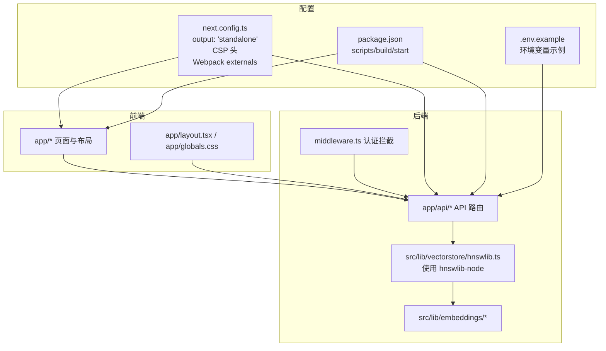
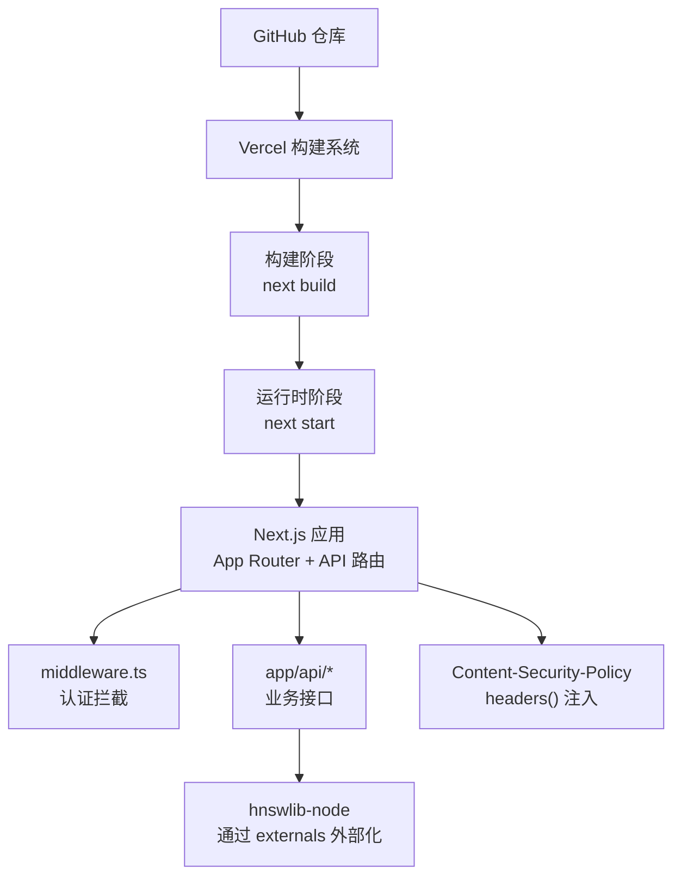
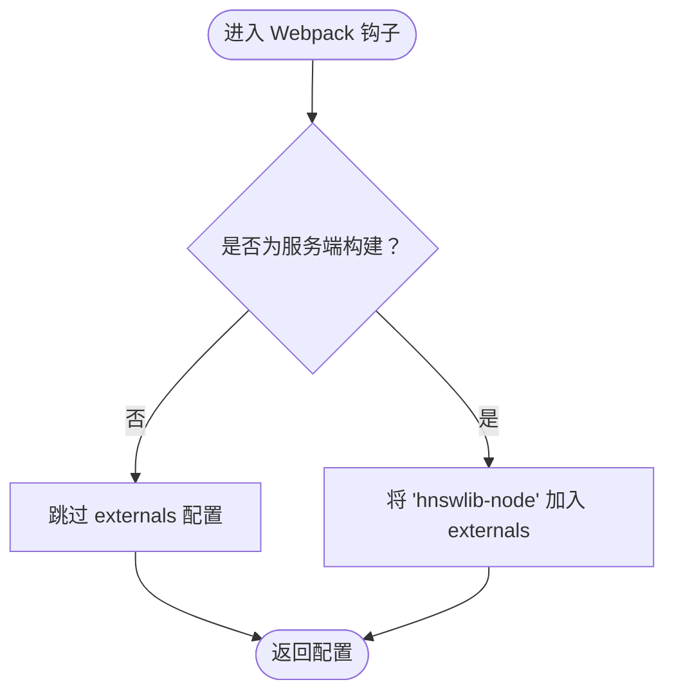
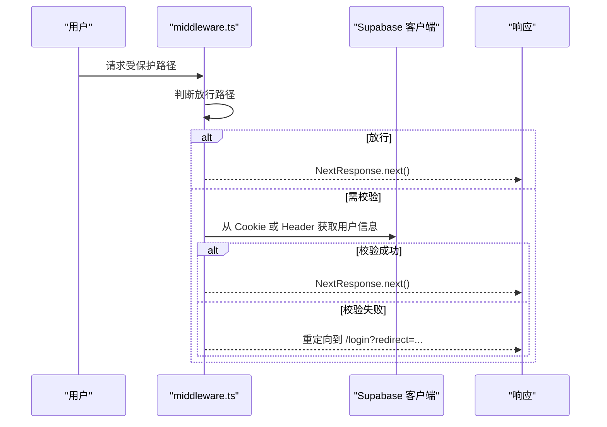
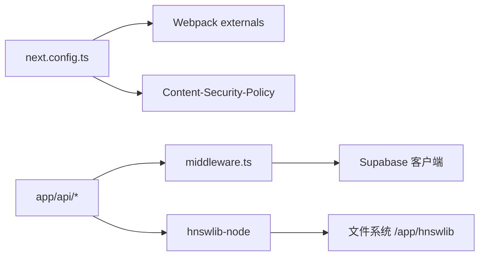

# Vercel 部署指南

<cite>
**本文引用的文件**
- [DEPLOY.md](file://DEPLOY.md)
- [next.config.ts](file://next.config.ts)
- [package.json](file://package.json)
- [.env.example](file://.env.example)
- [middleware.ts](file://middleware.ts)
- [src/lib/vectorstore/hnswlib.ts](file://src/lib/vectorstore/hnswlib.ts)
- [scripts/ingest.ts](file://scripts/ingest.ts)
- [railway.json](file://railway.json)
</cite>

## 目录
1. [简介](#简介)
2. [项目结构](#项目结构)
3. [核心组件](#核心组件)
4. [架构总览](#架构总览)
5. [详细组件分析](#详细组件分析)
6. [依赖关系分析](#依赖关系分析)
7. [性能考虑](#性能考虑)
8. [故障排查指南](#故障排查指南)
9. [结论](#结论)
10. [附录](#附录)

## 简介
本指南面向在 Vercel 平台上部署 ai-job-coach 项目的工程团队与运维人员。内容涵盖：
- 通过 GitHub 集成自动触发构建的流程
- Vercel 项目设置要点（框架预设为 Next.js、输出模式为 standalone）
- next.config.ts 中 output: 'standalone' 对 Vercel 部署的影响及原生模块处理（hnswlib-node）
- 环境变量配置清单（DEEPSEEK_API_KEY、OPENAI_API_KEY、SUPABASE_URL 等）及其在 Vercel Dashboard 中的设置方法
- 自定义域名绑定、SSL 证书配置、预览/生产环境分支设置
- 构建失败（依赖安装问题、TypeScript 错误）与运行时错误（API 路由 500、CSP 冲突）的排查方案
- 引用 DEPLOY.md 中的通用检查清单

## 项目结构
ai-job-coach 是基于 Next.js App Router 的前端与 API 服务混合项目，包含：
- 前端页面与布局：app/ 下的页面与布局文件
- API 路由：app/api/* 下的路由处理器
- 中间件：middleware.ts 实现认证拦截
- 向量检索：src/lib/vectorstore/hnswlib.ts 使用 hnswlib-node 实现向量索引
- 知识库摄入脚本：scripts/ingest.ts 用于生成向量索引文件
- Next.js 配置：next.config.ts 控制输出模式与安全头
- 环境变量示例：.env.example
- 部署参考：DEPLOY.md（Railway 部署指南，但其中的环境变量与健康检查端点同样适用于 Vercel）

图表来源
- [next.config.ts](file://next.config.ts#L1-L55)
- [middleware.ts](file://middleware.ts#L1-L170)
- [src/lib/vectorstore/hnswlib.ts](file://src/lib/vectorstore/hnswlib.ts#L1-L345)
- [package.json](file://package.json#L1-L42)
- [.env.example](file://.env.example#L1-L11)

章节来源
- [package.json](file://package.json#L1-L42)
- [next.config.ts](file://next.config.ts#L1-L55)
- [middleware.ts](file://middleware.ts#L1-L170)
- [src/lib/vectorstore/hnswlib.ts](file://src/lib/vectorstore/hnswlib.ts#L1-L345)
- [.env.example](file://.env.example#L1-L11)

## 核心组件
- Next.js 配置与安全头
  - output: 'standalone' 提升部署稳定性与可移植性
  - Content-Security-Policy 通过 headers() 注入，与前端 layout 中 meta CSP 保持一致
  - Webpack externals 将 hnswlib-node 标记为外部模块，避免打包时报错
- 中间件认证拦截
  - 对 /login、/invite、/api/*、静态资源放行
  - 其他路径进行会话校验，支持 Cookie 与 Authorization Bearer Token
- 向量检索与原生模块
  - HNSWLibStoreWrapper 使用 hnswlib-node，生产环境路径指向 /app/hnswlib
  - 支持保存/加载索引文件，便于首次部署后持久化
- 知识库摄入脚本
  - 本地运行生成向量索引，便于后续部署使用

章节来源
- [next.config.ts](file://next.config.ts#L1-L55)
- [middleware.ts](file://middleware.ts#L1-L170)
- [src/lib/vectorstore/hnswlib.ts](file://src/lib/vectorstore/hnswlib.ts#L1-L345)
- [scripts/ingest.ts](file://scripts/ingest.ts#L1-L77)

## 架构总览
下图展示 Vercel 部署时的关键交互：GitHub 触发构建 -> Vercel 执行构建与运行 -> Next.js 应用通过中间件与 API 路由提供服务，向量检索依赖 hnswlib-node 且通过 standalone 输出模式与 externals 配置保证运行时可用。

图表来源
- [next.config.ts](file://next.config.ts#L1-L55)
- [middleware.ts](file://middleware.ts#L1-L170)
- [src/lib/vectorstore/hnswlib.ts](file://src/lib/vectorstore/hnswlib.ts#L1-L345)

## 详细组件分析

### Vercel 项目设置与 GitHub 集成
- 在 Vercel 导入 GitHub 仓库后，选择框架预设为 Next.js；构建命令默认由 Next.js 提供，无需额外配置
- 输出模式选择 standalone，以提升部署稳定性与可移植性
- 分支策略：预览环境对应 PR 分支，生产环境对应 main/master 分支
- 自定义域名与 SSL：在 Vercel Dashboard 的 Domains 中添加域名并启用自动 SSL 证书

章节来源
- [next.config.ts](file://next.config.ts#L1-L55)

### next.config.ts 中 output: 'standalone' 的影响
- standalone 输出模式会将运行时所需的依赖打包为可独立运行的产物，减少冷启动时间并提升部署一致性
- 与 Vercel 的无服务器运行时配合良好，适合 App Router + API 路由的混合应用

章节来源
- [next.config.ts](file://next.config.ts#L1-L55)

### 原生模块处理：hnswlib-node
- 在 Webpack 中将 hnswlib-node 标记为 external，避免打包时报错
- 生产环境索引路径位于 /app/hnswlib，确保容器重启后仍可读取
- 首次部署可通过本地生成索引文件并随应用一起部署，或在运行时自动创建

图表来源
- [next.config.ts](file://next.config.ts#L36-L51)
- [src/lib/vectorstore/hnswlib.ts](file://src/lib/vectorstore/hnswlib.ts#L64-L73)

章节来源
- [next.config.ts](file://next.config.ts#L36-L51)
- [src/lib/vectorstore/hnswlib.ts](file://src/lib/vectorstore/hnswlib.ts#L64-L73)

### 环境变量配置清单与设置方法
- 必需变量（来自 .env.example 与 DEPLOY.md）
  - DEEPSEEK_API_KEY：用于 DeepSeek LLM
  - OPENAI_API_KEY：用于 OpenAI LLM（二选一）
  - SUPABASE_URL：Supabase 服务地址
  - SUPABASE_KEY / SUPABASE_ANON_KEY：Supabase 匿名密钥
  - SUPABASE_SERVICE_ROLE_KEY：Supabase 服务角色密钥（可选，用于更严格的用户校验）
- 在 Vercel Dashboard 中设置：
  - 进入项目 Settings -> Environment Variables
  - 添加上述变量，区分生产与预览环境
  - 对于敏感变量，使用 Vercel 的 Secret 管理

章节来源
- [.env.example](file://.env.example#L1-L11)
- [DEPLOY.md](file://DEPLOY.md#L33-L58)
- [middleware.ts](file://middleware.ts#L47-L56)

### 中间件与认证拦截
- 放行路径：/login、/invite、/api/*、静态资源
- 其他路径进行会话校验：
  - 优先从 Cookie 中解析 session token 与 userId
  - 若失败，尝试 Authorization Bearer Token
  - 如仍失败，使用 Supabase Admin API 验证 userId
- 未通过校验则重定向至 /login，并携带 redirect 参数

图表来源
- [middleware.ts](file://middleware.ts#L14-L153)

章节来源
- [middleware.ts](file://middleware.ts#L14-L153)

### API 路由与健康检查
- 健康检查端点：/api/health
- API 路由示例：/api/chat、/api/parse-resume、/api/interview/* 等
- 在 Vercel 中，这些路由将随 next start 运行，无需额外 runtime 指定（Next.js 16 默认行为）

章节来源
- [DEPLOY.md](file://DEPLOY.md#L93-L111)

### 向量检索与索引持久化
- HNSWLibStoreWrapper 使用 hnswlib-node 实现向量检索
- 生产环境默认索引路径为 /app/hnswlib，确保容器重启后仍可读取
- 首次部署可通过本地运行 scripts/ingest.ts 生成索引并随应用一起部署

章节来源
- [src/lib/vectorstore/hnswlib.ts](file://src/lib/vectorstore/hnswlib.ts#L64-L73)
- [scripts/ingest.ts](file://scripts/ingest.ts#L1-L77)

## 依赖关系分析
- next.config.ts 依赖 Webpack 配置与 CSP 注入
- middleware.ts 依赖 Supabase 客户端与环境变量
- API 路由依赖中间件与向量检索模块
- 向量检索模块依赖 hnswlib-node，通过 externals 外部化

图表来源
- [next.config.ts](file://next.config.ts#L1-L55)
- [middleware.ts](file://middleware.ts#L1-L170)
- [src/lib/vectorstore/hnswlib.ts](file://src/lib/vectorstore/hnswlib.ts#L1-L345)

章节来源
- [next.config.ts](file://next.config.ts#L1-L55)
- [middleware.ts](file://middleware.ts#L1-L170)
- [src/lib/vectorstore/hnswlib.ts](file://src/lib/vectorstore/hnswlib.ts#L1-L345)

## 性能考虑
- 使用 standalone 输出模式，减少冷启动与部署体积
- 通过 Webpack externals 外部化原生模块，避免不必要的打包开销
- 首次部署前生成向量索引文件，缩短运行时初始化时间
- 合理设置 Vercel 的预拉取与边缘缓存策略（按需）

## 故障排查指南
- 构建失败（依赖安装问题、TypeScript 错误）
  - 确认 package.json 中的依赖与版本兼容
  - 检查 Vercel 构建日志中的 npm/yarn 安装错误
  - 本地先执行 next build，定位 TypeScript 报错
- 运行时错误（API 路由 500）
  - 检查环境变量是否正确注入（DEEPSEEK_API_KEY、OPENAI_API_KEY、SUPABASE_*）
  - 查看 Vercel 日志，确认 API 路由可访问 /api/health
  - 确认中间件未因缺少 Supabase 配置而阻断请求
- CSP 冲突
  - next.config.ts 中已注入 CSP，若前端 layout 中也有 meta CSP，请保持一致
  - 若出现脚本或样式加载失败，检查 script-src、style-src、connect-src 策略
- 原生模块问题（hnswlib-node）
  - 确保 Webpack externals 已生效（isServer 条件下）
  - 首次部署后检查 /app/hnswlib 目录是否存在索引文件

章节来源
- [DEPLOY.md](file://DEPLOY.md#L169-L209)
- [next.config.ts](file://next.config.ts#L1-L55)
- [middleware.ts](file://middleware.ts#L47-L56)
- [src/lib/vectorstore/hnswlib.ts](file://src/lib/vectorstore/hnswlib.ts#L64-L73)

## 结论
通过在 Vercel 上启用 GitHub 集成、选择 Next.js 框架与 standalone 输出模式，并正确配置环境变量与 CSP，结合 Webpack externals 处理原生模块与向量索引的持久化策略，可稳定地部署 ai-job-coach 项目。建议在预览与生产环境分别设置独立的环境变量，并在上线前完成健康检查与 API 路由验证。

## 附录
- 通用检查清单（摘自 DEPLOY.md）
  - 所有环境变量已配置
  - 健康检查端点正常工作
  - /api/chat 可以正常响应
  - /api/parse-resume 可以正常解析文件
  - 向量索引文件已创建（如需要）
  - 日志可以正常查看
  - 应用可以正常重启
  - 自定义域名已配置（可选）

章节来源
- [DEPLOY.md](file://DEPLOY.md#L224-L234)