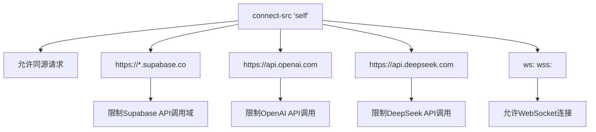

# 环境变量配置说明

<cite>
**本文档引用的文件**
- [.env.example](file://.env.example)
- [next.config.ts](file://next.config.ts)
- [DEPLOY.md](file://DEPLOY.md)
- [README.md](file://README.md)
- [lib/llm.ts](file://lib/llm.ts)
- [lib/db.ts](file://lib/db.ts)
- [app/api/invites/check/route.ts](file://app/api/invites/check/route.ts)
- [app/api/auth/create-session/route.ts](file://app/api/auth/create-session/route.ts)
- [railway.json](file://railway.json)
</cite>

## 目录
1. [环境变量概览](#环境变量概览)
2. [LLM服务认证变量](#llm服务认证变量)
3. [Supabase数据库连接变量](#supabase数据库连接变量)
4. [模型与运行时配置变量](#模型与运行时配置变量)
5. [CSP安全头配置](#csp安全头配置)
6. [安全实践建议](#安全实践建议)
7. [本地与生产环境配置差异](#本地与生产环境配置差异)

## 环境变量概览

ai-job-coach项目通过环境变量体系实现配置的灵活性和安全性，支持本地开发和生产环境的无缝切换。环境变量主要用于配置AI服务认证、数据库连接、运行时行为等关键参数。项目遵循安全最佳实践，通过`.gitignore`文件确保敏感信息不会被提交到版本控制系统。

**Section sources**
- [.env.example](file://.env.example)
- [README.md](file://README.md#L42-L47)

## LLM服务认证变量

### DEEPSEEK_API_KEY
该环境变量用于配置DeepSeek AI服务的API密钥，是服务器端调用DeepSeek Chat API进行智能求职辅导的核心认证凭证。当应用需要与DeepSeek模型交互时（如简历优化、模拟面试等），系统会使用此密钥进行身份验证。

### OPENAI_API_KEY
作为DeepSeek的替代方案，该变量用于配置OpenAI服务的API密钥。项目支持双LLM供应商架构，开发者可根据需求选择使用DeepSeek或OpenAI作为底层AI引擎。代码逻辑会优先检查DEEPSEEK_API_KEY，若未配置则尝试使用OPENAI_API_KEY。

**Section sources**
- [.env.example](file://.env.example#L8)
- [DEPLOY.md](file://DEPLOY.md#L38-L41)
- [lib/llm.ts](file://lib/llm.ts#L108-L109)

## Supabase数据库连接变量

### SUPABASE_URL
该变量存储Supabase项目的URL地址，用于建立与Supabase数据库和认证服务的连接。在多个API路由中（如邀请码验证、用户会话创建等），系统会使用此URL初始化Supabase客户端实例。

### SUPABASE_KEY
存储Supabase项目的匿名密钥（anon key）或服务角色密钥（service role key），与SUPABASE_URL配合使用完成身份认证。代码中通过`process.env.SUPABASE_ANON_KEY || process.env.SUPABASE_KEY`的逻辑实现密钥的灵活配置，优先使用专用的匿名密钥变量。

**Section sources**
- [DEPLOY.md](file://DEPLOY.md#L51-L52)
- [app/api/invites/check/route.ts](file://app/api/invites/check/route.ts#L30-L31)
- [lib/db.ts](file://lib/db.ts#L21)

## 模型与运行时配置变量

### LLM_MODEL_TYPE
指定默认的LLM模型供应商，可选值为"deepseek"或"openai"。该变量影响系统在初始化AI服务时的选择逻辑，确保应用使用预期的AI引擎。当同时配置了多个API密钥时，此变量起到明确的路由作用。

### NODE_ENV
控制应用的构建和运行时行为，典型值包括"development"、"production"和"test"。该变量影响多个方面的行为：
- 错误处理：生产环境会隐藏详细错误信息
- 性能优化：生产环境启用代码压缩和缓存
- 安全策略：如会话cookie的secure属性设置

### PORT
指定应用监听的端口号，在容器化部署中尤为重要。当部署到Railway等PaaS平台时，平台会通过此变量告知应用应该在哪个端口接受HTTP请求，实现标准化的容器网络通信。

**Section sources**
- [DEPLOY.md](file://DEPLOY.md#L44-L45)
- [app/api/auth/create-session/route.ts](file://app/api/auth/create-session/route.ts#L193)
- [railway.json](file://railway.json#L9)

## CSP安全头配置

在`next.config.ts`文件中，通过`headers()`函数配置了严格的内容安全策略（CSP），其中`connect-src`指令对API调用域进行了精确限制：



**Diagram sources**
- [next.config.ts](file://next.config.ts#L26)

此配置确保前端JavaScript只能向指定的安全域发起网络请求，有效防止跨站请求伪造（CSRF）和数据泄露攻击。所有外部API调用都被限制在预定义的可信源范围内。

**Section sources**
- [next.config.ts](file://next.config.ts#L13-L30)

## 安全实践建议

### 敏感信息保护
- **绝不提交真实密钥**：`.env.example`文件明确提示"不要提交真实密钥到仓库"，且`.gitignore`已配置忽略`.env*`文件
- **使用平台密钥管理**：推荐使用Railway或Vercel Secrets等平台提供的安全密钥管理功能，避免密钥硬编码
- **定期轮换API Key**：建立密钥轮换机制，定期更新API密钥以降低泄露风险

### 部署安全
- **容器安全**：确保`.env.local`在`.dockerignore`中，防止密钥意外包含在Docker镜像中
- **最小权限原则**：使用Supabase的匿名密钥而非服务角色密钥，限制数据库操作权限
- **环境隔离**：为开发、测试、生产环境使用不同的API密钥和数据库实例

**Section sources**
- [.env.example](file://.env.example#L2-L5)
- [DEPLOY.md](file://DEPLOY.md#L212-L214)
- [README.md](file://README.md#L114-L122)

## 本地与生产环境配置差异

### 本地开发配置
本地开发使用`.env.local`文件，该文件被`.gitignore`忽略，确保密钥不会提交到仓库。典型配置如下：
```env
DEEPSEEK_API_KEY=sk-xxxxx
SUPABASE_URL=https://xxxx.supabase.co
SUPABASE_KEY=xxxx-anon-key
NODE_ENV=development
PORT=3000
```

### 生产环境配置
生产环境通过部署平台（如Vercel、Railway）的环境变量界面配置，不使用文件形式。典型差异包括：
- **NODE_ENV**：设置为"production"
- **密钥管理**：使用平台Secrets功能而非文件
- **监控集成**：可能添加Sentry DSN等监控密钥

这种分离式配置确保了开发便利性与生产安全性的平衡，同时保持了代码的一致性。

**Section sources**
- [README.md](file://README.md#L42-L47)
- [DEPLOY.md](file://DEPLOY.md#L33-L57)
- [railway.json](file://railway.json)