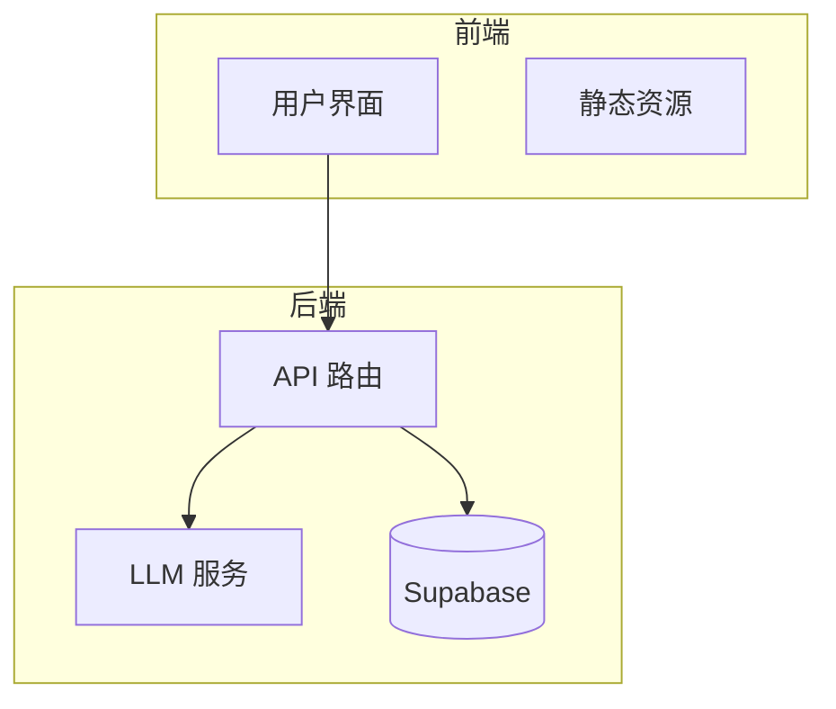
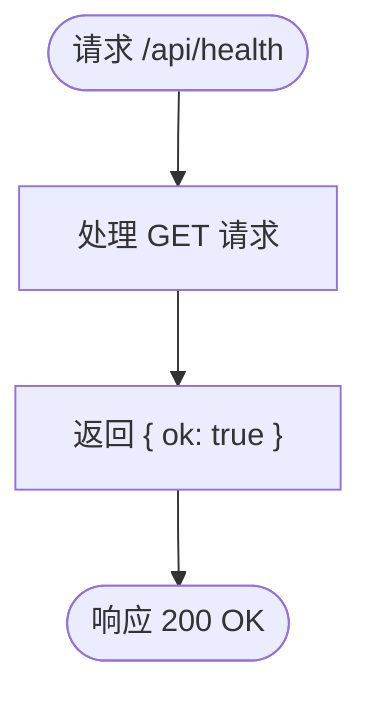
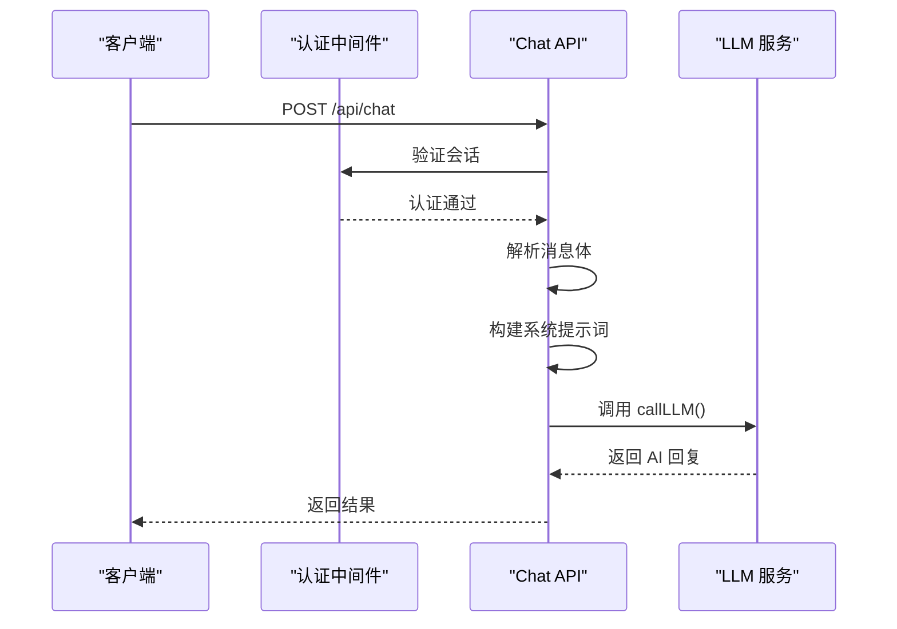
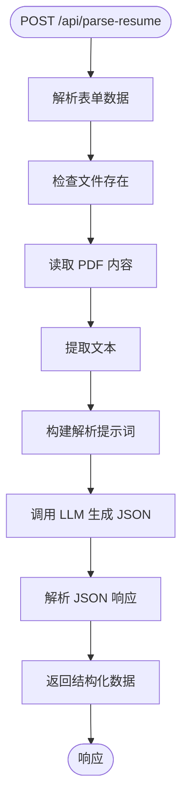
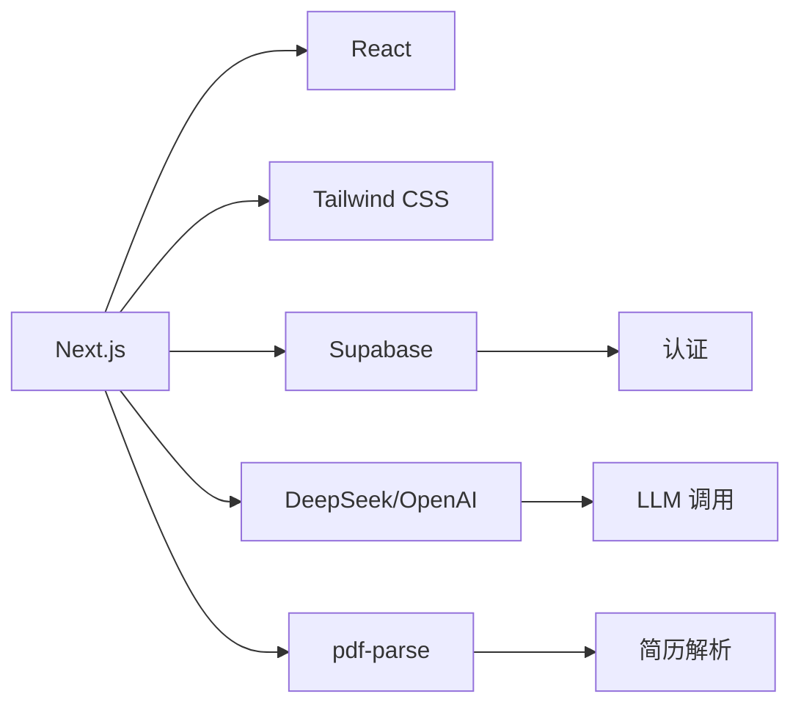

# 部署与环境配置

<cite>
**本文档引用文件**  
- [DEPLOY.md](file://DEPLOY.md)
- [.env.example](file://.env.example)
- [next.config.ts](file://next.config.ts)
- [railway.json](file://railway.json)
- [package.json](file://package.json)
- [README.md](file://README.md)
- [middleware.ts](file://middleware.ts)
- [app/api/health/route.ts](file://app/api/health/route.ts)
- [app/api/chat/route.ts](file://app/api/chat/route.ts)
- [app/api/parse-resume/route.ts](file://app/api/parse-resume/route.ts)
</cite>

## 目录
1. [简介](#简介)
2. [项目结构](#项目结构)
3. [核心组件](#核心组件)
4. [架构概述](#架构概述)
5. [详细组件分析](#详细组件分析)
6. [依赖分析](#依赖分析)
7. [性能考虑](#性能考虑)
8. [故障排除指南](#故障排除指南)
9. [结论](#结论)

## 简介
AI Job Coach 是一个基于 Next.js 和 DeepSeek AI 的智能求职助手应用，旨在帮助用户优化简历、准备面试、进行薪资谈判等求职相关任务。本指南详细说明如何在 Vercel 或 Railway 平台上完成全栈部署，涵盖前端静态资源托管与后端 API 服务配置。

## 项目结构
项目采用标准的 Next.js 应用目录结构，主要包含以下核心部分：
- `app/`：Next.js 13+ 的 App Router 结构，包含页面和 API 路由
- `components/`：可复用的 UI 组件
- `lib/`：核心业务逻辑、工具函数和状态管理
- `src/lib/`：AI 相关的智能体、链、知识库和向量存储
- 根目录包含部署配置文件如 `next.config.ts`、`railway.json` 和 `.env.example`

**Section sources**
- [README.md](file://README.md#L130-L145)

## 核心组件
项目的核心功能由多个 API 路由驱动，包括健康检查、聊天交互和简历解析。这些路由均配置为使用 Node.js 运行时，以确保能够调用外部 LLM API 和文件解析库。

**Section sources**
- [app/api/health/route.ts](file://app/api/health/route.ts#L1-L15)
- [app/api/chat/route.ts](file://app/api/chat/route.ts#L1-L238)
- [app/api/parse-resume/route.ts](file://app/api/parse-resume/route.ts#L1-L196)

## 架构概述
系统采用前后端一体化的 Next.js 架构，前端页面与后端 API 共享同一代码库。部署时，前端静态资源由平台自动托管，后端 API 作为 Serverless 函数运行。

**Diagram sources**
- [app/api/chat/route.ts](file://app/api/chat/route.ts#L1-L238)
- [app/api/parse-resume/route.ts](file://app/api/parse-resume/route.ts#L1-L196)
- [middleware.ts](file://middleware.ts#L1-L170)

## 详细组件分析

### 健康检查组件分析
健康检查端点 `/api/health` 用于验证服务的可用性，是部署监控的关键。

**Diagram sources**
- [app/api/health/route.ts](file://app/api/health/route.ts#L1-L15)

### 聊天组件分析
聊天 API `/api/chat` 是核心交互接口，负责处理用户消息并调用 LLM。

**Diagram sources**
- [app/api/chat/route.ts](file://app/api/chat/route.ts#L1-L238)
- [lib/auth.ts](file://lib/auth.ts)
- [lib/llm.ts](file://lib/llm.ts)

### 简历解析组件分析
简历解析 API `/api/parse-resume` 负责将 PDF 文件转换为结构化数据。

**Diagram sources**
- [app/api/parse-resume/route.ts](file://app/api/parse-resume/route.ts#L1-L196)
- [lib/llm.ts](file://lib/llm.ts)
- [pdf-parse](file://node_modules/pdf-parse)

## 依赖分析
项目依赖关系清晰，前端框架与 AI 服务解耦，便于维护和扩展。

**Diagram sources**
- [package.json](file://package.json#L1-L42)
- [app/api/parse-resume/route.ts](file://app/api/parse-resume/route.ts#L1-L196)

## 性能考虑
部署配置优化了性能，`next.config.ts` 中的 `output: 'standalone'` 减少了部署包体积，`railway.json` 配置了健康检查和自动重启策略。

**Section sources**
- [next.config.ts](file://next.config.ts#L1-L55)
- [railway.json](file://railway.json#L1-L30)

## 故障排除指南
常见部署问题包括环境变量未配置、API 密钥错误和依赖安装失败。建议首先检查日志，确保 `DEEPSEEK_API_KEY` 已正确设置。

**Section sources**
- [DEPLOY.md](file://DEPLOY.md#L169-L209)
- [README.md](file://README.md#L163-L178)

## 结论
通过遵循本指南，开发者可以成功在 Vercel 或 Railway 上部署 AI Job Coach 应用。关键步骤包括正确配置环境变量、理解构建配置的影响以及掌握故障排除方法。