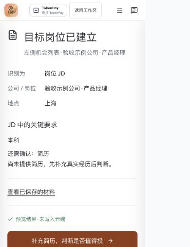
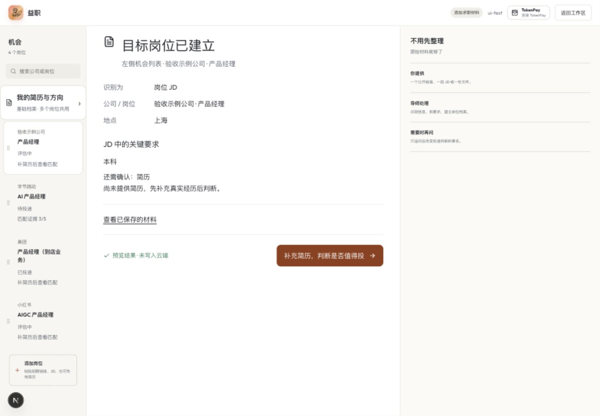

# 材料提交回执、真实进度与数据边界

## 范围与依据

依据业务真源 `X 运营/中文/outputs/ai-job-coach-product-review-2026-10-09.md`，用户确认本轮只收敛三项：提交后知道系统识别了什么、长任务失败可恢复、上传前说明数据去向。不替换原 PRD，不删除简历编辑、模板、导出、笔记或面试功能。

## 已实现

- 云端 POST 确认成功后才显示材料回执：材料类型、公司/岗位/方向、地点、前三条关键要求、仍缺的材料、保存位置与一个下一步。未提供简历不输出可靠匹配结论。
- 未识别的原文明确显示待确认，不伪装成建成目标岗位；可展开原文继续整理。已经识别的求职方向不会被误标为识别失败。
- `analyze` 保留旧 JSON 协议，新增 NDJSON 实际阶段事件：读取→整理→核对；客户端保存操作开始后才显示保存阶段。展示真实等待秒数、任务编号和延迟提示，不使用模拟百分比、假预计时间或假后台完成。
- 发现并删除旧实现中的假反馈：“已保存到当前浏览器，云同步稍后重试”实际既没有持久保存也没有自动重试。现在云保存失败明确可见、原输入不清空；同一挂载页面缓存分析结果，重试保存不再调用模型或消耗分析额度。
- 客户端同步提交锁防双击；文件缓存键基于 SHA-256 内容，避免同名/同大小文件复用错误结果。真实模型失败清掉旧请求编号，避免重放已经退款但不可重复预留的额度事务。
- 保存请求用 `intakeRequestId` 在当前用户已有云端 metadata 中找回同一结果，覆盖普通丢响应重试；无 ID 的旧调用不受影响，非法 ID 返回 400。此机制不是数据库原子并发去重。
- 上传前可见云端/模型说明，展开查看当前站点或已连接服务。新增鉴权只读 `/api/opportunities/intake-info`，不调用模型、不返回凭据、禁止共享缓存。
- 正式走查发现旧 middleware 把隐私页重定向到登录。仅放行精确 `/privacy`；新增回归确认 `/cockpit` 和 `/privacy-export` 仍需登录。更换上传文件时清除旧的“免费保存重试”标签，不能拿旧保存失败的价签表示新的模型分析。
- 隐私页补 StepFun，并订正未实现的自动脱敏、30 天自动清除、一键完整清除等承诺；说明原文解析、模型传输、云保存与底层来源/备份删除申请边界。
- 保持暖白与橙色。回执有独立阅读留白、手机整行下一步按钮、标题自动定位和可访问焦点；示例结果明确标“未写入云端”。Impeccable 加固原则用于失败/加载/恢复反馈，未开启自动钩子。

## 验证

- 最终独立干净快照：183 套 / 1855 用例通过，2 套 / 4 用例按既有配置跳过；生产 build 与 `tsc --noEmit` 成功。本轮文件 ESLint 0 error，CockpitApp 两条原有 unused warning 保留。
- 新增单元与接口回归：缓存/并发/真失败新编号/UTF-8 分块/断流/旧 JSON/无登录401/真实阶段/普通保存重放/非法编号/实际服务显示/服务读取失败/不混淆方向与未识别材料。
- 浏览器受控测试：真实页面组件，使用临时本地 fixture，无真实模型调用、无云端写入。503→原文/编号保留→新编号重试；另测无登录保存失败显示专用不消耗额度重试；成功后回执及唯一 CTA 进入新岗位，补简历入口可见。临时 fixture 已删除且未进入提交/发布快照。
- 响应式验收：1440px 桌面及 390px 手机；390px 文档 clientWidth/scrollWidth 均390，无水平溢出。回执截图是受控数据，不是生产真人完成证据。
- 手动 Impeccable detect 本轮 UI 文件一次，0 主问题；对新增 fallback 色与标题字号对齐后复核一次。旧 CockpitApp 色值 advisory 不归因本轮，未扩大修复、未持久屏蔽。

## 发布与真实验收

代码提交：`d3a8d2b`、`3bcf3c1`、`0663f79`、`18f7cd4`、`52693a6`、`3eeb1b9`；仅任务文件与局部收尾，auth/admin 等协作者改动保留。已 push backend 与开发分支。

首轮部署 `dpl_7h62mJKw8zhE5g6mG5GLcgb2dkJx`（0663f79）已真实验收并推广：暂存整理19.761秒，正式整理18.375秒，正式首进度0.874秒；实际 Step3.7Flash，两轮均保存/同编号重放/云回读/零额度保存通过，只一份云岗位、一次模型成功调用，合成账号与自身审计清理。正式 www 已核验指向同部署，首页200/匿名intake-info401。较早暂存 `dpl_5CrxULqSNvq9BYSC8ZhwAeFT7Bs6` 被 UI 收尾替代并取消，未推广。

最终部署 `dpl_A7djVcNH7YCDcuEBCfmzbqsZ3AKh`（3eeb1b9）READY：暂存真实整理20.181秒，保存/同编号重放/云回读/零额度保存均通过，一次模型调用；合成账号与自身审计清理。暂存隐私页正文含 StepFun 及真实保留/脱敏边界；匿名 intake-info401、匿名 cockpit307，登录保护未放宽。随后 promote 并核验 www 指向相同 ID；正式首页200、匿名intake-info401、隐私正文免登录可读。最终正式再验首进度0.736秒、整理23.491秒，实际 Step3.7Flash，云端保存/同编号重放/单份原文回读/额度归零仍保存通过，只一次模型调用；合成用户及自身审计再次清理。10分钟窗口 error 日志未返回条目，仅为短窗观察，不证明长期全站无错误；未查询 drains。浏览器连接在正式隐私页复验时超时，后续以公开 HTTP 和模型/数据库接口验收为证，不把它写成人工登录 UI 全流程通过。

真实验收脚本：`scripts/verify-material-intake-flow.mjs`。新建本轮专用虚构账号与一次站点免费额度，执行真实流式 JD 分析→保存→同编号重放→云回读，验证分析后额度归零仍可保存、只一份岗位、只一次模型成功记录；只清理本轮合成用户和自身生成审计。不使用真人 Cookie、材料、TokenPay 余额或充值。

## 未签收边界

1. 处理中仍需保留页面。跨刷新续跑、耐久后台队列、离开页面通知、取消实际模型调用未实现，本轮不声称完成。
2. 分析缓存仅当前挂载页面内存；刷新/关闭后无法取回未保存分析，界面已明示勿刷新。跨页面耐久恢复需服务端任务存储另做。
3. 普通保存重放不是并发唯一索引；客户端阻双击，但跨设备并发仍需数据库约束。多来源/快照写入也不是单次原子事务。
4. NDJSON 是处理阶段流，不是逐 token 输出最终结构化 JSON；终态错误可能在 HTTP200 的流中，客户端必须检查 `data.ok/status`。不凭 HTTP200 签收完成。
5. 未通过本轮证明旧 Kimi 面试、整轮语音、完整 PDF 与真实外部用户增长；之前的待验项保留。模型延迟只测本轮样例，不声称全局速度已经优化。

## 受控界面证据

